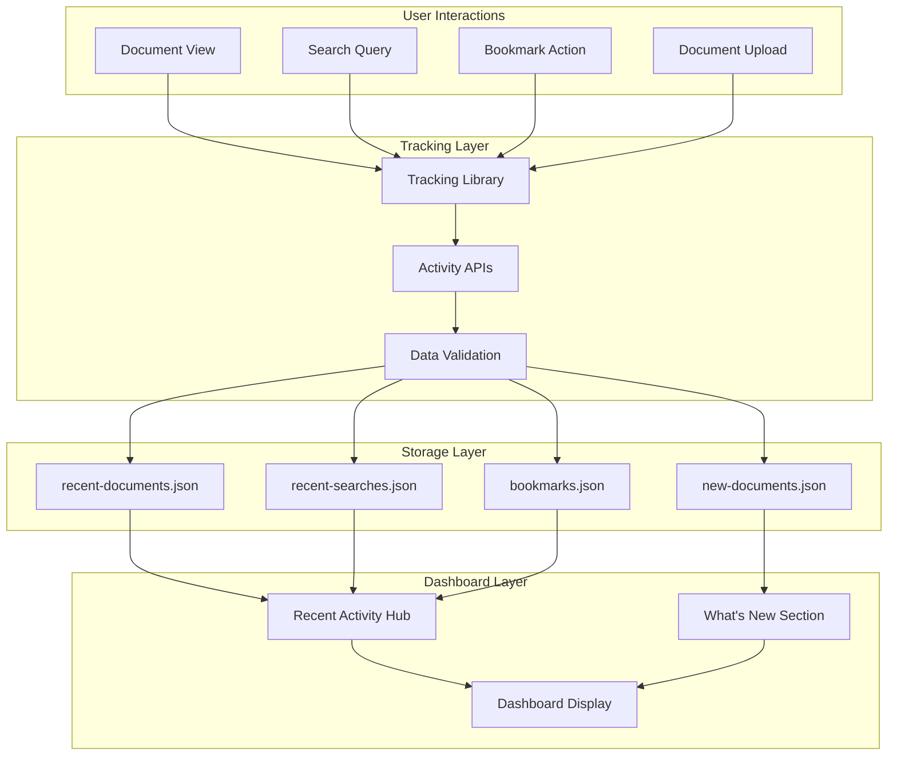

# Activity Tracking System Documentation

## Overview

The Compliance Hub activity tracking system monitors user interactions to provide personalized dashboard experiences and improved usability. The system tracks document views, search queries, bookmarks, and newly added documents to create a comprehensive activity history.

## Architecture Overview

### Data Flow Architecture



## Storage System

### File-Based Storage Structure

The system uses JSON files for development and small-scale deployments:

```
compliance-hub/
├── recent-documents.json    # Per-user document view history
├── recent-searches.json     # Per-user search history
├── bookmarks.json          # Per-user bookmarked documents
└── new-documents.json      # Global newly added documents
```

### Data Structures

#### Recent Documents (`recent-documents.json`)

```typescript
interface RecentDocument {
  id: string                // Unique activity ID
  documentId: string        // Reference to document
  title: string            // Document title
  state: string            // Document state (NY, CA, etc.)
  type: string             // Document type
  viewedAt: Date           // When user viewed document
}

// File structure: Map<userId, RecentDocument[]>
{
  "user_123": [
    {
      "id": "activity_1",
      "documentId": "doc_abc123",
      "title": "Sports Betting License Requirements",
      "state": "NY",
      "type": "Regulation",
      "viewedAt": "2024-01-15T14:30:00Z"
    }
  ]
}
```

#### Recent Searches (`recent-searches.json`)

```typescript
interface RecentSearch {
  id: string                // Unique search ID
  query: string            // Search query text
  timestamp: Date          // When search was performed
  resultsCount: number     // Number of results returned
  searchType: string       // Type of search (ai-search, keyword, etc.)
  states?: string          // JSON string of selected states
}

// File structure: Map<userId, RecentSearch[]>
{
  "user_123": [
    {
      "id": "search_1",
      "query": "advertising restrictions",
      "timestamp": "2024-01-15T14:30:00Z",
      "resultsCount": 5,
      "searchType": "ai-search",
      "states": "[\"NY\", \"CA\", \"NJ\"]"
    }
  ]
}
```

#### Bookmarks (`bookmarks.json`)

```typescript
interface Bookmark {
  id: string                // Unique bookmark ID
  documentId: string        // Reference to document
  title: string            // Document title
  state: string            // Document state
  type: string             // Document type
  bookmarkedAt: Date       // When document was bookmarked
}

// File structure: Map<userId, Bookmark[]>
{
  "user_123": [
    {
      "id": "bookmark_1",
      "documentId": "doc_abc123",
      "title": "Sports Betting License Requirements",
      "state": "NY",
      "type": "Regulation",
      "bookmarkedAt": "2024-01-15T14:30:00Z"
    }
  ]
}
```

#### New Documents (`new-documents.json`)

```typescript
interface NewDocument {
  id: string                // Unique entry ID
  documentId: string        // Reference to document
  title: string            // Document title
  state: string            // Document state
  type: string             // Document type
  addedAt: Date            // When document was added
}

// File structure: Map<'global', NewDocument[]>
{
  "global": [
    {
      "id": "new_doc_1",
      "documentId": "doc_xyz789",
      "title": "Updated Advertising Guidelines",
      "state": "CA",
      "type": "Guidance",
      "addedAt": "2024-01-15T14:30:00Z"
    }
  ]
}
```

## Tracking Library

### Core Tracking Functions

```typescript
// /lib/tracking.ts

/**
 * Track document view for current user
 */
export const trackDocumentView = async (
  documentId: string, 
  title: string, 
  state?: string, 
  type?: string
): Promise<void> => {
  try {
    await fetch('/api/user/recent-documents', {
      method: 'POST',
      headers: {
        'Content-Type': 'application/json',
      },
      body: JSON.stringify({
        documentId,
        title,
        state,
        type
      })
    })
  } catch (error) {
    console.error('Error tracking document view:', error)
  }
}

/**
 * Track search query with state information
 */
export const trackSearch = async (
  query: string, 
  resultsCount: number, 
  searchType: string = 'ai-search', 
  states?: string
): Promise<void> => {
  try {
    await fetch('/api/user/recent-searches', {
      method: 'POST',
      headers: {
        'Content-Type': 'application/json',
      },
      body: JSON.stringify({
        query,
        resultsCount,
        searchType,
        states
      })
    })
  } catch (error) {
    console.error('Error tracking search:', error)
  }
}

/**
 * Add document to bookmarks
 */
export const addBookmark = async (
  documentId: string, 
  title: string, 
  state?: string, 
  type?: string
): Promise<any> => {
  try {
    const response = await fetch('/api/user/bookmarks', {
      method: 'POST',
      headers: {
        'Content-Type': 'application/json',
      },
      body: JSON.stringify({
        documentId,
        title,
        state,
        type
      })
    })
    
    if (!response.ok) {
      const data = await response.json()
      throw new Error(data.error || 'Failed to add bookmark')
    }
    
    return await response.json()
  } catch (error) {
    console.error('Error adding bookmark:', error)
    throw error
  }
}

/**
 * Remove document from bookmarks
 */
export const removeBookmark = async (documentId: string): Promise<any> => {
  try {
    const response = await fetch(`/api/user/bookmarks?documentId=${documentId}`, {
      method: 'DELETE',
    })
    
    if (!response.ok) {
      throw new Error('Failed to remove bookmark')
    }
    
    return await response.json()
  } catch (error) {
    console.error('Error removing bookmark:', error)
    throw error
  }
}

/**
 * Check if document is bookmarked
 */
export const isBookmarked = async (documentId: string): Promise<boolean> => {
  try {
    const response = await fetch(`/api/user/bookmarks?documentId=${documentId}`, {
      method: 'HEAD',
    })
    
    return response.ok
  } catch (error) {
    console.error('Error checking bookmark status:', error)
    return false
  }
}
```

## API Endpoints

### Recent Documents API

```typescript
// /app/api/user/recent-documents/route.ts

import { NextRequest, NextResponse } from 'next/server'
import { getServerSession } from 'next-auth'
import { authOptions } from '@/lib/auth/auth-options'
import { promises as fs } from 'fs'
import path from 'path'

const STORAGE_FILE = path.join(process.cwd(), 'recent-documents.json')

interface RecentDocument {
  id: string
  title: string
  state: string
  type: string
  viewedAt: Date
  documentId: string
}

async function loadRecentDocuments(): Promise<Map<string, RecentDocument[]>> {
  try {
    const data = await fs.readFile(STORAGE_FILE, 'utf-8')
    const parsed = JSON.parse(data)
    const documents = new Map<string, RecentDocument[]>()
    
    for (const [userId, userDocuments] of Object.entries(parsed)) {
      documents.set(userId, (userDocuments as any[]).map(doc => ({
        ...doc,
        viewedAt: new Date(doc.viewedAt)
      })))
    }
    
    return documents
  } catch (error) {
    return new Map<string, RecentDocument[]>()
  }
}

async function saveRecentDocuments(documents: Map<string, RecentDocument[]>): Promise<void> {
  try {
    const data = Object.fromEntries(documents.entries())
    await fs.writeFile(STORAGE_FILE, JSON.stringify(data, null, 2))
  } catch (error) {
    console.error('Error saving recent documents:', error)
  }
}

export async function GET(request: NextRequest) {
  try {
    const session = await getServerSession(authOptions)
    
    if (!session?.user?.id) {
      return NextResponse.json({ error: 'Unauthorized' }, { status: 401 })
    }

    const recentDocuments = await loadRecentDocuments()
    const userRecent = recentDocuments.get(session.user.id) || []
    
    // Sort by most recent and limit to 10
    const recent = userRecent
      .sort((a, b) => new Date(b.viewedAt).getTime() - new Date(a.viewedAt).getTime())
      .slice(0, 10)
      .map(doc => ({
        ...doc,
        viewedAt: doc.viewedAt.toISOString()
      }))

    return NextResponse.json({ recent })
  } catch (error) {
    console.error('Error fetching recent documents:', error)
    return NextResponse.json({ error: 'Internal server error' }, { status: 500 })
  }
}

export async function POST(request: NextRequest) {
  try {
    const session = await getServerSession(authOptions)
    
    if (!session?.user?.id) {
      return NextResponse.json({ error: 'Unauthorized' }, { status: 401 })
    }

    const { documentId, title, state, type } = await request.json()

    if (!documentId || !title) {
      return NextResponse.json({ error: 'Missing required fields' }, { status: 400 })
    }

    const userId = session.user.id
    const recentDocuments = await loadRecentDocuments()
    const userRecent = recentDocuments.get(userId) || []

    // Remove existing entry for this document
    const filtered = userRecent.filter(doc => doc.documentId !== documentId)

    // Add new entry at the beginning
    const newEntry = {
      id: Date.now().toString(),
      documentId,
      title,
      state: state || 'Unknown',
      type: type || 'Document',
      viewedAt: new Date()
    }

    filtered.unshift(newEntry)

    // Keep only last 50 entries
    const updated = filtered.slice(0, 50)
    recentDocuments.set(userId, updated)
    await saveRecentDocuments(recentDocuments)

    return NextResponse.json({ success: true })
  } catch (error) {
    console.error('Error tracking document view:', error)
    return NextResponse.json({ error: 'Internal server error' }, { status: 500 })
  }
}
```

### Recent Searches API

```typescript
// /app/api/user/recent-searches/route.ts

import { NextRequest, NextResponse } from 'next/server'
import { getServerSession } from 'next-auth'
import { authOptions } from '@/lib/auth/auth-options'
import { promises as fs } from 'fs'
import path from 'path'

const STORAGE_FILE = path.join(process.cwd(), 'recent-searches.json')

interface RecentSearch {
  id: string
  query: string
  timestamp: Date
  resultsCount: number
  searchType: string
  states?: string
}

async function loadRecentSearches(): Promise<Map<string, RecentSearch[]>> {
  try {
    const data = await fs.readFile(STORAGE_FILE, 'utf-8')
    const parsed = JSON.parse(data)
    const searches = new Map<string, RecentSearch[]>()
    
    for (const [userId, userSearches] of Object.entries(parsed)) {
      searches.set(userId, (userSearches as any[]).map(search => ({
        ...search,
        timestamp: new Date(search.timestamp)
      })))
    }
    
    return searches
  } catch (error) {
    return new Map<string, RecentSearch[]>()
  }
}

async function saveRecentSearches(searches: Map<string, RecentSearch[]>): Promise<void> {
  try {
    const data = Object.fromEntries(searches.entries())
    await fs.writeFile(STORAGE_FILE, JSON.stringify(data, null, 2))
  } catch (error) {
    console.error('Error saving recent searches:', error)
  }
}

export async function GET(request: NextRequest) {
  try {
    const session = await getServerSession(authOptions)
    
    if (!session?.user?.id) {
      return NextResponse.json({ error: 'Unauthorized' }, { status: 401 })
    }

    const recentSearches = await loadRecentSearches()
    const userRecent = recentSearches.get(session.user.id) || []
    
    // Sort by most recent and limit to 10
    const recent = userRecent
      .sort((a, b) => new Date(b.timestamp).getTime() - new Date(a.timestamp).getTime())
      .slice(0, 10)
      .map(search => ({
        ...search,
        timestamp: search.timestamp.toISOString()
      }))

    return NextResponse.json({ recent })
  } catch (error) {
    console.error('Error fetching recent searches:', error)
    return NextResponse.json({ error: 'Internal server error' }, { status: 500 })
  }
}

export async function POST(request: NextRequest) {
  try {
    const session = await getServerSession(authOptions)
    
    if (!session?.user?.id) {
      return NextResponse.json({ error: 'Unauthorized' }, { status: 401 })
    }

    const { query, resultsCount, searchType, states } = await request.json()

    if (!query) {
      return NextResponse.json({ error: 'Missing required fields' }, { status: 400 })
    }

    const userId = session.user.id
    const recentSearches = await loadRecentSearches()
    const userRecent = recentSearches.get(userId) || []

    // Remove existing entry for this query
    const filtered = userRecent.filter(search => search.query !== query)

    // Add new entry at the beginning
    const newEntry = {
      id: Date.now().toString(),
      query,
      resultsCount: resultsCount || 0,
      searchType: searchType || 'ai-search',
      states: states || null,
      timestamp: new Date()
    }

    filtered.unshift(newEntry)

    // Keep only last 50 entries
    const updated = filtered.slice(0, 50)
    recentSearches.set(userId, updated)
    await saveRecentSearches(recentSearches)

    return NextResponse.json({ success: true })
  } catch (error) {
    console.error('Error tracking search:', error)
    return NextResponse.json({ error: 'Internal server error' }, { status: 500 })
  }
}
```

### Bookmarks API

```typescript
// /app/api/user/bookmarks/route.ts

export async function GET(request: NextRequest) {
  try {
    const session = await getServerSession(authOptions)
    
    if (!session?.user?.id) {
      return NextResponse.json({ error: 'Unauthorized' }, { status: 401 })
    }

    const url = new URL(request.url)
    const documentId = url.searchParams.get('documentId')

    const bookmarks = await loadBookmarks()
    const userBookmarks = bookmarks.get(session.user.id) || []

    if (documentId) {
      // Check if specific document is bookmarked
      const isBookmarked = userBookmarks.some(bookmark => bookmark.documentId === documentId)
      return NextResponse.json({ bookmarked: isBookmarked })
    }

    // Return all bookmarks
    const sortedBookmarks = userBookmarks
      .sort((a, b) => new Date(b.bookmarkedAt).getTime() - new Date(a.bookmarkedAt).getTime())
      .map(bookmark => ({
        ...bookmark,
        bookmarkedAt: bookmark.bookmarkedAt.toISOString()
      }))

    return NextResponse.json({ bookmarks: sortedBookmarks })
  } catch (error) {
    console.error('Error fetching bookmarks:', error)
    return NextResponse.json({ error: 'Internal server error' }, { status: 500 })
  }
}

export async function POST(request: NextRequest) {
  try {
    const session = await getServerSession(authOptions)
    
    if (!session?.user?.id) {
      return NextResponse.json({ error: 'Unauthorized' }, { status: 401 })
    }

    const { documentId, title, state, type } = await request.json()

    if (!documentId || !title) {
      return NextResponse.json({ error: 'Missing required fields' }, { status: 400 })
    }

    const userId = session.user.id
    const bookmarks = await loadBookmarks()
    const userBookmarks = bookmarks.get(userId) || []

    // Check if already bookmarked
    const existingBookmark = userBookmarks.find(bookmark => bookmark.documentId === documentId)
    if (existingBookmark) {
      return NextResponse.json({ error: 'Document already bookmarked' }, { status: 400 })
    }

    // Add new bookmark
    const newBookmark = {
      id: Date.now().toString(),
      documentId,
      title,
      state: state || 'Unknown',
      type: type || 'Document',
      bookmarkedAt: new Date()
    }

    userBookmarks.unshift(newBookmark)
    bookmarks.set(userId, userBookmarks)
    await saveBookmarks(bookmarks)

    return NextResponse.json({ success: true })
  } catch (error) {
    console.error('Error adding bookmark:', error)
    return NextResponse.json({ error: 'Internal server error' }, { status: 500 })
  }
}

export async function DELETE(request: NextRequest) {
  try {
    const session = await getServerSession(authOptions)
    
    if (!session?.user?.id) {
      return NextResponse.json({ error: 'Unauthorized' }, { status: 401 })
    }

    const url = new URL(request.url)
    const documentId = url.searchParams.get('documentId')

    if (!documentId) {
      return NextResponse.json({ error: 'Missing documentId parameter' }, { status: 400 })
    }

    const userId = session.user.id
    const bookmarks = await loadBookmarks()
    const userBookmarks = bookmarks.get(userId) || []

    // Remove bookmark
    const filtered = userBookmarks.filter(bookmark => bookmark.documentId !== documentId)
    
    if (filtered.length === userBookmarks.length) {
      return NextResponse.json({ error: 'Bookmark not found' }, { status: 404 })
    }

    bookmarks.set(userId, filtered)
    await saveBookmarks(bookmarks)

    return NextResponse.json({ success: true })
  } catch (error) {
    console.error('Error removing bookmark:', error)
    return NextResponse.json({ error: 'Internal server error' }, { status: 500 })
  }
}

export async function HEAD(request: NextRequest) {
  try {
    const session = await getServerSession(authOptions)
    
    if (!session?.user?.id) {
      return new NextResponse(null, { status: 401 })
    }

    const url = new URL(request.url)
    const documentId = url.searchParams.get('documentId')

    if (!documentId) {
      return new NextResponse(null, { status: 400 })
    }

    const bookmarks = await loadBookmarks()
    const userBookmarks = bookmarks.get(session.user.id) || []

    const isBookmarked = userBookmarks.some(bookmark => bookmark.documentId === documentId)
    
    return new NextResponse(null, { status: isBookmarked ? 200 : 404 })
  } catch (error) {
    console.error('Error checking bookmark status:', error)
    return new NextResponse(null, { status: 500 })
  }
}
```

## Integration Points

### Document Viewer Integration

```typescript
// /components/documents/modern-document-library.tsx

import { trackDocumentView } from '@/lib/tracking'

export function ModernDocumentLibrary() {
  const handleView = (doc: Document) => {
    setViewingDocument({ id: doc.id, title: doc.title })
    
    // Track document view
    const documentType = doc.documentTypes.length > 0 
      ? doc.documentTypes[0].documentType.displayName 
      : 'Document'
    
    trackDocumentView(doc.id, doc.title, doc.state, documentType)
  }

  // Handle viewDocumentId from URL parameter
  useEffect(() => {
    if (viewDocumentId && documents.length > 0) {
      const docToView = documents.find(doc => doc.id === viewDocumentId)
      if (docToView) {
        handleView(docToView)
      }
    }
  }, [viewDocumentId, documents])

  // Rest of component...
}
```

### Search Integration

```typescript
// /app/search/page.tsx

import { trackSearch } from '@/lib/tracking'

export default function SearchPage() {
  const handleSearch = async (query: string) => {
    // Perform search
    const results = await performSearch(query)
    
    // Track search
    const statesParam = selectedStates.length > 0 
      ? JSON.stringify(selectedStates)
      : undefined
    
    trackSearch(query, results.length, 'ai-search', statesParam)
    
    // Update UI
    setSearchResults(results)
  }

  // Rest of component...
}
```

### Upload Integration

```typescript
// /app/api/documents/upload-async-llamaindex/route.ts

export async function POST(request: NextRequest) {
  try {
    // Standard upload logic...
    const document = await createDocument(...)
    
    // Track the newly added document
    try {
      const documentType = documentTypesArray.length > 0 
        ? documentTypesArray[0] 
        : 'Document'
      
      await fetch(`${process.env.NEXTAUTH_URL}/api/user/new-documents`, {
        method: 'POST',
        headers: { 'Content-Type': 'application/json' },
        body: JSON.stringify({
          documentId: document.id,
          title: document.title,
          state: document.state,
          type: documentType,
          internal: true // Bypass authentication for server-to-server calls
        })
      })
      
      console.log('📝 Document addition tracked')
    } catch (error) {
      console.warn('⚠️ Failed to track document addition:', error)
    }
    
    return NextResponse.json({ success: true, document })
  } catch (error) {
    // Error handling...
  }
}
```

## Dashboard Integration

### Recent Activity Hub

```typescript
// /components/dashboard/RecentActivityHub.tsx

export function RecentActivityHub() {
  const [recentDocuments, setRecentDocuments] = useState<RecentDocument[]>([])
  const [recentSearches, setRecentSearches] = useState<RecentSearch[]>([])
  const [bookmarks, setBookmarks] = useState<Bookmark[]>([])
  const [loading, setLoading] = useState(true)

  useEffect(() => {
    const fetchRecentActivity = async () => {
      try {
        const [docsResponse, searchesResponse, bookmarksResponse] = await Promise.all([
          fetch('/api/user/recent-documents'),
          fetch('/api/user/recent-searches'),
          fetch('/api/user/bookmarks')
        ])

        if (docsResponse.ok) {
          const docsData = await docsResponse.json()
          setRecentDocuments(docsData.recent.slice(0, 3))
        }

        if (searchesResponse.ok) {
          const searchesData = await searchesResponse.json()
          setRecentSearches(searchesData.recent.slice(0, 3))
        }

        if (bookmarksResponse.ok) {
          const bookmarksData = await bookmarksResponse.json()
          setBookmarks(bookmarksData.bookmarks.slice(0, 3))
        }
      } catch (error) {
        console.error('Error fetching recent activity:', error)
      } finally {
        setLoading(false)
      }
    }

    fetchRecentActivity()
  }, [])

  const handleSearchRerun = async (search: RecentSearch) => {
    const searchParams = new URLSearchParams()
    searchParams.set('q', search.query)
    
    if (search.states) {
      searchParams.set('states', search.states)
    }
    
    window.location.href = `/search?${searchParams.toString()}`
  }

  return (
    <div className="bg-white rounded-lg shadow">
      <div className="p-6 border-b border-gray-200">
        <h2 className="text-xl font-semibold text-gray-900">Recent Activity</h2>
        <p className="text-gray-600 text-sm mt-1">
          Your recent documents, searches, and bookmarks
        </p>
      </div>

      <div className="p-6">
        <div className="grid grid-cols-1 lg:grid-cols-3 gap-8">
          {/* Recent Documents */}
          <RecentDocumentsSection documents={recentDocuments} loading={loading} />
          
          {/* Recent Searches */}
          <RecentSearchesSection 
            searches={recentSearches} 
            loading={loading}
            onSearchRerun={handleSearchRerun}
          />
          
          {/* Bookmarks */}
          <BookmarksSection bookmarks={bookmarks} loading={loading} />
        </div>
      </div>
    </div>
  )
}
```

## Performance Optimization

### Debounced Tracking

```typescript
// Debounced tracking to prevent excessive API calls
export function useDebounceTracking(delay: number = 1000) {
  const [trackingQueue, setTrackingQueue] = useState<Array<() => Promise<void>>>([])
  
  useEffect(() => {
    if (trackingQueue.length === 0) return
    
    const timer = setTimeout(async () => {
      // Execute all queued tracking calls
      await Promise.all(trackingQueue.map(trackingCall => trackingCall()))
      setTrackingQueue([])
    }, delay)
    
    return () => clearTimeout(timer)
  }, [trackingQueue, delay])
  
  const queueTracking = (trackingCall: () => Promise<void>) => {
    setTrackingQueue(prev => [...prev, trackingCall])
  }
  
  return { queueTracking }
}
```

### Batch Operations

```typescript
// Batch API for multiple activity updates
export async function batchTrackActivity(activities: ActivityItem[]) {
  try {
    const response = await fetch('/api/user/activity/batch', {
      method: 'POST',
      headers: { 'Content-Type': 'application/json' },
      body: JSON.stringify({ activities })
    })
    
    if (!response.ok) {
      throw new Error('Batch tracking failed')
    }
    
    return await response.json()
  } catch (error) {
    console.error('Error in batch tracking:', error)
  }
}
```

## Error Handling

### Graceful Degradation

```typescript
// Activity tracking with graceful degradation
export const trackDocumentViewSafe = async (
  documentId: string, 
  title: string, 
  state?: string, 
  type?: string
) => {
  try {
    await trackDocumentView(documentId, title, state, type)
  } catch (error) {
    // Log error but don't interrupt user experience
    console.warn('Activity tracking failed:', error)
    
    // Optionally queue for retry
    retryQueue.add(() => trackDocumentView(documentId, title, state, type))
  }
}
```

### Retry Mechanism

```typescript
// Retry mechanism for failed tracking
class TrackingRetryQueue {
  private queue: Array<() => Promise<void>> = []
  private isProcessing = false
  
  add(trackingCall: () => Promise<void>) {
    this.queue.push(trackingCall)
    this.processQueue()
  }
  
  private async processQueue() {
    if (this.isProcessing || this.queue.length === 0) return
    
    this.isProcessing = true
    
    while (this.queue.length > 0) {
      const trackingCall = this.queue.shift()!
      
      try {
        await trackingCall()
      } catch (error) {
        console.error('Retry failed:', error)
        // Could implement exponential backoff here
      }
      
      // Small delay between retries
      await new Promise(resolve => setTimeout(resolve, 100))
    }
    
    this.isProcessing = false
  }
}

export const retryQueue = new TrackingRetryQueue()
```

## Testing Strategy

### Unit Tests

```typescript
// Activity tracking tests
describe('Activity Tracking', () => {
  beforeEach(() => {
    // Mock fetch
    global.fetch = jest.fn()
  })
  
  test('trackDocumentView calls API with correct data', async () => {
    const mockFetch = jest.mocked(fetch)
    mockFetch.mockResolvedValueOnce({
      ok: true,
      json: async () => ({ success: true })
    } as Response)
    
    await trackDocumentView('doc-123', 'Test Document', 'NY', 'Regulation')
    
    expect(mockFetch).toHaveBeenCalledWith('/api/user/recent-documents', {
      method: 'POST',
      headers: { 'Content-Type': 'application/json' },
      body: JSON.stringify({
        documentId: 'doc-123',
        title: 'Test Document',
        state: 'NY',
        type: 'Regulation'
      })
    })
  })
  
  test('trackSearch handles state information correctly', async () => {
    const mockFetch = jest.mocked(fetch)
    mockFetch.mockResolvedValueOnce({
      ok: true,
      json: async () => ({ success: true })
    } as Response)
    
    await trackSearch('test query', 5, 'ai-search', '["NY", "CA"]')
    
    expect(mockFetch).toHaveBeenCalledWith('/api/user/recent-searches', {
      method: 'POST',
      headers: { 'Content-Type': 'application/json' },
      body: JSON.stringify({
        query: 'test query',
        resultsCount: 5,
        searchType: 'ai-search',
        states: '["NY", "CA"]'
      })
    })
  })
})
```

### Integration Tests

```typescript
// API integration tests
describe('Activity APIs', () => {
  test('recent documents API returns user-specific data', async () => {
    const mockSession = { user: { id: 'user-123' } }
    jest.mocked(getServerSession).mockResolvedValue(mockSession)
    
    const response = await GET(new NextRequest('http://localhost:3000/api/user/recent-documents'))
    const data = await response.json()
    
    expect(data.recent).toBeDefined()
    expect(Array.isArray(data.recent)).toBe(true)
  })
})
```

## Migration and Scaling

### Database Migration

```typescript
// Migration script for production database
export async function migrateActivityDataToDatabase() {
  const files = [
    'recent-documents.json',
    'recent-searches.json',
    'bookmarks.json',
    'new-documents.json'
  ]
  
  for (const file of files) {
    const data = await fs.readFile(path.join(process.cwd(), file), 'utf-8')
    const parsed = JSON.parse(data)
    
    // Migrate each activity type to database
    await migrateActivityType(file, parsed)
  }
}
```

### Scaling Considerations

```typescript
// Production-ready activity tracking with database
export class DatabaseActivityTracker {
  async trackDocumentView(userId: string, documentId: string, metadata: any) {
    await prisma.activityLog.create({
      data: {
        userId,
        action: 'document_view',
        resourceId: documentId,
        metadata,
        timestamp: new Date()
      }
    })
  }
  
  async getRecentDocuments(userId: string, limit: number = 10) {
    const activities = await prisma.activityLog.findMany({
      where: {
        userId,
        action: 'document_view'
      },
      orderBy: {
        timestamp: 'desc'
      },
      take: limit,
      include: {
        resource: true
      }
    })
    
    return activities.map(activity => ({
      id: activity.id,
      documentId: activity.resourceId,
      title: activity.resource.title,
      viewedAt: activity.timestamp
    }))
  }
}
```

---

*This activity tracking system documentation provides comprehensive coverage of the user activity monitoring implementation. For production deployments, consider migrating to a database-backed solution for better scalability and performance.*