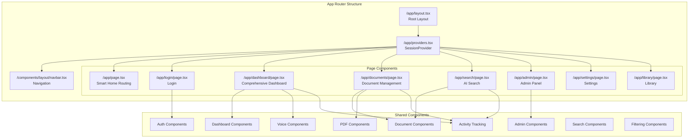
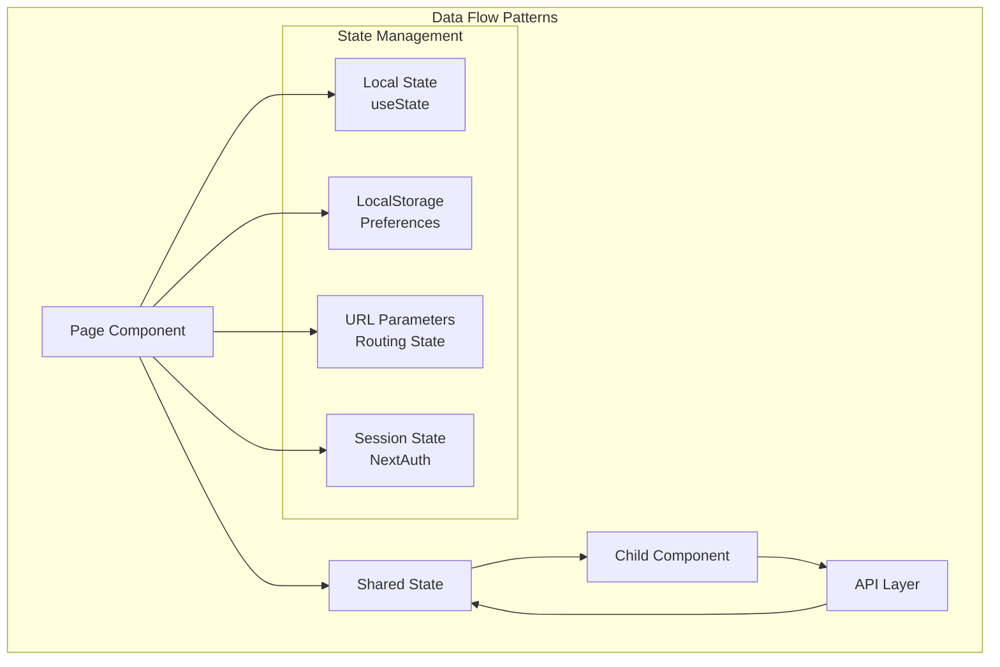

# Component Architecture Documentation

## Overview

The Compliance Hub frontend follows a modern React component architecture built with Next.js 14, emphasizing composition, reusability, and maintainability. The architecture uses a traditional hierarchical component structure with local state management and props-based communication patterns. The UI is enhanced with ShadCN/UI components for a premium, consistent design system with built-in accessibility and animations.

## Frontend Component Hierarchy

### Component Structure Overview



## Page Components

### 1. Core Pages

#### `/app/page.tsx` - Smart Home Routing
- **Purpose**: Intelligent routing based on authentication state
- **Key Features**:
  - Authentication-based routing logic
  - Redirects authenticated users to dashboard
  - Shows landing page for unauthenticated users
  - Server-side session checking
- **Dependencies**: `getServerSession`, `authOptions`, `LandingPage` component

#### `/app/login/page.tsx` - Authentication Page
- **Purpose**: User authentication interface
- **Key Features**:
  - Credential-based login form
  - NextAuth integration
  - Redirect handling after successful login
- **Dependencies**: `LoginForm` component, NextAuth hooks

#### `/app/dashboard/page.tsx` - Comprehensive Dashboard
- **Purpose**: Main user dashboard with activity tracking and quick access
- **Key Features**:
  - Real-time activity tracking with recent documents, searches, and bookmarks
  - Newly added documents notifications
  - Compliance status overview with ShadCN Card components
  - Quick actions center with gradient backgrounds and hover animations
  - State-specific mini-dashboards
  - React Suspense for optimized loading
  - Professional micro-animations and transitions
- **Dependencies**: `ComplianceStatusOverview`, `RecentActivityHub`, `WhatsNewSection`, `QuickActionsCenter`, `StateMiniDashboards`
- **ShadCN Components**: Card, CardContent, CardHeader, CardTitle, Badge, Alert, Button, Tabs, Skeleton
- **Access Control**: Available to all authenticated users

#### `/app/documents/page.tsx` - Document Library
- **Purpose**: Document viewing and browsing interface
- **Key Features**:
  - Document library with multiple view modes (dashboard, table, card)
  - State-based filtering and search
  - Document viewing and citation navigation
  - Automatic document view tracking
  - URL parameter handling for direct document access
  - Responsive design for all user types
- **Dependencies**: `ModernDocumentLibrary`, activity tracking utilities
- **Access Control**: Available to all authenticated users

#### `/app/search/page.tsx` - AI Search Interface
- **Purpose**: AI-powered search with streaming responses
- **Key Features**:
  - Real-time streaming search results with multi-state support
  - State-isolated answer generation for accurate multi-jurisdiction queries
  - Progressive state lifecycle (queued → processing → streaming → complete)
  - Citation processing and linking with support for legal formats [2(3)(a)]
  - Follow-up question support
  - Multi-LLM provider support
  - Automatic search tracking with state information
  - URL parameter handling for search re-runs
  - Immediate UI feedback for multi-state searches
- **Dependencies**: `StreamingMultiStateResults`, `CitationTextViewer`, markdown processing, activity tracking utilities

#### `/app/admin/page.tsx` - Document Administration Interface
- **Purpose**: Admin-only document upload and management
- **Key Features**:
  - Document upload with advanced processing (LlamaIndex)
  - Document collection management
  - Bulk operations and administrative tools
  - Admin-only access with authentication checks
- **Dependencies**: `DocumentList`, `LlamaIndexUploadForm`
- **Access Control**: Restricted to users with `ADMIN` role only

#### `/app/settings/page.tsx` - System Settings Interface
- **Purpose**: Admin-only system configuration and user management
- **Key Features**:
  - RAG configuration options (LLM provider, models, parameters)
  - User management (create, view, delete users)
  - Role assignment (USER/ADMIN)
  - System preferences and configuration
- **Dependencies**: Configuration forms, user management components, state management
- **Access Control**: Restricted to users with `ADMIN` role only

### 2. Role-Based Access Control

The application implements comprehensive role-based access control with two user roles:

#### **USER Role (Standard Users)**
- **Navigation Access**: Dashboard, AI Search, Documents
- **Page Access**: Can view documents, perform searches, access dashboard
- **Restrictions**: Cannot access Admin or Settings pages
- **UI Experience**: Clean interface without admin-specific buttons

#### **ADMIN Role (Administrators)**
- **Navigation Access**: Dashboard, AI Search, Documents, Doc Admin, Settings
- **Page Access**: Full system access including document management and system configuration
- **Special Features**: 
  - User management capabilities
  - Document upload and administration
  - System configuration access
  - Purple "Admin" badge in navbar
- **UI Experience**: Full navigation with shield icons for admin sections

#### **Access Control Implementation**
```typescript
// Component-level access control
const isAdmin = session?.user?.role === 'ADMIN'

// Navigation rendering
{isAdmin && (
  <Link href="/admin">
    <Shield className="h-4 w-4 mr-1" />
    Doc Admin
  </Link>
)}

// Page-level protection
if (session.user.role !== 'ADMIN') {
  return <AccessDeniedComponent />
}
```

#### **Route Protection**
- **Middleware Protection**: `/admin/*`, `/settings/*`, `/api/users/*`, `/api/settings/*`
- **Component Protection**: Admin-only components check user role
- **API Protection**: All admin endpoints verify ADMIN role
- **URL Protection**: Direct URL access shows "Access Denied" for unauthorized users

### 3. Layout Components

#### `/app/layout.tsx` - Root Layout
```typescript
export default function RootLayout({
  children,
}: {
  children: React.ReactNode
}) {
  return (
    <html lang="en">
      <body className={inter.className}>
        <Providers>
          <Navbar />
          {children}
        </Providers>
      </body>
    </html>
  )
}
```

**Key Responsibilities**:
- Global HTML structure
- Provider wrapper integration
- Font and styling setup
- Navigation bar inclusion

#### `/app/providers.tsx` - Context Providers
```typescript
export function Providers({ children }: { children: React.ReactNode }) {
  return (
    <SessionProvider>
      {children}
    </SessionProvider>
  )
}
```

**Key Responsibilities**:
- NextAuth session management
- Global state provider wrapper
- Context distribution to child components

## Shared Component Architecture

### 1. Document Components (`/components/documents/`)

#### Core Document Components

##### `ModernDocumentLibrary` - Main Document Interface
```typescript
interface ModernDocumentLibraryProps {
  refreshKey?: number;
}
```

**Key Features**:
- Multiple view modes (dashboard, table, card)
- Advanced filtering with @mention and #category system
- Toggle between legacy and mention-based filtering modes
- Sorting and pagination
- Favorite documents management
- LocalStorage integration for preferences
- ShadCN Table component for enhanced table view

**Child Components**:
- `DocumentMentionInput`: Advanced filtering with @state and #category mentions
- `CategoryDropdown`: Category selection dropdown
- `CategoryPill`: Visual category tags
- `DocumentViewOptions`: View mode and sorting controls
- `DocumentDashboard`: Dashboard view with statistics
- `DocumentTableView`: Tabular document display with ShadCN Table
- `EnhancedDocumentCard`: Card-based document display

##### `TextViewer` - Document Content Display
```typescript
interface TextViewerProps {
  document: Document;
  highlightText?: string;
  searchText?: string;
  onClose: () => void;
}
```

**Key Features**:
- Text highlighting with search navigation
- Mac-style find functionality (Enter/Shift+Enter)
- Match counter and current match indicator
- Keyboard shortcuts for navigation
- Responsive layout

##### `CitationTextViewer` - Citation-Linked Text Display
```typescript
interface CitationTextViewerProps {
  document: Document;
  citation?: Citation;
  onClose: () => void;
}
```

**Key Features**:
- Citation-specific text display
- Automatic highlighting of cited sections
- Integration with AI search results
- Source document linking

#### Upload Components

##### `EnhancedUploadForm` - Modern Upload Interface
```typescript
interface EnhancedUploadFormProps {
  onUploadSuccess?: () => void;
}
```

**Key Features**:
- Drag-and-drop file upload
- Multi-category selection (verticals, document types)
- Progress tracking and status updates
- Error handling and validation
- State selection integration

##### `LlamaIndexUploadForm` - Admin Upload Interface
```typescript
interface LlamaIndexUploadFormProps {
  onUploadSuccess?: () => void;
}
```

**Key Features**:
- Admin-specific upload functionality
- Advanced categorization options
- Batch processing support
- Enhanced error reporting

### 2. PDF Components (`/components/pdf/`)

#### PDF Viewer Components

##### `PDFViewer` - Main PDF Display
```typescript
interface PDFViewerProps {
  document: Document;
  onClose: () => void;
  highlightText?: string;
}
```

**Key Features**:
- React-PDF integration
- Page navigation and zoom controls
- Text highlighting overlay
- Responsive design
- Loading states and error handling

##### `AnnotatedPDFViewer` - PDF with Annotations
```typescript
interface AnnotatedPDFViewerProps {
  document: Document;
  annotations: Annotation[];
  onAnnotationCreate: (annotation: Annotation) => void;
  onAnnotationUpdate: (annotation: Annotation) => void;
  onAnnotationDelete: (annotationId: string) => void;
}
```

**Key Features**:
- Interactive PDF annotation
- Highlight creation and management
- Annotation sidebar integration
- Coordinate-based positioning
- Multi-user annotation support

##### `AnnotationSidebar` - Annotation Management
```typescript
interface AnnotationSidebarProps {
  annotations: Annotation[];
  onAnnotationSelect: (annotation: Annotation) => void;
  onAnnotationDelete: (annotationId: string) => void;
}
```

**Key Features**:
- Annotation list display
- Annotation filtering and search
- Edit/delete functionality
- User attribution display

### 3. Authentication Components (`/components/auth/`)

##### `LoginForm` - Authentication Form
```typescript
interface LoginFormProps {
  onSuccess?: () => void;
}
```

**Key Features**:
- Credential-based authentication
- Form validation and error handling
- NextAuth integration
- Redirect management
- Loading states

### 4. Dashboard Components (`/components/dashboard/`)

##### `ComplianceStatusOverview` - System Status Dashboard
```typescript
interface ComplianceStatusOverviewProps {
  // Real-time compliance metrics
}
```

**Key Features**:
- Real-time compliance status monitoring with ShadCN Cards
- System health indicators with animated badges
- Processing status overview with color-coded cards
- Visual status indicators with hover effects
- Urgent alerts using ShadCN Alert component
- Professional micro-animations (hover:scale-105, animate-pulse)

**ShadCN Components Used**:
- Card with hover:shadow-md and hover:scale-105 transitions
- Badge with variant support (default, secondary, destructive)
- Alert with custom styling for urgent items
- Color-coded backgrounds (green-50, yellow-50, red-50)

##### `RecentActivityHub` - User Activity Tracking
```typescript
interface RecentActivityHubProps {
  // Real-time activity data
}
```

**Key Features**:
- Tabbed interface using ShadCN Tabs component
- Recent document views with automatic tracking
- Search history with state information and re-run capability
- Bookmark management with persistence
- Real-time data fetching from activity APIs
- Interactive elements with hover animations
- Loading states with ShadCN Skeleton component

**ShadCN Implementation**:
- Tabs, TabsContent, TabsList, TabsTrigger for navigation
- Card components for each activity item
- Badge components for counts and metadata
- Skeleton loaders for async content
- Consistent hover effects across all items

##### `WhatsNewSection` - New Documents Display
```typescript
interface WhatsNewSectionProps {
  // Newly added documents
}
```

**Key Features**:
- Recently added documents by administrators
- Real-time document notifications
- Regulatory changes and updates
- Trending topics and deadlines

##### `QuickActionsCenter` - Action Hub
```typescript
interface QuickActionsCenterProps {
  // User role-based actions
}
```

**Key Features**:
- Role-based quick actions with premium styling
- Direct access to common functions
- Upload shortcuts for admins
- Search shortcuts with document counts
- Gradient backgrounds (from-white to-gray-50)
- Hover animations and transitions

**ShadCN Styling**:
- Button components with group hover effects
- Gradient backgrounds on hover (hover:from-indigo-50 hover:to-blue-50)
- Icon containers with color transitions
- Badge components for search result counts
- Professional spacing and micro-animations

##### `StateMiniDashboards` - State-Specific Information
```typescript
interface StateMiniDashboardsProps {
  // State-specific data
}
```

**Key Features**:
- State-specific compliance information
- Jurisdiction-aware data display
- State filtering and navigation
- Compliance deadlines by state

### 5. Voice Assistant Components (`/components/voice/`)

##### `VoiceAssistantElevenLabs` - Voice Interface
```typescript
interface VoiceAssistantProps {
  className?: string;
}
```

**Key Features**:
- Native ElevenLabs ConvAI widget integration
- Authentication-based rendering
- Dynamic script loading
- CSP-compliant security configuration
- Seamless voice interaction capabilities

### 6. Search Components (`/components/search/`)

##### `StreamingMultiStateResults` - Multi-State Search Display
```typescript
interface StreamingMultiStateResultsProps {
  query: string;
  onClose: () => void;
}
```

**Key Features**:
- State-isolated answer generation
- Progressive state lifecycle visualization
- Real-time streaming with immediate UI feedback
- Collapsible citations with legal format support
- Color-coded state sections with consistent colors
- Follow-up question input
- Markdown rendering with proper formatting

**State Lifecycle**:
1. `queued` - State added to processing queue
2. `processing` - Actively searching state documents
3. `streaming` - Receiving and displaying results
4. `complete` - State search finished

### 7. Filtering Components (`/components/documents/`)

##### `DocumentMentionInput` - Advanced Filtering Interface
```typescript
interface DocumentMentionInputProps {
  value: string;
  onChange: (value: string) => void;
  states: State[];
  verticals: Vertical[];
  documentTypes: DocumentType[];
}
```

**Key Features**:
- @mention support for state filtering
- #category support for vertical and document type filtering
- Dropdown suggestions with keyboard navigation
- Visual pills for selected filters
- Toggle between mention and legacy modes

### 8. Activity Tracking Library (`/lib/tracking.ts`)

##### Tracking Utilities
```typescript
// Document tracking
export const trackDocumentView = async (documentId: string, title: string, state?: string, type?: string) => Promise<void>

// Search tracking
export const trackSearch = async (query: string, resultsCount: number, searchType: string, states?: string) => Promise<void>

// Bookmark management
export const addBookmark = async (documentId: string, title: string, state?: string, type?: string) => Promise<object>
export const removeBookmark = async (documentId: string) => Promise<object>
export const isBookmarked = async (documentId: string) => Promise<boolean>
```

**Key Features**:
- Document view tracking with metadata
- Search history with state information
- Bookmark management with persistence
- Error handling and retry logic
- API integration for user activity

## ShadCN/UI Integration

### Component Library Setup

The application uses ShadCN/UI components for a consistent, accessible design system:

```typescript
// Core ShadCN components in use
import { Card, CardContent, CardHeader, CardTitle } from '@/components/ui/card'
import { Button } from '@/components/ui/button'
import { Badge } from '@/components/ui/badge'
import { Alert, AlertDescription, AlertTitle } from '@/components/ui/alert'
import { Tabs, TabsContent, TabsList, TabsTrigger } from '@/components/ui/tabs'
import { Table, TableBody, TableCell, TableHead, TableHeader, TableRow } from '@/components/ui/table'
import { Skeleton } from '@/components/ui/skeleton'
import { Input } from '@/components/ui/input'
import { Select, SelectContent, SelectItem, SelectTrigger, SelectValue } from '@/components/ui/select'
```

### Design System Patterns

#### Consistent Hover Effects
```css
/* Card hover effects */
.card-hover {
  @apply transition-all duration-200 hover:shadow-md hover:scale-105;
}

/* Button group hover */
.button-group-hover {
  @apply group transition-all duration-200 hover:shadow-md hover:scale-105 
         border-gray-200 hover:border-indigo-200 
         bg-white hover:bg-gradient-to-r hover:from-indigo-50 hover:to-blue-50;
}
```

#### Color-Coded States
```typescript
// Consistent color assignment for states
const stateColors = {
  'CA': 'blue',
  'NY': 'green',
  'TX': 'purple',
  'FL': 'orange',
  // ... deterministic color mapping
}
```

## Component Interaction Patterns

### 1. Data Flow Architecture



### 2. Communication Patterns

#### Parent-Child Communication
```typescript
// Parent Component
const [documents, setDocuments] = useState<Document[]>([]);
const [selectedState, setSelectedState] = useState<string>('');

// Child Component Props
<StateSelector
  selectedState={selectedState}
  onStateChange={setSelectedState}
  favoriteStates={favoriteStates}
/>

// Child Component Implementation
interface StateSelectorProps {
  selectedState: string;
  onStateChange: (state: string) => void;
  favoriteStates: string[];
}
```

#### Callback Pattern for Actions
```typescript
// Upload Form Success Callback
<EnhancedUploadForm
  onUploadSuccess={() => {
    fetchDocuments(); // Refresh document list
    showSuccessMessage(); // Show feedback
  }}
/>
```

#### Event Handling Pattern
```typescript
// Search Component Event Flow
const handleSearch = async (e: React.FormEvent) => {
  e.preventDefault();
  setLoading(true);
  setAnswer('');
  
  try {
    const response = await fetch('/api/search-citations-stream', {
      method: 'POST',
      headers: { 'Content-Type': 'application/json' },
      body: JSON.stringify({ query, selectedStates })
    });
    
    // Process streaming response
    const reader = response.body?.getReader();
    // ... streaming logic
  } catch (error) {
    setError('Search failed');
  } finally {
    setLoading(false);
  }
};
```

### 3. State Management Strategies

#### Local State Management
```typescript
// Component State Pattern
const [documents, setDocuments] = useState<Document[]>([]);
const [loading, setLoading] = useState(true);
const [error, setError] = useState<string>('');
const [filters, setFilters] = useState({
  state: '',
  category: '',
  searchTerm: ''
});
```

#### LocalStorage Integration
```typescript
// Preference Persistence
const [favoriteStates, setFavoriteStates] = useState<string[]>(() => {
  const saved = localStorage.getItem('compliance-hub-favorite-states');
  return saved ? JSON.parse(saved) : [];
});

useEffect(() => {
  localStorage.setItem('compliance-hub-favorite-states', JSON.stringify(favoriteStates));
}, [favoriteStates]);
```

#### URL State Management
```typescript
// Search params for shareable state
const searchParams = useSearchParams();
const router = useRouter();

const updateURL = (params: Record<string, string>) => {
  const newParams = new URLSearchParams(searchParams);
  Object.entries(params).forEach(([key, value]) => {
    newParams.set(key, value);
  });
  router.push(`${pathname}?${newParams.toString()}`);
};
```

## API Integration Patterns

### 1. RESTful API Integration

#### Document Operations
```typescript
// Document CRUD Operations
const fetchDocuments = async () => {
  const response = await fetch('/api/documents/v2');
  const data = await response.json();
  return data.documents;
};

const uploadDocument = async (formData: FormData) => {
  const response = await fetch('/api/documents/upload', {
    method: 'POST',
    body: formData
  });
  return response.json();
};
```

#### Search Operations
```typescript
// Streaming Search API
const searchWithStreaming = async (query: string) => {
  const response = await fetch('/api/search-citations-stream', {
    method: 'POST',
    headers: { 'Content-Type': 'application/json' },
    body: JSON.stringify({ query, selectedStates })
  });
  
  const reader = response.body?.getReader();
  const decoder = new TextDecoder();
  
  while (true) {
    const { done, value } = await reader.read();
    if (done) break;
    
    const chunk = decoder.decode(value);
    // Process streaming chunk
  }
};
```

### 2. Error Handling Patterns

#### Component Error Boundaries
```typescript
// Error State Management
const [error, setError] = useState<string>('');

const handleError = (error: unknown) => {
  const message = error instanceof Error ? error.message : 'An error occurred';
  setError(message);
  console.error('Component error:', error);
};

// Error Display
{error && (
  <div className="bg-red-50 border border-red-200 text-red-700 px-4 py-3 rounded">
    {error}
  </div>
)}
```

#### Async Operation Error Handling
```typescript
const performAsyncOperation = async () => {
  try {
    setLoading(true);
    setError('');
    const result = await apiCall();
    setData(result);
  } catch (error) {
    setError(error instanceof Error ? error.message : 'Operation failed');
  } finally {
    setLoading(false);
  }
};
```

## Performance Optimization Patterns

### 1. Component Optimization

#### Memoization Strategies
```typescript
// Expensive calculations
const sortedDocuments = useMemo(() => {
  return documents.sort((a, b) => {
    switch (sortConfig.key) {
      case 'title':
        return sortConfig.direction === 'asc' 
          ? a.title.localeCompare(b.title)
          : b.title.localeCompare(a.title);
      // ... other cases
    }
  });
}, [documents, sortConfig]);

// Event handler memoization
const handleDocumentSelect = useCallback((document: Document) => {
  setSelectedDocument(document);
  onDocumentSelect?.(document);
}, [onDocumentSelect]);
```

#### Lazy Loading
```typescript
// Component lazy loading
const PDFViewer = lazy(() => import('./pdf-viewer'));

// Conditional rendering with Suspense
{showPDFViewer && (
  <Suspense fallback={<div>Loading PDF...</div>}>
    <PDFViewer document={selectedDocument} />
  </Suspense>
)}
```

### 2. Data Loading Optimization

#### Debounced Search
```typescript
const [searchTerm, setSearchTerm] = useState('');
const debouncedSearchTerm = useDeferredValue(searchTerm);

useEffect(() => {
  if (debouncedSearchTerm.length >= 3) {
    performSearch(debouncedSearchTerm);
  }
}, [debouncedSearchTerm]);
```

#### Pagination and Virtual Scrolling
```typescript
// Pagination state
const [currentPage, setCurrentPage] = useState(1);
const [pageSize] = useState(20);

// Paginated data
const paginatedDocuments = useMemo(() => {
  const start = (currentPage - 1) * pageSize;
  const end = start + pageSize;
  return sortedDocuments.slice(start, end);
}, [sortedDocuments, currentPage, pageSize]);
```

## Testing Patterns

### 1. Component Testing Strategy

#### Unit Test Structure
```typescript
// Component test example
describe('DocumentLibrary', () => {
  test('renders document list correctly', () => {
    render(<DocumentLibrary documents={mockDocuments} />);
    expect(screen.getByText('Document Library')).toBeInTheDocument();
  });
  
  test('filters documents by state', () => {
    render(<DocumentLibrary documents={mockDocuments} />);
    fireEvent.change(screen.getByLabelText('State'), { target: { value: 'NY' } });
    expect(screen.getByText('New York Document')).toBeInTheDocument();
  });
});
```

#### Integration Testing
```typescript
// API integration tests
test('document upload flow', async () => {
  const mockUpload = jest.fn();
  render(<UploadForm onUploadSuccess={mockUpload} />);
  
  const file = new File(['content'], 'test.pdf', { type: 'application/pdf' });
  fireEvent.change(screen.getByLabelText('Upload File'), { target: { files: [file] } });
  fireEvent.click(screen.getByText('Upload'));
  
  await waitFor(() => {
    expect(mockUpload).toHaveBeenCalled();
  });
});
```

## Security Considerations

### 1. Authentication Integration

#### Protected Route Pattern
```typescript
// Page-level authentication
export default function ProtectedPage() {
  const { data: session, status } = useSession();
  
  if (status === 'loading') return <LoadingSpinner />;
  if (status === 'unauthenticated') redirect('/login');
  
  return <PageContent />;
}
```

#### Role-Based Access Control
```typescript
// Component-level access control
const AdminOnlyComponent = () => {
  const { data: session } = useSession();
  
  if (session?.user?.role !== 'ADMIN') {
    return <UnauthorizedMessage />;
  }
  
  return <AdminInterface />;
};
```

### 2. Data Validation

#### Input Sanitization
```typescript
// Form validation
const validateInput = (input: string) => {
  // Sanitize HTML
  const sanitized = input.replace(/<[^>]*>/g, '');
  
  // Validate length
  if (sanitized.length > 1000) {
    throw new Error('Input too long');
  }
  
  return sanitized;
};
```

---

*This component architecture documentation provides comprehensive coverage of the frontend structure and patterns. For specific implementation details, refer to the individual component files and their TypeScript interfaces.*