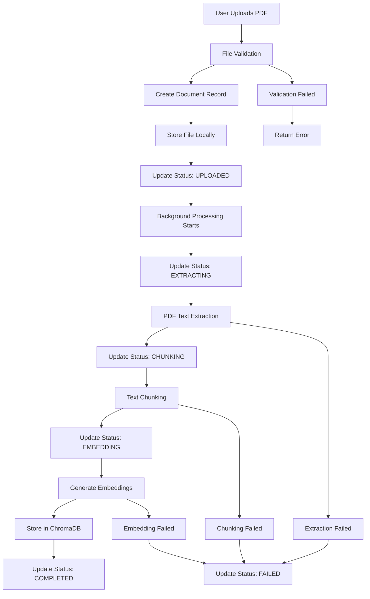
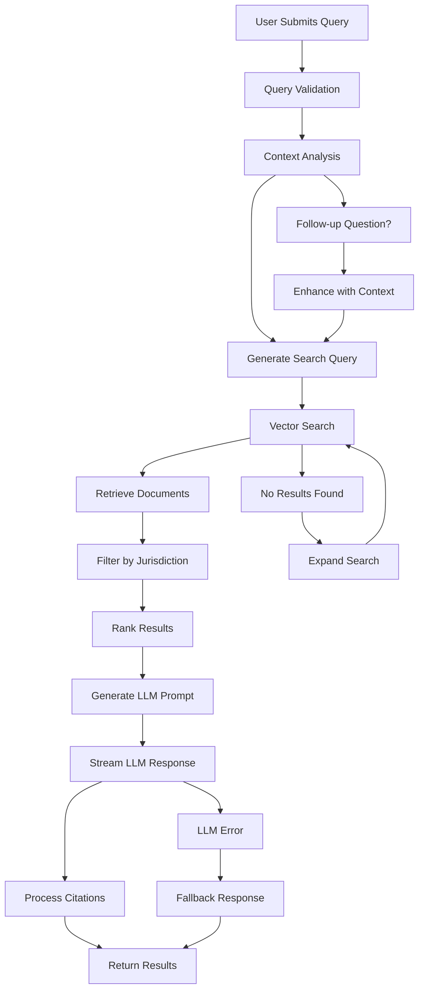
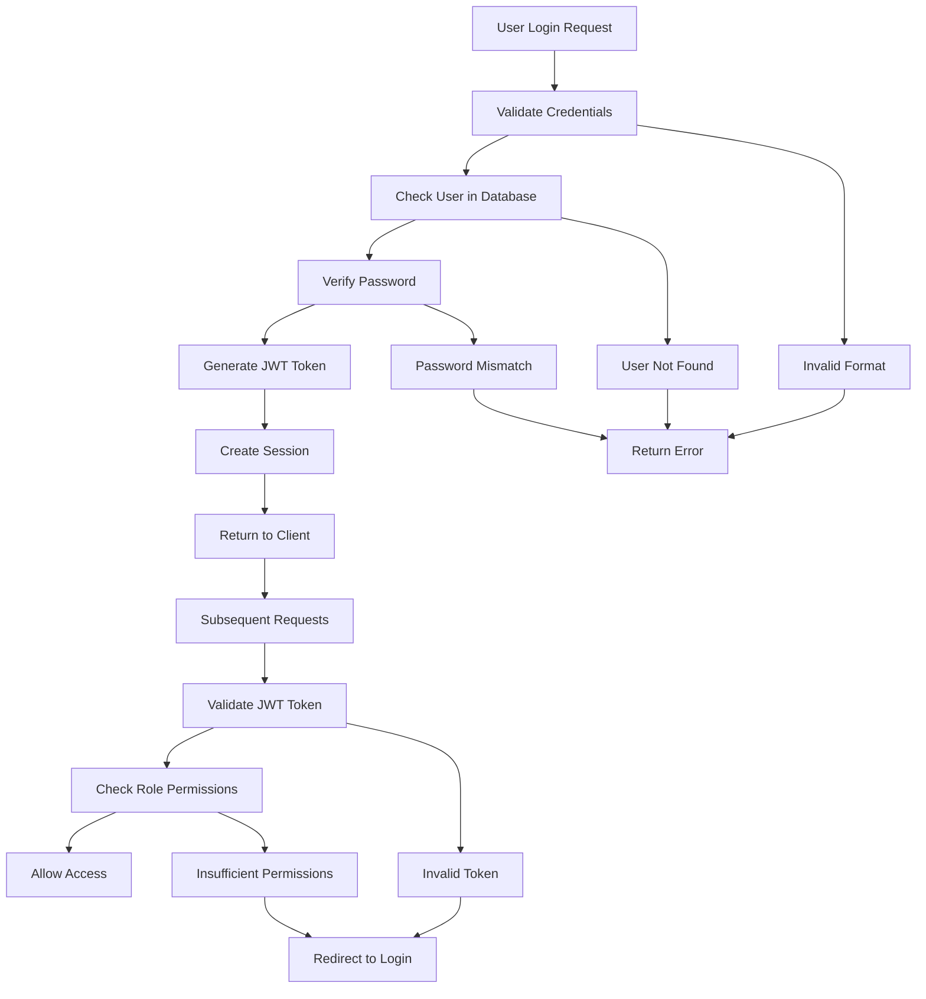
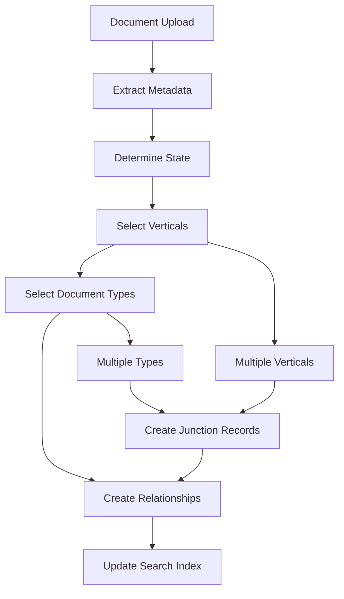
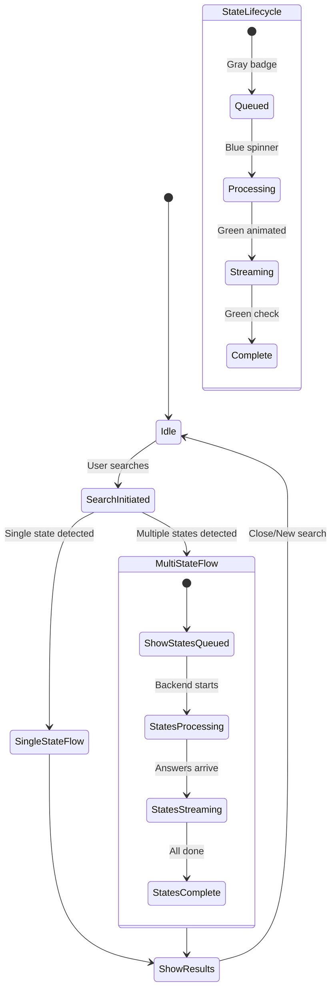
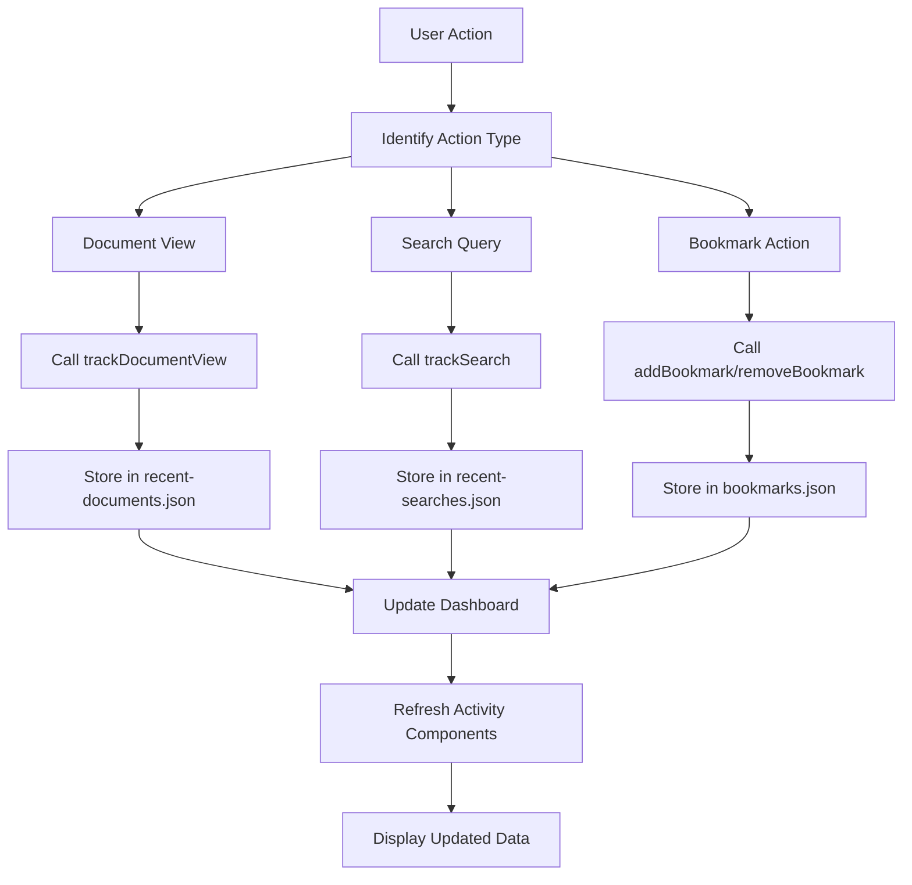
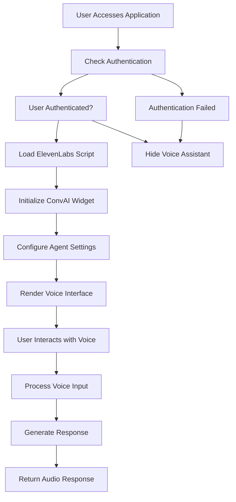
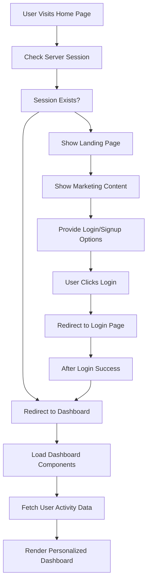
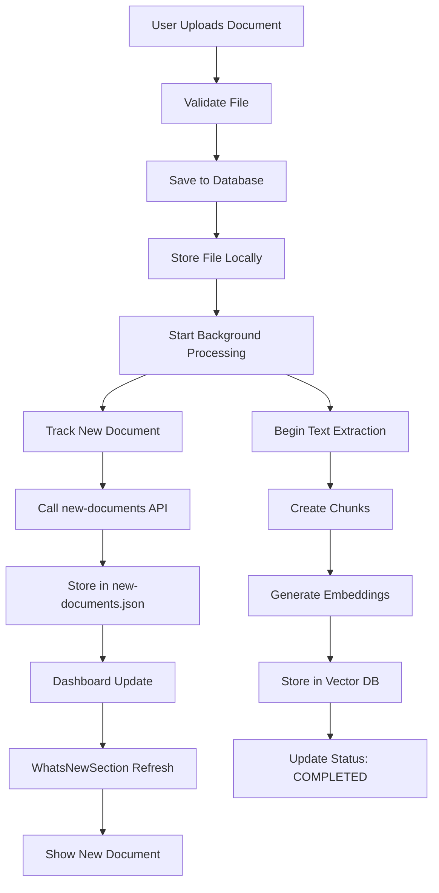
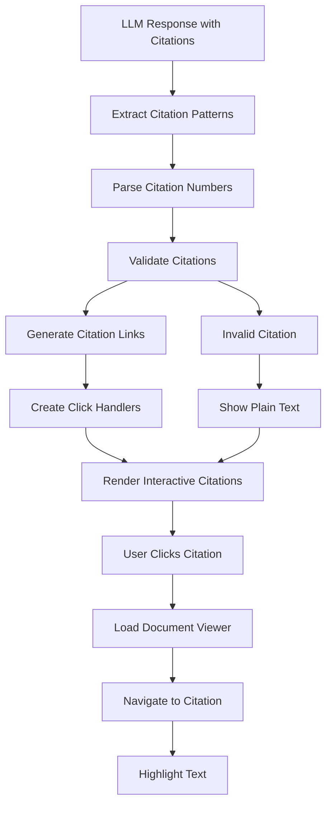

# Core Workflows & Business Logic Documentation

## Overview

The Compliance Hub operates through several interconnected workflows that handle document processing, AI-powered search, and user interactions. This document details the core business processes and their implementation.

## Primary Workflows

### 1. Document Upload & Processing Workflow

The document processing workflow is the foundation of the system, transforming uploaded PDF documents into searchable, AI-ready content.



#### Phase 1: Upload & Validation
```typescript
// Document upload process
async function uploadDocument(file: File, metadata: DocumentMetadata): Promise<DocumentResult> {
  // 1. Validate file type and size
  if (!file.type.includes('pdf')) {
    throw new Error('Only PDF files are supported');
  }
  
  if (file.size > MAX_FILE_SIZE) {
    throw new Error('File size exceeds maximum limit');
  }
  
  // 2. Create database record
  const document = await prisma.document.create({
    data: {
      title: metadata.title,
      description: metadata.description,
      state: metadata.state,
      uploadedBy: metadata.userId,
      filePath: generateFilePath(file.name),
      fileSize: file.size,
      processingStatus: 'UPLOADED',
      processingProgress: 0
    }
  });
  
  // 3. Store file locally
  await saveFile(file, document.filePath);
  
  // 4. Trigger background processing
  await triggerBackgroundProcessing(document.id);
  
  return document;
}
```

#### Phase 2: Background Processing
```typescript
async function processDocument(documentId: string): Promise<void> {
  try {
    // Update status to EXTRACTING
    await updateDocumentStatus(documentId, 'EXTRACTING', 10);
    
    // Extract text from PDF
    const extractedText = await extractTextFromPDF(filePath);
    
    // Update status to CHUNKING
    await updateDocumentStatus(documentId, 'CHUNKING', 30);
    
    // Create text chunks
    const chunks = await createTextChunks(extractedText);
    
    // Update status to EMBEDDING
    await updateDocumentStatus(documentId, 'EMBEDDING', 60);
    
    // Generate embeddings
    const embeddings = await generateEmbeddings(chunks);
    
    // Store in ChromaDB
    const vectorId = await storeInVectorDB(embeddings, documentId);
    
    // Update status to COMPLETED
    await updateDocumentStatus(documentId, 'COMPLETED', 100, {
      content: extractedText,
      vectorId: vectorId,
      totalChunks: chunks.length
    });
    
  } catch (error) {
    await updateDocumentStatus(documentId, 'FAILED', 0, {
      processingError: error.message
    });
  }
}
```

#### Error Handling & Recovery
- **Validation Errors**: Immediate user feedback with specific error messages
- **Processing Failures**: Automatic retry mechanism with exponential backoff
- **Partial Processing**: Resume from last successful step
- **Status Tracking**: Real-time progress updates for user feedback

### 2. AI Search Workflow

The AI search workflow combines vector search with large language models to provide intelligent, citation-backed responses.



#### Phase 1: Query Processing
```typescript
async function processSearchQuery(query: string, context?: SearchContext): Promise<SearchResult> {
  // 1. Validate query
  if (!query || query.trim().length < 3) {
    throw new Error('Query must be at least 3 characters long');
  }
  
  // 2. Enhance query with context (for follow-up questions)
  let enhancedQuery = query;
  if (context?.previousQuery) {
    enhancedQuery = await enhanceQueryWithContext(query, context);
  }
  
  // 3. Generate embedding for vector search
  const queryEmbedding = await generateQueryEmbedding(enhancedQuery);
  
  // 4. Perform vector search
  const vectorResults = await searchVectorDB(queryEmbedding, {
    limit: 10,
    threshold: 0.7
  });
  
  return { enhancedQuery, vectorResults };
}
```

#### Phase 2: LLM Processing
```typescript
async function generateAIResponse(query: string, documents: Document[]): Promise<StreamingResponse> {
  // 1. Create context-aware prompt
  const prompt = createRAGPrompt(query, documents);
  
  // 2. Stream LLM response
  const stream = await streamLLMResponse(prompt);
  
  // 3. Process streaming response
  return processStreamingResponse(stream, documents);
}

function createRAGPrompt(query: string, documents: Document[]): string {
  return `
    You are a regulatory compliance expert for sports betting and online gaming.
    
    Query: ${query}
    
    Context Documents:
    ${documents.map((doc, index) => `
      [${index + 1}] ${doc.title} (${doc.state})
      ${doc.content}
    `).join('\n')}
    
    Instructions:
    1. Provide accurate information based solely on the provided documents
    2. Include citation numbers [1], [2], etc. for all factual claims
    3. Be specific about jurisdictional differences
    4. If information is not available, clearly state this
  `;
}
```

#### Phase 3: Citation Processing
```typescript
async function processCitations(response: string, documents: Document[]): Promise<ProcessedResponse> {
  // 1. Extract citation patterns
  const citationPattern = /\[\s*([0-9,\s]+)\s*\]/g;
  const citations = [];
  
  // 2. Process each citation
  let match;
  while ((match = citationPattern.exec(response)) !== null) {
    const citationNumbers = match[1].split(',').map(n => parseInt(n.trim()));
    
    for (const num of citationNumbers) {
      if (num > 0 && num <= documents.length) {
        citations.push({
          number: num,
          document: documents[num - 1],
          snippet: extractRelevantSnippet(documents[num - 1], response)
        });
      }
    }
  }
  
  // 3. Return processed response with citations
  return {
    answer: response,
    citations: citations,
    documents: documents
  };
}
```

### 3. User Authentication & Authorization Workflow

The authentication workflow ensures secure access to the system with role-based permissions.



#### Authentication Logic
```typescript
async function authenticateUser(email: string, password: string): Promise<AuthResult> {
  // 1. Find user in database
  const user = await prisma.user.findUnique({
    where: { email }
  });
  
  if (!user) {
    throw new Error('Invalid credentials');
  }
  
  // 2. Verify password
  const isValid = await bcrypt.compare(password, user.password);
  
  if (!isValid) {
    throw new Error('Invalid credentials');
  }
  
  // 3. Generate JWT token
  const token = jwt.sign(
    { 
      userId: user.id, 
      email: user.email, 
      role: user.role 
    },
    JWT_SECRET,
    { expiresIn: '24h' }
  );
  
  return {
    user: {
      id: user.id,
      email: user.email,
      name: user.name,
      role: user.role
    },
    token
  };
}
```

#### Authorization Middleware
```typescript
function requireRole(requiredRole: UserRole) {
  return async (req: NextRequest, context: any) => {
    // 1. Extract and validate token
    const token = extractTokenFromHeader(req);
    
    if (!token) {
      return unauthorizedResponse();
    }
    
    // 2. Decode and verify token
    const decoded = jwt.verify(token, JWT_SECRET) as TokenPayload;
    
    // 3. Check role permissions
    if (decoded.role !== requiredRole && decoded.role !== 'ADMIN') {
      return forbiddenResponse();
    }
    
    // 4. Add user to request context
    context.user = decoded;
    
    return null; // Allow request to proceed
  };
}
```

### 4. Document Categorization Workflow

The categorization workflow organizes documents across multiple dimensions for efficient filtering and search.



#### Categorization Logic
```typescript
async function categorizeDocument(documentId: string, categorization: DocumentCategorization): Promise<void> {
  // 1. Create vertical relationships
  for (const verticalId of categorization.verticals) {
    await prisma.documentVertical.create({
      data: {
        documentId,
        verticalId
      }
    });
  }
  
  // 2. Create document type relationships
  for (const typeId of categorization.documentTypes) {
    await prisma.documentDocumentType.create({
      data: {
        documentId,
        documentTypeId: typeId
      }
    });
  }
  
  // 3. Update document with state information
  await prisma.document.update({
    where: { id: documentId },
    data: {
      state: categorization.state
    }
  });
}
```

### 5. Progressive UI State Management

The UI now implements progressive state management for optimal user experience during multi-state searches.



#### Progressive Loading Implementation
```typescript
// Immediate UI feedback for multi-state
if (isMultiState) {
  setLoading(false) // Hide generic spinner immediately
  
  // Initialize UI with all states in queued status
  setMultiStateResult({
    query: searchQuery,
    stateAnswers: states.map(state => ({
      state,
      answer: '',
      citations: [],
      sourceCount: 0,
      status: 'queued' // Visual indicator
    }))
  })
}

// Update states progressively
function handleStateEvent(event: StateSearchEvent) {
  switch (event.type) {
    case 'state-processing':
      updateStateStatus(event.state, 'processing')
      break
      
    case 'state-answer':
      updateStateAnswer(event.state, {
        answer: event.answer,
        citations: event.citations,
        sourceCount: event.sourceCount,
        status: 'streaming'
      })
      break
      
    case 'state-complete':
      updateStateStatus(event.state, 'complete')
      break
  }
}
```

### 6. Dashboard Activity Tracking Workflow

The dashboard activity tracking workflow monitors user interactions and provides real-time updates to the comprehensive dashboard.



#### Activity Tracking Implementation
```typescript
// Document view tracking
async function trackDocumentView(documentId: string, title: string, state?: string, type?: string): Promise<void> {
  try {
    await fetch('/api/user/recent-documents', {
      method: 'POST',
      headers: { 'Content-Type': 'application/json' },
      body: JSON.stringify({ documentId, title, state, type })
    });
  } catch (error) {
    console.error('Error tracking document view:', error);
  }
}

// Search tracking with state information
async function trackSearch(query: string, resultsCount: number, searchType: string, states?: string): Promise<void> {
  try {
    await fetch('/api/user/recent-searches', {
      method: 'POST',
      headers: { 'Content-Type': 'application/json' },
      body: JSON.stringify({ query, resultsCount, searchType, states })
    });
  } catch (error) {
    console.error('Error tracking search:', error);
  }
}

// Bookmark management
async function addBookmark(documentId: string, title: string, state?: string, type?: string): Promise<void> {
  try {
    const response = await fetch('/api/user/bookmarks', {
      method: 'POST',
      headers: { 'Content-Type': 'application/json' },
      body: JSON.stringify({ documentId, title, state, type })
    });
    
    if (!response.ok) {
      throw new Error('Failed to add bookmark');
    }
  } catch (error) {
    console.error('Error adding bookmark:', error);
    throw error;
  }
}
```

#### Dashboard Data Flow
```typescript
// Dashboard components fetch real-time data
async function fetchRecentActivity(): Promise<void> {
  try {
    const [docsResponse, searchesResponse, bookmarksResponse] = await Promise.all([
      fetch('/api/user/recent-documents'),
      fetch('/api/user/recent-searches'),
      fetch('/api/user/bookmarks')
    ]);

    const [docs, searches, bookmarks] = await Promise.all([
      docsResponse.json(),
      searchesResponse.json(),
      bookmarksResponse.json()
    ]);

    // Update dashboard components
    updateRecentDocuments(docs.recent);
    updateRecentSearches(searches.recent);
    updateBookmarks(bookmarks.bookmarks);
  } catch (error) {
    console.error('Error fetching recent activity:', error);
  }
}
```

### 6. Voice Assistant Integration Workflow

The voice assistant workflow integrates ElevenLabs ConvAI widget for hands-free regulatory research.



#### Voice Assistant Implementation
```typescript
// Voice assistant component with authentication
export function VoiceAssistantElevenLabs({ className = '' }: VoiceAssistantProps) {
  const { data: session } = useSession();

  // Load ElevenLabs script dynamically
  useEffect(() => {
    if (typeof window !== 'undefined' && !document.querySelector('script[src*="convai-widget-embed"]')) {
      const script = document.createElement('script');
      script.src = 'https://unpkg.com/@elevenlabs/convai-widget-embed';
      script.async = true;
      script.type = 'text/javascript';
      document.head.appendChild(script);
    }
  }, []);

  // Only render for authenticated users
  if (!session?.user) {
    return null;
  }

  return (
    <div className={`${className}`}>
      <elevenlabs-convai agent-id="agent_01k09mvx7aepg9zy3w59k327ye"></elevenlabs-convai>
    </div>
  );
}
```

#### CSP Configuration for Voice Assistant
```javascript
// next.config.js - Updated CSP for ElevenLabs integration
const nextConfig = {
  async headers() {
    return [
      {
        source: '/:path*',
        headers: [
          {
            key: 'Content-Security-Policy',
            value: "default-src 'self'; script-src 'self' 'unsafe-inline' 'unsafe-eval' https://unpkg.com blob: data:; connect-src 'self' https://api.openai.com wss://api.openai.com https://*.anthropic.com https://*.elevenlabs.io wss://*.elevenlabs.io; style-src 'self' 'unsafe-inline'; img-src 'self' data: blob: https://*.googleapis.com https://*.elevenlabs.io; font-src 'self'; media-src 'self' blob: data:; frame-src 'self' https://*.elevenlabs.io; worker-src 'self' blob: data:;"
          }
        ]
      }
    ];
  }
};
```

### 7. Smart Home Routing Workflow

The smart home routing workflow provides authentication-based navigation experience.



#### Smart Routing Implementation
```typescript
// Smart home page routing
export default async function Home() {
  // Check authentication on server side
  const session = await getServerSession(authOptions);
  
  // Redirect authenticated users to dashboard
  if (session?.user) {
    redirect('/dashboard');
  }
  
  // Show landing page for unauthenticated users
  return <LandingPage />;
}
```

### 8. Document Upload with Automatic Tracking Workflow

The enhanced document upload workflow includes automatic tracking for dashboard notifications.



#### Enhanced Upload Implementation
```typescript
// Upload with automatic tracking
async function uploadDocument(file: File, metadata: DocumentMetadata): Promise<DocumentResult> {
  // Standard upload process
  const document = await createDocumentRecord(metadata);
  await saveFile(file, document.filePath);
  
  // Track new document for dashboard
  try {
    await fetch('/api/user/new-documents', {
      method: 'POST',
      headers: { 'Content-Type': 'application/json' },
      body: JSON.stringify({
        documentId: document.id,
        title: document.title,
        state: document.state,
        type: metadata.type,
        internal: true // Bypass authentication for server-to-server calls
      })
    });
  } catch (error) {
    console.error('Failed to track document addition:', error);
  }
  
  // Trigger background processing
  await triggerBackgroundProcessing(document.id);
  
  return document;
}
```

### 9. Citation Management Workflow

The citation management workflow links search results to specific document locations with precision.



#### Citation Processing
```typescript
function processCitations(answer: string, documents: Document[]): ProcessedAnswer {
  const citationRegex = /\[\s*([0-9,\s]+)\s*\]/g;
  const processedParts = [];
  let lastIndex = 0;
  
  let match;
  while ((match = citationRegex.exec(answer)) !== null) {
    // Add text before citation
    if (match.index > lastIndex) {
      processedParts.push(answer.substring(lastIndex, match.index));
    }
    
    // Process citation numbers
    const citationNumbers = match[1]
      .split(',')
      .map(num => parseInt(num.trim()))
      .filter(num => !isNaN(num));
    
    // Create clickable citation links
    const citationLinks = citationNumbers.map(num => {
      const citationIndex = num - 1;
      
      if (citationIndex >= 0 && citationIndex < documents.length) {
        return createCitationLink(num, documents[citationIndex]);
      }
      
      return createPlainCitation(num);
    });
    
    processedParts.push(createCitationGroup(citationLinks));
    lastIndex = match.index + match[0].length;
  }
  
  // Add remaining text
  if (lastIndex < answer.length) {
    processedParts.push(answer.substring(lastIndex));
  }
  
  return {
    processedAnswer: processedParts,
    citationCount: getCitationCount(answer)
  };
}
```

## Business Rules & Constraints

### Document Management Rules
1. **File Format**: Only PDF files are accepted
2. **File Size**: Maximum 50MB per document
3. **State Assignment**: Each document must be assigned to exactly one state
4. **Categorization**: Documents must have at least one vertical and one document type
5. **Processing Status**: Documents must complete processing before being searchable

### Search Rules
1. **Minimum Query Length**: Queries must be at least 3 characters
2. **Result Limits**: Maximum 10 documents per search
3. **Citation Validation**: All citations must reference valid documents
4. **Jurisdictional Filtering**: Results filtered by selected states
5. **Response Streaming**: All responses must be streamed for real-time feedback

### User Access Rules
1. **Role-Based Access**: Admin users have full access, regular users have limited access
2. **Document Upload**: Only authenticated users can upload documents
3. **Search Access**: All authenticated users can perform searches
4. **Administrative Functions**: Only admin users can manage system settings

### Data Integrity Rules
1. **Referential Integrity**: All foreign keys must reference valid records
2. **Unique Constraints**: Email addresses and system names must be unique
3. **Cascade Deletes**: Related records are cleaned up when documents are deleted
4. **Audit Trail**: All user actions are logged for compliance

## Error Handling Strategies

### Document Processing Errors
- **Validation Errors**: Immediate user feedback with specific messages
- **Processing Failures**: Automatic retry with exponential backoff
- **Partial Failures**: Resume processing from last successful step
- **Resource Constraints**: Queue management for concurrent processing

### Search Errors
- **No Results**: Suggest query refinements and related searches
- **LLM Failures**: Fallback to basic search results
- **Citation Errors**: Display uncited information with warnings
- **Streaming Interruptions**: Graceful recovery and continuation

### System Errors
- **Database Errors**: Connection pooling and retry logic
- **Authentication Failures**: Clear error messages and recovery paths
- **File System Errors**: Backup storage and recovery procedures
- **External API Errors**: Fallback providers and degraded functionality

---

*This workflow documentation provides comprehensive coverage of the core business processes. For implementation details, refer to the service layer and API documentation.*