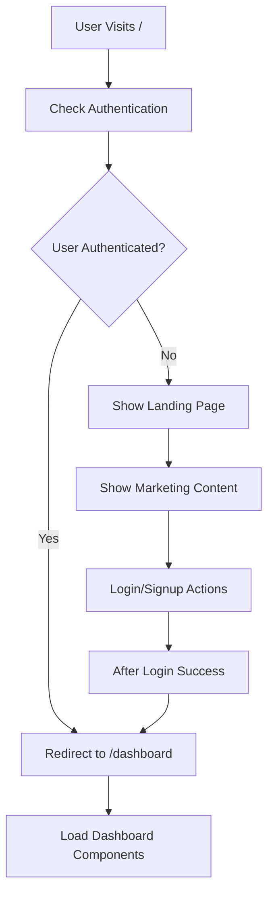
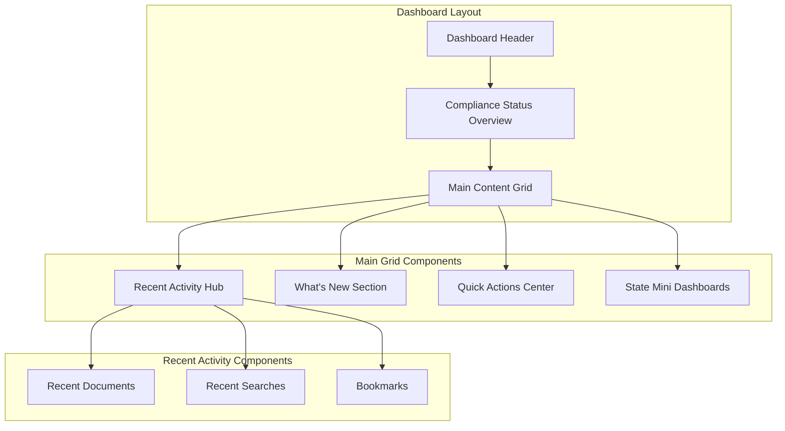

# Dashboard System Documentation

## Overview

The Compliance Hub dashboard system provides a comprehensive, real-time overview of user activity, compliance status, and quick access to frequently used features. The dashboard is designed to be the central hub for all user interactions once they log into the application. The UI has been enhanced with ShadCN/UI components for a premium, professional appearance with consistent animations and interactions.

## Dashboard Architecture

### Smart Home Routing

The dashboard system implements intelligent routing based on user authentication status:



### Dashboard Components Architecture



## Dashboard Components

### 1. Dashboard Page (`/app/dashboard/page.tsx`)

The main dashboard page implements server-side rendering with React Suspense for optimal performance:

```typescript
export default async function DashboardPage() {
  const session = await getServerSession(authOptions);
  
  return (
    <div className="max-w-7xl mx-auto px-4 sm:px-6 lg:px-8 py-8">
      {/* Personalized Header */}
      <div className="mb-8">
        <h1 className="text-3xl font-bold text-gray-900">
          Welcome back, {session?.user?.email?.split('@')[0] || 'User'}
        </h1>
        <p className="mt-2 text-gray-600">
          Here's your compliance overview and recent activity
        </p>
      </div>

      {/* Compliance Status Overview */}
      <Suspense fallback={<div className="h-32 bg-gray-100 rounded-lg animate-pulse mb-8" />}>
        <ComplianceStatusOverview />
      </Suspense>

      {/* Main Content Grid */}
      <div className="grid grid-cols-1 lg:grid-cols-3 gap-8 mb-8">
        <div className="lg:col-span-2 space-y-8">
          <Suspense fallback={<LoadingFallback />}>
            <RecentActivityHub />
          </Suspense>
          
          <Suspense fallback={<LoadingFallback />}>
            <WhatsNewSection />
          </Suspense>
        </div>

        <div className="space-y-8">
          <QuickActionsCenter />
          
          <Suspense fallback={<LoadingFallback />}>
            <StateMiniDashboards />
          </Suspense>
        </div>
      </div>
    </div>
  );
}
```

### 2. Compliance Status Overview

Provides a high-level view of system compliance status and health indicators with ShadCN Card components and professional animations:

```typescript
import { Card, CardContent, CardHeader, CardTitle } from '@/components/ui/card'
import { Badge } from '@/components/ui/badge'
import { Alert, AlertDescription, AlertTitle } from '@/components/ui/alert'

export function ComplianceStatusOverview() {
  return (
    <Card className="mb-8">
      <CardHeader>
        <div className="flex items-center justify-between">
          <div>
            <CardTitle className="text-xl">Compliance Status Overview</CardTitle>
            <CardDescription>Monitor your compliance health across all states</CardDescription>
          </div>
          <Badge variant="secondary" className="text-xs">
            Last updated: 2 hours ago
          </Badge>
        </div>
      </CardHeader>
      <CardContent>
        <div className="grid grid-cols-1 md:grid-cols-2 lg:grid-cols-4 gap-6">
          {/* Health Score Card */}
          <Card className="transition-all duration-200 hover:shadow-md hover:scale-105">
            <CardContent className="p-6">
              <div className="flex items-center justify-between">
                <div className="space-y-2">
                  <p className="text-sm font-medium text-muted-foreground">Health Score</p>
                  <div className="flex items-center space-x-2">
                    <span className="text-3xl font-bold text-green-600">94%</span>
                    <Badge variant="default">Excellent</Badge>
                  </div>
                </div>
                <div className="p-3 rounded-full bg-green-50">
                  <Shield className="h-6 w-6 text-green-600" />
                </div>
              </div>
            </CardContent>
          </Card>
          {/* Additional status cards with hover effects */}
        </div>
        
        {/* Urgent Alert */}
        <Alert className="mt-6 border-red-200 bg-red-50">
          <AlertTriangle className="h-4 w-4" />
          <AlertTitle className="text-red-800">Urgent: Michigan License Renewal</AlertTitle>
          <AlertDescription className="flex items-center justify-between">
            <span className="text-red-700">Deadline in 3 days</span>
            <Button variant="destructive" size="sm" className="ml-4 animate-pulse hover:animate-none">
              Review Now
            </Button>
          </AlertDescription>
        </Alert>
      </CardContent>
    </Card>
  );
}
```

### 3. Recent Activity Hub

The central component for displaying user activity with real-time data, now featuring a tabbed interface with ShadCN components:

```typescript
import { Tabs, TabsContent, TabsList, TabsTrigger } from '@/components/ui/tabs'
import { Card, CardContent, CardHeader, CardTitle } from '@/components/ui/card'
import { Badge } from '@/components/ui/badge'
import { Skeleton } from '@/components/ui/skeleton'
import { Button } from '@/components/ui/button'

export function RecentActivityHub() {
  const [recentDocuments, setRecentDocuments] = useState<RecentDocument[]>([]);
  const [recentSearches, setRecentSearches] = useState<RecentSearch[]>([]);
  const [bookmarks, setBookmarks] = useState<Bookmark[]>([]);
  const [loading, setLoading] = useState(true);

  // Fetch logic remains the same...

  if (loading) {
    return (
      <Card>
        <CardHeader>
          <CardTitle>Recent Activity</CardTitle>
        </CardHeader>
        <CardContent>
          <div className="space-y-4">
            <div className="flex space-x-1">
              <Skeleton className="h-10 w-32" />
              <Skeleton className="h-10 w-32" />
              <Skeleton className="h-10 w-32" />
            </div>
            <div className="space-y-3">
              <Skeleton className="h-16 w-full" />
              <Skeleton className="h-16 w-full" />
              <Skeleton className="h-16 w-full" />
            </div>
          </div>
        </CardContent>
      </Card>
    );
  }

  return (
    <Card className="shadow-lg border-0">
      <CardHeader>
        <CardTitle className="text-xl">Recent Activity</CardTitle>
        <p className="text-muted-foreground">Your recent documents, searches, and bookmarks</p>
      </CardHeader>
      
      <CardContent>
        <Tabs defaultValue="documents" className="w-full">
          <TabsList className="grid w-full grid-cols-3">
            <TabsTrigger value="documents" className="flex items-center space-x-2">
              <FileText className="h-4 w-4" />
              <span>Documents</span>
              {recentDocuments.length > 0 && (
                <Badge variant="secondary" className="ml-1">
                  {recentDocuments.length}
                </Badge>
              )}
            </TabsTrigger>
            <TabsTrigger value="searches" className="flex items-center space-x-2">
              <Search className="h-4 w-4" />
              <span>Searches</span>
              {recentSearches.length > 0 && (
                <Badge variant="secondary" className="ml-1">
                  {recentSearches.length}
                </Badge>
              )}
            </TabsTrigger>
            <TabsTrigger value="bookmarks" className="flex items-center space-x-2">
              <Star className="h-4 w-4" />
              <span>Bookmarks</span>
              {bookmarks.length > 0 && (
                <Badge variant="secondary" className="ml-1">
                  {bookmarks.length}
                </Badge>
              )}
            </TabsTrigger>
          </TabsList>

          <TabsContent value="documents" className="mt-6">
            {/* Document cards with hover effects */}
            {recentDocuments.map((doc) => (
              <Card key={doc.id} className="transition-all duration-200 hover:shadow-md hover:scale-105">
                <CardContent className="p-4">
                  {/* Document content with badges and icons */}
                </CardContent>
              </Card>
            ))}
          </TabsContent>

          <TabsContent value="searches" className="mt-6">
            {/* Search cards with re-run capability */}
          </TabsContent>

          <TabsContent value="bookmarks" className="mt-6">
            {/* Bookmark cards with hover effects */}
          </TabsContent>
        </Tabs>
      </CardContent>
    </Card>
  );
}
```

### 4. What's New Section

Displays recently added documents and regulatory updates:

```typescript
export function WhatsNewSection() {
  const [newDocuments, setNewDocuments] = useState<NewDocument[]>([]);
  const [loading, setLoading] = useState(true);

  useEffect(() => {
    const fetchNewDocuments = async () => {
      try {
        const response = await fetch('/api/user/new-documents');
        if (response.ok) {
          const data = await response.json();
          setNewDocuments(data.recent.slice(0, 3));
        }
      } catch (error) {
        console.error('Error fetching new documents:', error);
      } finally {
        setLoading(false);
      }
    };

    fetchNewDocuments();
  }, []);

  return (
    <div className="bg-white rounded-lg shadow">
      <div className="p-6 border-b border-gray-200">
        <h2 className="text-xl font-semibold text-gray-900 flex items-center">
          <Sparkles className="h-5 w-5 text-indigo-600 mr-2" />
          What's New
        </h2>
        <p className="text-gray-600 text-sm mt-1">
          Latest updates, changes, and important deadlines
        </p>
      </div>

      <div className="p-6">
        <div className="grid grid-cols-1 lg:grid-cols-2 gap-8">
          {/* New Documents */}
          <NewDocumentsSection 
            documents={newDocuments}
            loading={loading}
          />
          
          {/* Regulatory Changes */}
          <RegulatoryChangesSection />
        </div>
      </div>
    </div>
  );
}
```

### 5. Quick Actions Center

Role-based quick actions for common tasks with premium ShadCN styling and animations:

```typescript
import { Card, CardContent, CardHeader, CardTitle } from '@/components/ui/card'
import { Button } from '@/components/ui/button'
import { Badge } from '@/components/ui/badge'

export function QuickActionsCenter() {
  const { data: session } = useSession();
  const isAdmin = session?.user?.role === 'ADMIN';

  return (
    <Card className="shadow-lg border-0 bg-gradient-to-br from-white to-gray-50">
      <CardHeader className="pb-4">
        <CardTitle className="text-xl flex items-center">
          <div className="p-2 rounded-lg bg-indigo-100 mr-3">
            <Settings className="h-5 w-5 text-indigo-600" />
          </div>
          Quick Actions
        </CardTitle>
        <p className="text-muted-foreground text-sm">Fast access to common tasks</p>
      </CardHeader>

      <CardContent className="space-y-6">
        {/* Primary Actions with enhanced styling */}
        <div className="space-y-3">
          <Button
            asChild
            variant="outline"
            size="lg"
            className="h-auto p-4 justify-start group transition-all duration-200 hover:shadow-md hover:scale-105 border-gray-200 hover:border-indigo-200 bg-white hover:bg-gradient-to-r hover:from-indigo-50 hover:to-blue-50"
          >
            <Link href="/search" className="flex items-center space-x-4">
              <div className="p-2 rounded-lg bg-indigo-50 group-hover:bg-indigo-100 transition-colors">
                <Search className="h-6 w-6 text-indigo-600" />
              </div>
              <div className="text-left">
                <h3 className="font-semibold text-gray-900 group-hover:text-indigo-700 transition-colors">
                  AI Search
                </h3>
                <p className="text-sm text-muted-foreground">Natural language search</p>
              </div>
            </Link>
          </Button>
        </div>

        {/* Secondary Actions Grid */}
        <div className="grid grid-cols-2 gap-3">
          {/* Smaller action buttons with hover effects */}
        </div>

        {/* Quick Search Shortcuts */}
        <div className="border-t border-gray-100 pt-6">
          <div className="flex items-center mb-4">
            <Search className="h-4 w-4 text-indigo-600 mr-2" />
            <h3 className="text-sm font-semibold text-gray-900">Quick Searches</h3>
          </div>
          <div className="space-y-2">
            {shortcuts.map((shortcut) => (
              <Button
                key={shortcut.title}
                asChild
                variant="ghost"
                className="w-full justify-between h-auto p-3 group transition-all duration-200 hover:bg-indigo-50 hover:border-indigo-100 border border-transparent rounded-lg"
              >
                <Link href={`/search?q=${encodeURIComponent(shortcut.query)}`}>
                  <div className="flex items-center">
                    <div className="p-1 rounded bg-gray-100 group-hover:bg-indigo-100 transition-colors mr-3">
                      <Search className="h-3 w-3 text-gray-500 group-hover:text-indigo-600" />
                    </div>
                    <span className="text-sm text-gray-700 group-hover:text-indigo-700 transition-colors">
                      {shortcut.title}
                    </span>
                  </div>
                  <Badge variant="secondary" className="text-xs bg-gray-100 group-hover:bg-indigo-100 group-hover:text-indigo-700 transition-colors">
                    {shortcut.count}
                  </Badge>
                </Link>
              </Button>
            ))}
          </div>
        </div>
      </CardContent>
    </Card>
  );
}
```

### 6. State Mini Dashboards

State-specific compliance information and quick access:

```typescript
export function StateMiniDashboards() {
  const [favoriteStates, setFavoriteStates] = useState<string[]>([]);
  const [stateData, setStateData] = useState<Record<string, StateInfo>>({});

  useEffect(() => {
    loadFavoriteStates();
    fetchStateData();
  }, []);

  return (
    <div className="bg-white rounded-lg shadow">
      <div className="p-6 border-b border-gray-200">
        <h2 className="text-xl font-semibold text-gray-900">State Overview</h2>
        <p className="text-gray-600 text-sm mt-1">
          Quick access to state-specific information
        </p>
      </div>

      <div className="p-6">
        <div className="space-y-4">
          {favoriteStates.map((state) => (
            <StateMiniCard
              key={state}
              state={state}
              data={stateData[state]}
              onViewDetails={() => handleViewStateDetails(state)}
            />
          ))}
        </div>
      </div>
    </div>
  );
}
```

## Data Flow and API Integration

### Real-Time Data Fetching

The dashboard components use React hooks to fetch real-time data:

```typescript
// Custom hook for dashboard data
export function useDashboardData() {
  const [data, setData] = useState<DashboardData>();
  const [loading, setLoading] = useState(true);
  const [error, setError] = useState<string | null>(null);

  useEffect(() => {
    const fetchData = async () => {
      try {
        setLoading(true);
        setError(null);
        
        const [activity, newDocs, compliance] = await Promise.all([
          fetch('/api/user/recent-activity'),
          fetch('/api/user/new-documents'),
          fetch('/api/compliance/status')
        ]);

        const dashboardData: DashboardData = {
          activity: await activity.json(),
          newDocuments: await newDocs.json(),
          compliance: await compliance.json()
        };

        setData(dashboardData);
      } catch (err) {
        setError(err instanceof Error ? err.message : 'Failed to fetch data');
      } finally {
        setLoading(false);
      }
    };

    fetchData();
    
    // Set up periodic refresh
    const interval = setInterval(fetchData, 30000); // 30 seconds
    
    return () => clearInterval(interval);
  }, []);

  return { data, loading, error };
}
```

### Activity Tracking Integration

The dashboard integrates with the activity tracking system:

```typescript
// Activity tracking utilities
export const dashboardActivityUtils = {
  // Track dashboard visits
  trackDashboardVisit: async () => {
    await fetch('/api/user/activity', {
      method: 'POST',
      headers: { 'Content-Type': 'application/json' },
      body: JSON.stringify({
        action: 'dashboard_visit',
        timestamp: new Date().toISOString()
      })
    });
  },

  // Track quick action usage
  trackQuickAction: async (action: string) => {
    await fetch('/api/user/activity', {
      method: 'POST',
      headers: { 'Content-Type': 'application/json' },
      body: JSON.stringify({
        action: 'quick_action',
        details: { actionType: action },
        timestamp: new Date().toISOString()
      })
    });
  },

  // Track search reruns from dashboard
  trackSearchRerun: async (searchId: string) => {
    await fetch('/api/user/activity', {
      method: 'POST',
      headers: { 'Content-Type': 'application/json' },
      body: JSON.stringify({
        action: 'search_rerun',
        details: { searchId },
        timestamp: new Date().toISOString()
      })
    });
  }
};
```

## Performance Optimizations

### React Suspense Implementation

The dashboard uses React Suspense for optimized loading:

```typescript
// Suspense boundaries for different sections
const DashboardWithSuspense = () => (
  <div className="dashboard-container">
    <Suspense fallback={<ComplianceStatusSkeleton />}>
      <ComplianceStatusOverview />
    </Suspense>
    
    <Suspense fallback={<ActivityHubSkeleton />}>
      <RecentActivityHub />
    </Suspense>
    
    <Suspense fallback={<WhatsNewSkeleton />}>
      <WhatsNewSection />
    </Suspense>
    
    <Suspense fallback={<StateDashboardSkeleton />}>
      <StateMiniDashboards />
    </Suspense>
  </div>
);
```

### Memoization and Optimization

```typescript
// Memoized components for performance
const MemoizedRecentActivityHub = memo(RecentActivityHub);
const MemoizedWhatsNewSection = memo(WhatsNewSection);

// Optimized data fetching with SWR pattern
export function useOptimizedDashboardData() {
  return useSWR('/api/dashboard/data', fetcher, {
    refreshInterval: 30000,
    revalidateOnFocus: true,
    revalidateOnReconnect: true
  });
}
```

## Responsive Design

### Mobile-First Layout

The dashboard implements a responsive grid system:

```css
/* Dashboard responsive grid */
.dashboard-grid {
  display: grid;
  grid-template-columns: 1fr;
  gap: 2rem;
}

/* Tablet layout */
@media (min-width: 768px) {
  .dashboard-grid {
    grid-template-columns: 1fr 1fr;
  }
}

/* Desktop layout */
@media (min-width: 1024px) {
  .dashboard-grid {
    grid-template-columns: 2fr 1fr;
  }
}
```

### Adaptive Components

Components adapt to screen size:

```typescript
// Responsive component behavior
export function ResponsiveRecentActivity() {
  const [isMobile, setIsMobile] = useState(false);

  useEffect(() => {
    const checkMobile = () => {
      setIsMobile(window.innerWidth < 768);
    };

    checkMobile();
    window.addEventListener('resize', checkMobile);
    
    return () => window.removeEventListener('resize', checkMobile);
  }, []);

  return (
    <div className={`recent-activity ${isMobile ? 'mobile-layout' : 'desktop-layout'}`}>
      {/* Adaptive content */}
    </div>
  );
}
```

## Error Handling and Fallbacks

### Error Boundaries

```typescript
// Dashboard error boundary
class DashboardErrorBoundary extends React.Component<
  { children: React.ReactNode },
  { hasError: boolean }
> {
  constructor(props: any) {
    super(props);
    this.state = { hasError: false };
  }

  static getDerivedStateFromError(error: Error) {
    return { hasError: true };
  }

  componentDidCatch(error: Error, errorInfo: React.ErrorInfo) {
    console.error('Dashboard error:', error, errorInfo);
  }

  render() {
    if (this.state.hasError) {
      return (
        <div className="dashboard-error">
          <h2>Something went wrong with the dashboard</h2>
          <button onClick={() => window.location.reload()}>
            Reload Dashboard
          </button>
        </div>
      );
    }

    return this.props.children;
  }
}
```

### Graceful Degradation

```typescript
// Fallback components for failed data loads
export function ActivityFallback() {
  return (
    <div className="bg-white rounded-lg shadow p-6">
      <h3 className="text-lg font-medium text-gray-900 mb-4">
        Recent Activity
      </h3>
      <div className="text-center py-8 text-gray-500">
        <AlertCircle className="h-12 w-12 mx-auto mb-3 text-gray-300" />
        <p>Unable to load recent activity</p>
        <button 
          onClick={() => window.location.reload()}
          className="mt-2 text-indigo-600 hover:text-indigo-500"
        >
          Try again
        </button>
      </div>
    </div>
  );
}
```

## Security Considerations

### Authentication Verification

```typescript
// Server-side authentication check
export async function getDashboardData(req: NextRequest) {
  const session = await getServerSession(authOptions);
  
  if (!session?.user) {
    return NextResponse.redirect('/login');
  }

  // Fetch user-specific dashboard data
  const dashboardData = await fetchUserDashboardData(session.user.id);
  
  return NextResponse.json(dashboardData);
}
```

### Data Sanitization

```typescript
// Input sanitization for dashboard interactions
export function sanitizeDashboardInput(input: any) {
  return {
    ...input,
    // Remove any potentially harmful content
    searchQuery: input.searchQuery?.replace(/<[^>]*>/g, ''),
    stateFilter: input.stateFilter?.replace(/[^\w\s]/gi, ''),
    // Validate allowed actions
    action: ALLOWED_ACTIONS.includes(input.action) ? input.action : 'default'
  };
}
```

## Testing Strategy

### Component Testing

```typescript
// Dashboard component tests
describe('Dashboard Components', () => {
  test('renders dashboard with user data', async () => {
    const mockSession = { user: { id: '1', email: 'test@example.com' } };
    
    render(
      <SessionProvider session={mockSession}>
        <Dashboard />
      </SessionProvider>
    );

    expect(screen.getByText('Welcome back, test')).toBeInTheDocument();
  });

  test('handles loading states correctly', () => {
    render(<RecentActivityHub />);
    
    expect(screen.getByTestId('loading-spinner')).toBeInTheDocument();
  });

  test('displays error states gracefully', () => {
    jest.spyOn(global, 'fetch').mockRejectedValue(new Error('API Error'));
    
    render(<RecentActivityHub />);
    
    expect(screen.getByText('Unable to load recent activity')).toBeInTheDocument();
  });
});
```

### Integration Testing

```typescript
// Dashboard integration tests
describe('Dashboard Integration', () => {
  test('fetches and displays real-time data', async () => {
    const mockApiData = {
      recentDocuments: [{ id: '1', title: 'Test Doc' }],
      recentSearches: [{ id: '1', query: 'test query' }],
      bookmarks: [{ id: '1', title: 'Bookmarked Doc' }]
    };

    mockFetch(mockApiData);

    render(<Dashboard />);

    await waitFor(() => {
      expect(screen.getByText('Test Doc')).toBeInTheDocument();
      expect(screen.getByText('test query')).toBeInTheDocument();
      expect(screen.getByText('Bookmarked Doc')).toBeInTheDocument();
    });
  });
});
```

---

*This dashboard system documentation provides comprehensive coverage of the dashboard architecture, components, and implementation details. For specific component APIs, refer to the individual component documentation.*