# Data Flow Diagrams Documentation

## Overview

This document provides comprehensive data flow diagrams for the Compliance Hub application, illustrating how data moves through the system from user interactions to database operations and external service integrations.

## Primary Data Flow Patterns

### 1. Document Upload & Processing Data Flow

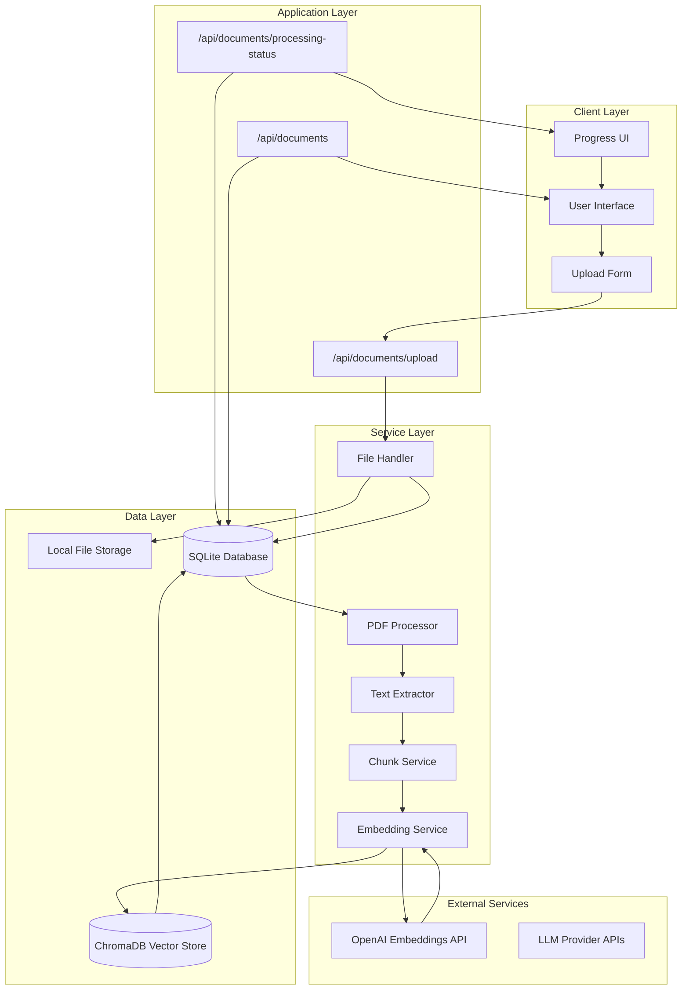

### 2. AI Search & Response Data Flow

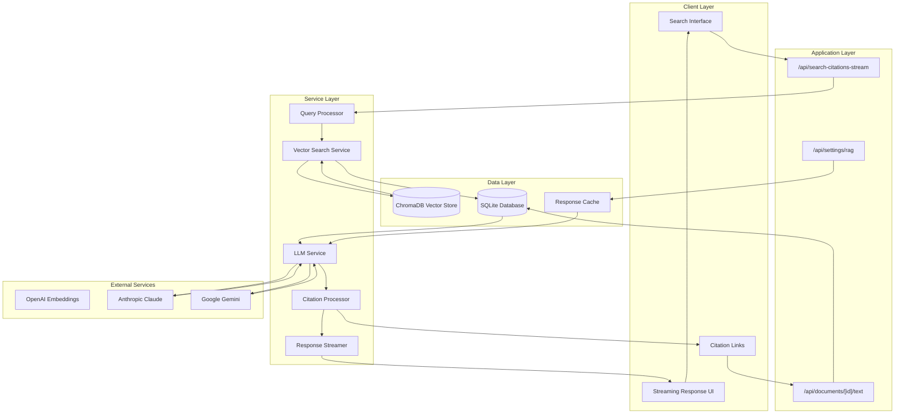

### 3. Authentication & Authorization Data Flow

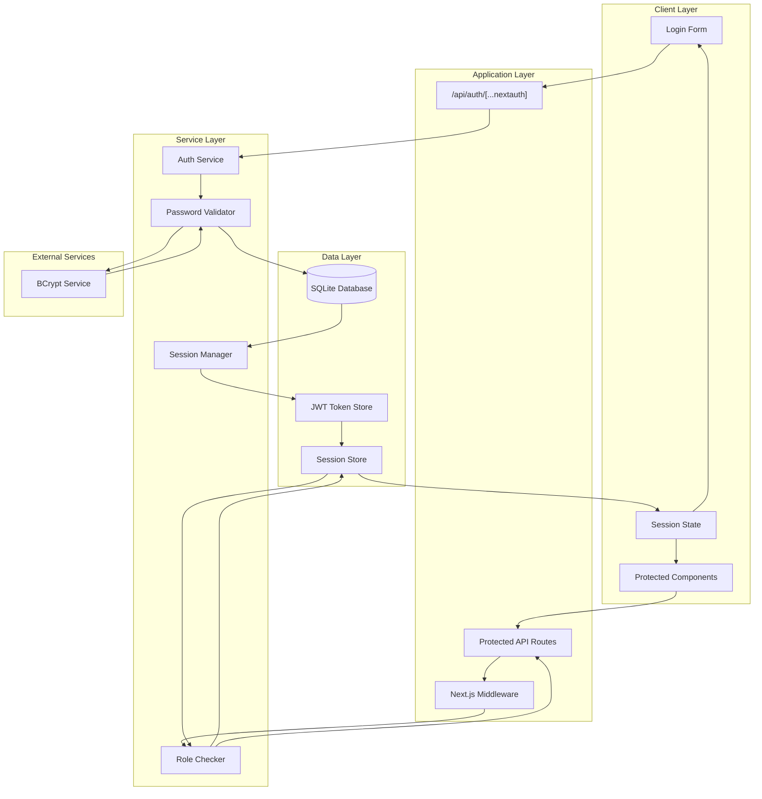

## Detailed Data Flow Scenarios

### 1. Document Upload Process

#### Data Flow Steps:
1. **User Initiation**: User selects PDF file and fills form
2. **Client Validation**: Form validates file type, size, required fields
3. **File Upload**: FormData sent to `/api/documents/upload`
4. **Server Processing**: 
   - File saved to local storage
   - Database record created with `UPLOADED` status
   - Background processing triggered
5. **Background Processing**:
   - Status updates to `EXTRACTING`
   - PDF text extraction
   - Status updates to `CHUNKING`
   - Text chunking for embeddings
   - Status updates to `EMBEDDING`
   - Vector embedding generation
   - ChromaDB storage
   - Status updates to `COMPLETED`

#### Data Transformations:
```typescript
// Input: FormData
{
  file: File,
  title: string,
  description: string,
  state: string,
  categoryId: string
}

// Database Record
{
  id: "cuid_string",
  title: "Document Title",
  filePath: "documents/filename.pdf",
  processingStatus: "UPLOADED",
  processingProgress: 0
}

// ChromaDB Vector
{
  id: "chunk_id",
  embedding: [0.1, 0.2, ...],
  metadata: {
    documentId: "doc_id",
    chunkIndex: 0,
    content: "chunk text"
  }
}
```

### 2. Search Query Processing

#### Data Flow Steps:
1. **Query Input**: User enters search query
2. **Query Validation**: Length, content validation
3. **Context Enhancement**: Add conversation context if available
4. **Vector Search**: 
   - Query embedding generation
   - ChromaDB similarity search
   - Document retrieval
5. **LLM Processing**:
   - Context preparation
   - LLM API call
   - Response streaming
6. **Citation Processing**:
   - Citation pattern extraction
   - Document linking
   - UI rendering

#### Data Transformations:
```typescript
// Input Query
{
  query: "What are the licensing requirements?",
  states: ["NY", "CA"],
  conversationContext: {...}
}

// Vector Search Results
{
  results: [
    {
      id: "chunk_id",
      score: 0.85,
      metadata: {
        documentId: "doc_id",
        content: "licensing requirements..."
      }
    }
  ]
}

// LLM Response
{
  answer: "Licensing requirements include [1] background checks...",
  citations: [
    {
      number: 1,
      documentId: "doc_id",
      text: "background checks are required..."
    }
  ]
}
```

### 3. User Session Management

#### Data Flow Steps:
1. **Login Request**: Credentials submitted
2. **Authentication**: Database user lookup, password verification
3. **Session Creation**: JWT token generation
4. **Session Storage**: Token stored in HTTP-only cookies
5. **Request Authorization**: Middleware validates tokens
6. **Role Checking**: Access control based on user roles

#### Data Transformations:
```typescript
// Login Input
{
  email: "user@example.com",
  password: "plaintext_password"
}

// Database Lookup
{
  id: "user_id",
  email: "user@example.com",
  password: "$2b$10$hashedpassword",
  role: "USER"
}

// JWT Token
{
  sub: "user_id",
  email: "user@example.com",
  role: "USER",
  iat: 1640995200,
  exp: 1641081600
}
```

## Complex Data Flow Scenarios

### 1. Multi-Step Document Processing with Error Handling

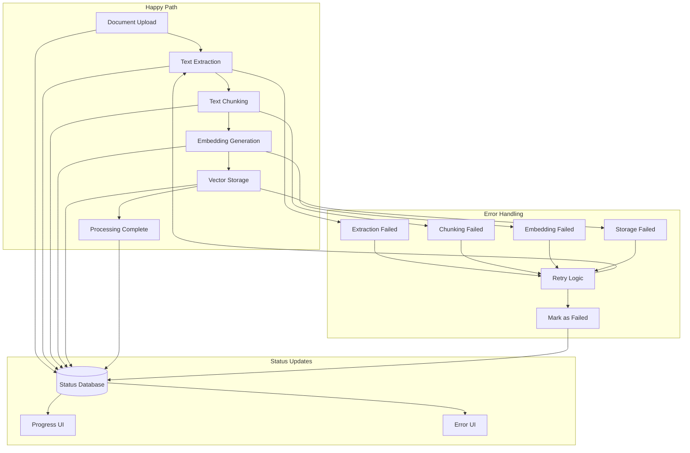

### 2. Real-time Search with Streaming Response

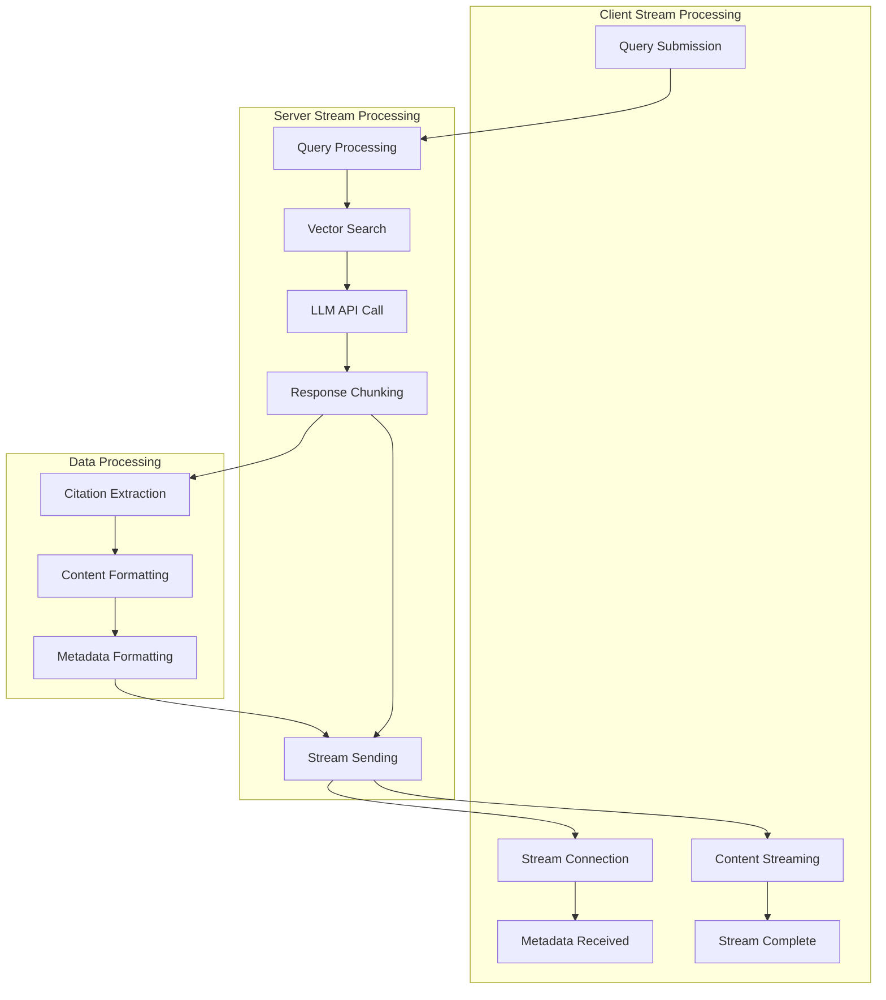

## Data Consistency Patterns

### 1. Document State Consistency

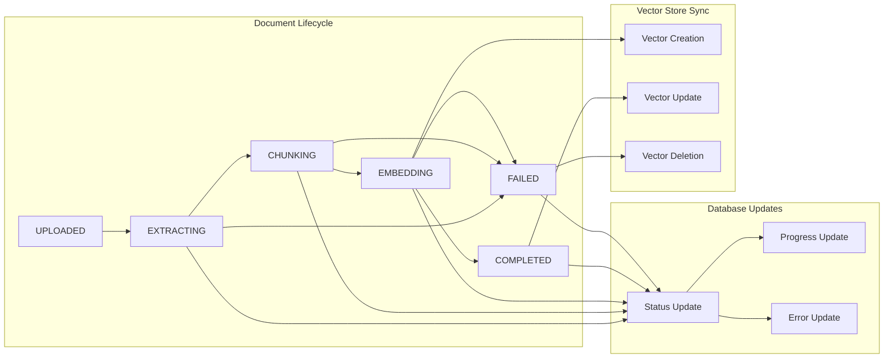

### 2. Search Result Consistency

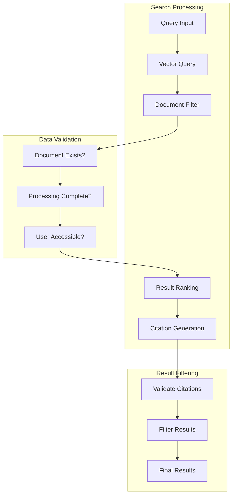

## Performance Optimization Data Flows

### 1. Caching Strategy

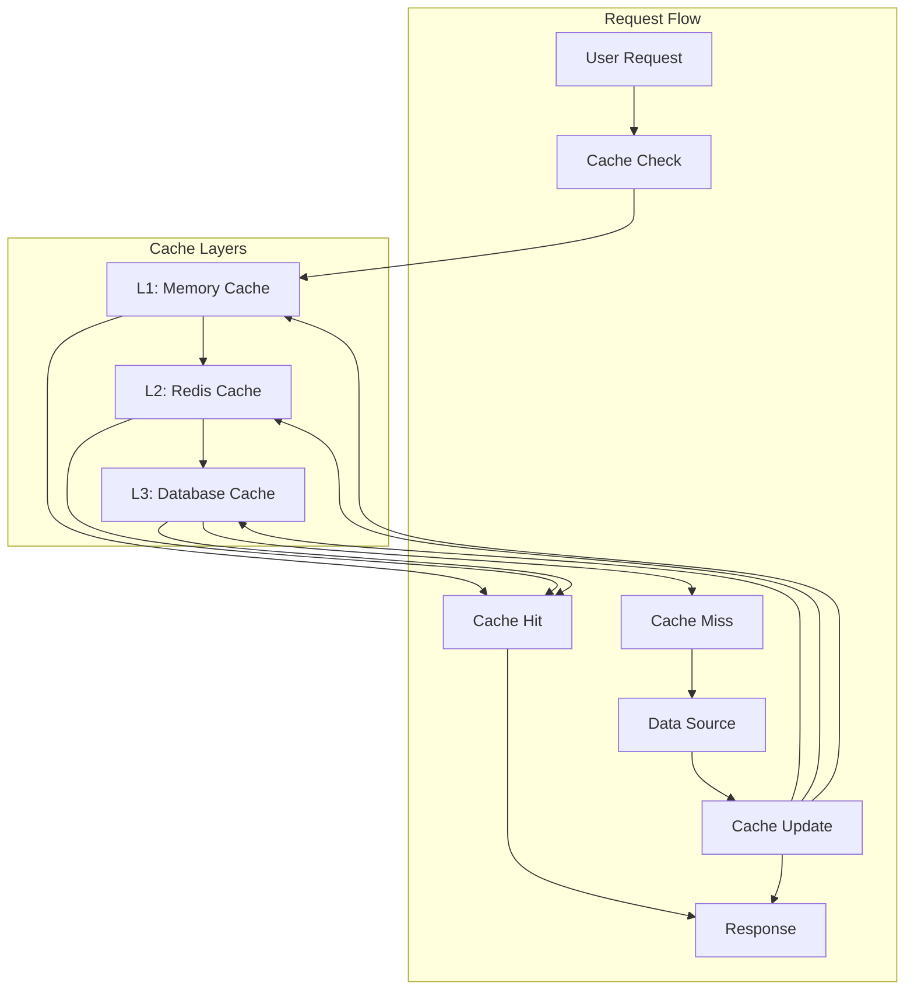

### 2. Database Query Optimization

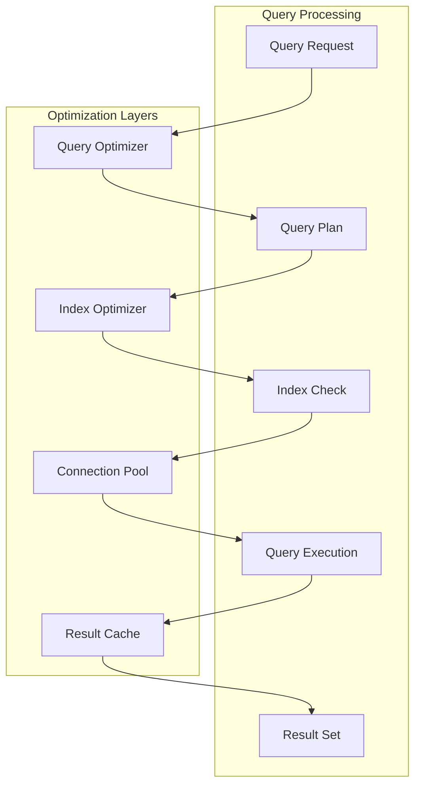

## Error Handling Data Flows

### 1. Graceful Error Recovery

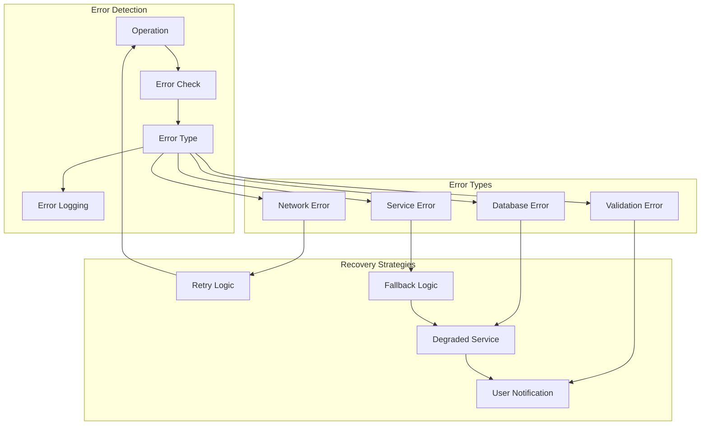

### 2. Data Validation Flow

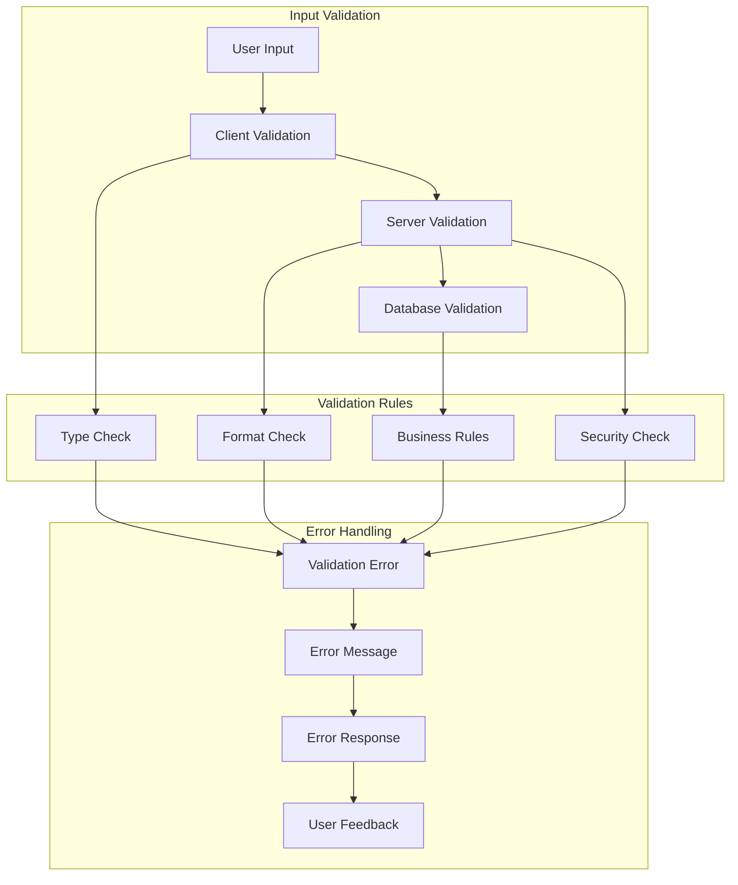

## Monitoring & Analytics Data Flows

### 1. System Monitoring

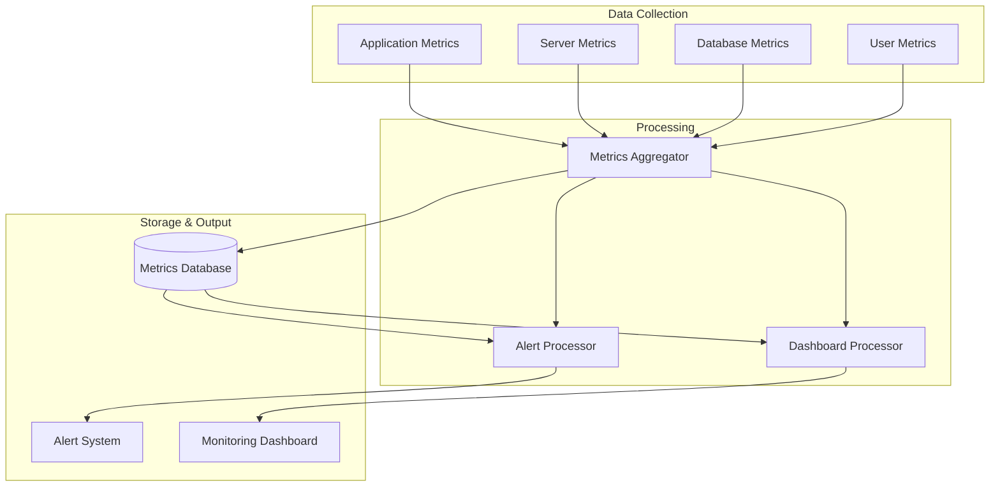

### 2. User Analytics

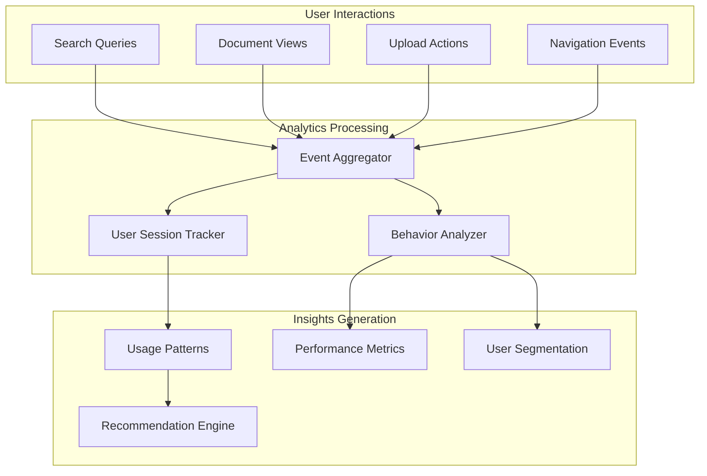

---

*This data flow documentation provides comprehensive coverage of how data moves through the Compliance Hub system. For implementation details, refer to the service layer and API documentation.*