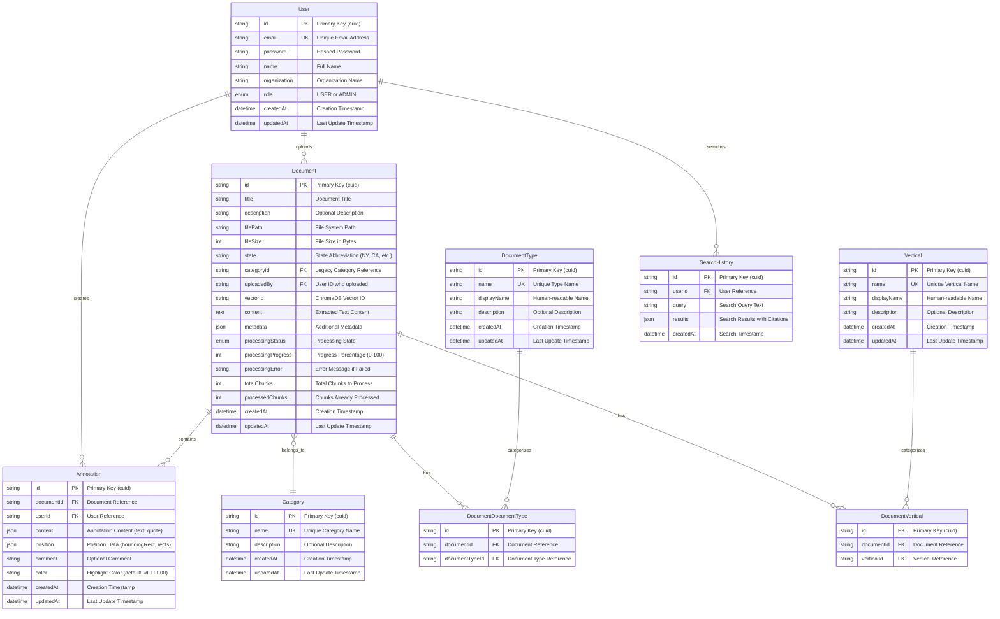

# Database Design & Data Models Documentation

## Overview

The Compliance Hub uses a relational database design optimized for document management, user authentication, and search functionality. The system employs SQLite for development with Prisma ORM for type-safe database operations and easy migration management.

## Database Schema Architecture

### Entity Relationship Diagram



## Core Data Models

### 1. User Management

#### User Entity
```typescript
interface User {
  id: string;           // Primary key (cuid)
  email: string;        // Unique email address
  password: string;     // Hashed password (bcrypt)
  name: string;         // Full name
  organization: string; // Organization name
  role: UserRole;       // USER | ADMIN
  createdAt: DateTime;  // Creation timestamp
  updatedAt: DateTime;  // Last update timestamp
  
  // Relationships
  searchHistory: SearchHistory[];
  annotations: Annotation[];
}

enum UserRole {
  ADMIN = "ADMIN",
  USER = "USER"
}
```

**Design Considerations:**
- Uses `cuid` for primary keys to avoid collision issues
- Passwords are hashed using bcryptjs for security
- Role-based access control with simple USER/ADMIN roles
- Organization field for future multi-tenant support

### 2. Document Management

#### Document Entity
```typescript
interface Document {
  id: string;                    // Primary key (cuid)
  title: string;                 // Document title
  description?: string;          // Optional description
  filePath: string;              // File system path
  fileSize: number;              // File size in bytes
  state: string;                 // State abbreviation (NY, CA, etc.)
  categoryId?: string;           // Legacy category reference
  uploadedBy: string;            // User ID who uploaded
  vectorId?: string;             // ChromaDB vector ID
  content?: string;              // Extracted text content
  metadata?: Record<string, any>; // Additional metadata (JSON)
  processingStatus: ProcessingStatus;
  processingProgress: number;    // 0-100 percentage
  processingError?: string;      // Error message if failed
  totalChunks?: number;          // Total chunks to process
  processedChunks: number;       // Chunks already processed
  createdAt: DateTime;           // Creation timestamp
  updatedAt: DateTime;           // Last update timestamp
  
  // Relationships
  category?: Category;
  verticals: DocumentVertical[];
  documentTypes: DocumentDocumentType[];
  annotations: Annotation[];
}

enum ProcessingStatus {
  UPLOADED = "UPLOADED",        // File uploaded, waiting for processing
  EXTRACTING = "EXTRACTING",    // Extracting text from PDF
  CHUNKING = "CHUNKING",        // Creating text chunks
  EMBEDDING = "EMBEDDING",      // Creating embeddings
  COMPLETED = "COMPLETED",      // Processing complete
  FAILED = "FAILED"             // Processing failed
}
```

**Design Considerations:**
- State field uses standardized abbreviations (NY, CA, CO, etc.)
- Processing status tracking for async document processing
- Flexible metadata field for additional document properties
- Vector ID links to ChromaDB for embeddings

#### Document Categorization

The system uses a flexible categorization system with multiple dimensions:

```typescript
// Verticals (Industry Areas)
interface Vertical {
  id: string;
  name: string;         // Unique system name
  displayName: string;  // Human-readable name
  description?: string;
  documents: DocumentVertical[];
}

// Document Types (Regulatory Categories)
interface DocumentType {
  id: string;
  name: string;         // Unique system name
  displayName: string;  // Human-readable name
  description?: string;
  documents: DocumentDocumentType[];
}

// Legacy Categories (Backward Compatibility)
interface Category {
  id: string;
  name: string;         // Unique category name
  description?: string;
  documents: Document[];
}
```

**Many-to-Many Relationships:**
- Documents can belong to multiple verticals (Fantasy Sports, Landbased, etc.)
- Documents can have multiple types (Formal Guidance, Licensing Forms, etc.)
- Junction tables manage these relationships with proper constraints

### 3. Search & Analytics

#### Search History
```typescript
interface SearchHistory {
  id: string;
  userId: string;       // User who performed search
  query: string;        // Search query text
  results: Record<string, any>; // Search results with citations (JSON)
  createdAt: DateTime;  // Search timestamp
  
  // Relationships
  user: User;
}
```

**Design Considerations:**
- Stores complete search results for analytics and caching
- JSON field allows flexible result structure
- Indexed by user for personalized search history

### 4. Annotation System

#### Annotation Entity
```typescript
interface Annotation {
  id: string;
  documentId: string;   // Document reference
  userId: string;       // User who created annotation
  content: {            // Annotation content (JSON)
    text: string;       // Highlighted text
    quote: string;      // Original quote
  };
  position: {           // Position data (JSON)
    boundingRect: {
      x1: number;
      y1: number;
      x2: number;
      y2: number;
      width: number;
      height: number;
      pageNumber: number;
    };
    rects: Array<any>;  // Additional rectangles
  };
  comment?: string;     // Optional comment
  color: string;        // Highlight color (default: #FFFF00)
  createdAt: DateTime;  // Creation timestamp
  updatedAt: DateTime;  // Last update timestamp
  
  // Relationships
  document: Document;
  user: User;
}
```

**Design Considerations:**
- JSON fields for flexible content and position data
- Supports PDF coordinate system for precise highlighting
- Color customization for different annotation types

## Indexing Strategy

### Primary Indexes
```sql
-- Document indexes for common queries
CREATE INDEX idx_document_state ON Document(state);
CREATE INDEX idx_document_category ON Document(categoryId);
CREATE INDEX idx_document_title ON Document(title);
CREATE INDEX idx_document_processing_status ON Document(processingStatus);
CREATE INDEX idx_document_uploaded_by ON Document(uploadedBy);

-- Junction table indexes
CREATE INDEX idx_document_vertical_document ON DocumentVertical(documentId);
CREATE INDEX idx_document_vertical_vertical ON DocumentVertical(verticalId);
CREATE INDEX idx_document_type_document ON DocumentDocumentType(documentId);
CREATE INDEX idx_document_type_type ON DocumentDocumentType(documentTypeId);

-- Search and annotation indexes
CREATE INDEX idx_search_history_user ON SearchHistory(userId);
CREATE INDEX idx_annotation_document ON Annotation(documentId);
CREATE INDEX idx_annotation_user ON Annotation(userId);
```

### Query Optimization Patterns
- **State-based filtering**: Optimized for jurisdictional queries
- **Categorization queries**: Efficient many-to-many relationship queries
- **User-scoped data**: Fast user-specific data retrieval
- **Processing status**: Quick filtering of document processing states

## Data Access Patterns

### 1. Document Retrieval Patterns

```typescript
// Get documents by state with categories
const documents = await prisma.document.findMany({
  where: { state: 'NY' },
  include: {
    verticals: {
      include: { vertical: true }
    },
    documentTypes: {
      include: { documentType: true }
    },
    category: true
  }
});

// Get documents by processing status
const processingDocuments = await prisma.document.findMany({
  where: {
    processingStatus: {
      in: ['UPLOADED', 'EXTRACTING', 'CHUNKING', 'EMBEDDING']
    }
  },
  select: {
    id: true,
    title: true,
    processingStatus: true,
    processingProgress: true
  }
});
```

### 2. Search Pattern

```typescript
// Get user search history
const searchHistory = await prisma.searchHistory.findMany({
  where: { userId: userId },
  orderBy: { createdAt: 'desc' },
  take: 10
});

// Create search record
const searchRecord = await prisma.searchHistory.create({
  data: {
    userId: userId,
    query: searchQuery,
    results: searchResults
  }
});
```

### 3. Annotation Patterns

```typescript
// Get document annotations
const annotations = await prisma.annotation.findMany({
  where: { documentId: documentId },
  include: {
    user: {
      select: { name: true, email: true }
    }
  },
  orderBy: { createdAt: 'desc' }
});
```

## Data Validation & Constraints

### Database Constraints
- **Unique Constraints**: Email addresses, category names, vertical names
- **Foreign Key Constraints**: Referential integrity for all relationships
- **Check Constraints**: Processing progress (0-100), valid state codes
- **Cascade Deletes**: Cleanup of related records when documents are deleted

### Application-Level Validation
- **Email Format**: Valid email address format
- **State Codes**: Valid US state abbreviations
- **File Types**: PDF file validation
- **User Roles**: Valid role enumeration
- **Processing Status**: Valid status transitions

## Migration Strategy

### Schema Evolution
- **Prisma Migrations**: Automatic migration generation and management
- **Backward Compatibility**: Maintained through careful schema changes
- **Data Preservation**: Safe migration patterns for existing data

### Version Control
- **Migration Files**: Version-controlled migration scripts
- **Schema Snapshots**: Point-in-time schema documentation
- **Rollback Procedures**: Safe rollback strategies for failed migrations

## Performance Considerations

### Database Optimization
- **Connection Pooling**: Efficient connection management
- **Query Optimization**: Indexed queries for common operations
- **Bulk Operations**: Efficient batch processing for large datasets
- **Caching Strategy**: Application-level caching for frequently accessed data

### Scalability Patterns
- **Partitioning**: State-based data partitioning for geographic distribution
- **Sharding**: Horizontal scaling strategies for large datasets
- **Read Replicas**: Read-only replicas for analytics and reporting
- **Archive Strategy**: Historical data archival for performance

---

*This database design documentation provides comprehensive coverage of the data models and access patterns. For specific implementation details, refer to the Prisma schema file and service layer documentation.*