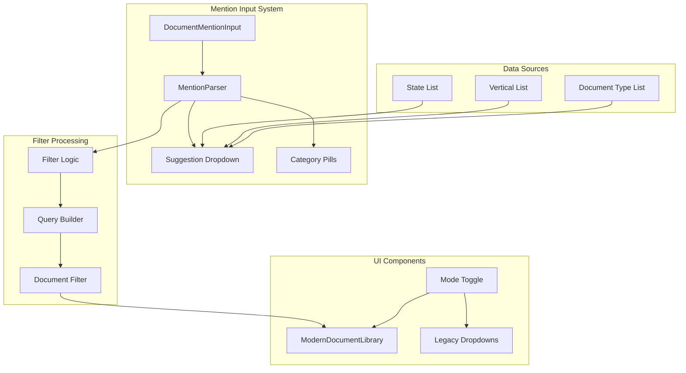

# Mention-Based Filtering Documentation

## Overview

The Mention-Based Filtering system provides an intuitive way to filter documents using @mentions for states and #hashtags for categories. This system replaces traditional dropdown-based filtering with a more flexible, user-friendly approach that supports complex filtering combinations.

## Core Concepts

### Mention Types

1. **@State Mentions**: Filter by jurisdiction
   - Format: `@NY`, `@California`, `@TX`
   - Examples: `@NY @CA` (documents from New York OR California)

2. **#Category Mentions**: Filter by document categories
   - **Verticals**: `#sports_betting`, `#online_gaming`, `#daily_fantasy`
   - **Document Types**: `#regulation`, `#guidance`, `#statute`
   - Examples: `#sports_betting #regulation` (sports betting documents that are regulations)

### Filtering Logic

```typescript
// Hierarchical filtering logic
interface FilterCriteria {
  states: string[]        // OR logic within states
  verticals: string[]     // OR logic within verticals  
  documentTypes: string[] // OR logic within document types
  // AND logic between different filter types
}

// Example: @NY @CA #sports_betting #regulation
// Means: (NY OR CA) AND (sports_betting) AND (regulation)
```

## Architecture

### Component Structure



## Implementation Details

### 1. DocumentMentionInput Component

The main input component that handles mention parsing and suggestions.

```typescript
interface DocumentMentionInputProps {
  value: string
  onChange: (value: string) => void
  states: State[]
  verticals: Vertical[]
  documentTypes: DocumentType[]
}

export function DocumentMentionInput({ 
  value, 
  onChange, 
  states, 
  verticals, 
  documentTypes 
}: DocumentMentionInputProps) {
  const [showSuggestions, setShowSuggestions] = useState(false)
  const [suggestions, setSuggestions] = useState<Suggestion[]>([])
  const [currentMention, setCurrentMention] = useState<string>('')
  const [mentionType, setMentionType] = useState<'state' | 'vertical' | 'documentType' | null>(null)
  
  const handleInputChange = (e: React.ChangeEvent<HTMLInputElement>) => {
    const newValue = e.target.value
    onChange(newValue)
    
    // Parse current mention being typed
    const { mention, type } = parseCurrentMention(newValue, e.target.selectionStart)
    
    if (mention && type) {
      setCurrentMention(mention)
      setMentionType(type)
      setSuggestions(getSuggestions(mention, type, { states, verticals, documentTypes }))
      setShowSuggestions(true)
    } else {
      setShowSuggestions(false)
    }
  }
  
  return (
    <div className="relative">
      <Input
        value={value}
        onChange={handleInputChange}
        placeholder="Filter by @state or #category (e.g., @NY @CA #sports_betting)"
        className="pr-10"
      />
      
      {showSuggestions && (
        <SuggestionDropdown
          suggestions={suggestions}
          onSelect={(suggestion) => {
            const newValue = insertSuggestion(value, currentMention, suggestion)
            onChange(newValue)
            setShowSuggestions(false)
          }}
        />
      )}
    </div>
  )
}
```

### 2. Mention Parser

Parses the input string to extract mentions and their types.

```typescript
interface ParsedMentions {
  states: string[]
  verticals: string[]
  documentTypes: string[]
}

export function parseMentions(input: string): ParsedMentions {
  // Extract @state mentions
  const stateMatches = input.match(/@(\w+)/g) || []
  const states = stateMatches.map(match => match.slice(1))
  
  // Extract #category mentions  
  const categoryMatches = input.match(/#(\w+)/g) || []
  const categories = categoryMatches.map(match => match.slice(1))
  
  // Separate verticals and document types
  const verticals = categories.filter(cat => isVertical(cat))
  const documentTypes = categories.filter(cat => isDocumentType(cat))
  
  return {
    states: states.map(normalizeState),
    verticals,
    documentTypes
  }
}

// Helper functions
function isVertical(category: string): boolean {
  const verticalNames = ['sports_betting', 'online_gaming', 'daily_fantasy', 'lottery', 'casino']
  return verticalNames.includes(category)
}

function isDocumentType(category: string): boolean {
  const typeNames = ['regulation', 'guidance', 'statute', 'ruling', 'advisory']
  return typeNames.includes(category)
}

function normalizeState(state: string): string {
  // Handle various state formats
  const stateMap: Record<string, string> = {
    'ny': 'NY',
    'newyork': 'NY',
    'new_york': 'NY',
    'ca': 'CA', 
    'california': 'CA',
    'tx': 'TX',
    'texas': 'TX'
  }
  
  return stateMap[state.toLowerCase()] || state.toUpperCase()
}
```

### 3. Suggestion System

Provides intelligent suggestions based on the current mention being typed.

```typescript
interface Suggestion {
  value: string
  label: string
  type: 'state' | 'vertical' | 'documentType'
  description?: string
}

function getSuggestions(
  mention: string,
  type: 'state' | 'vertical' | 'documentType',
  data: { states: State[], verticals: Vertical[], documentTypes: DocumentType[] }
): Suggestion[] {
  const query = mention.toLowerCase()
  
  switch (type) {
    case 'state':
      return data.states
        .filter(state => 
          state.code.toLowerCase().includes(query) ||
          state.name.toLowerCase().includes(query)
        )
        .slice(0, 10)
        .map(state => ({
          value: state.code,
          label: `@${state.code}`,
          type: 'state',
          description: state.name
        }))
        
    case 'vertical':
      return data.verticals
        .filter(vertical => 
          vertical.name.toLowerCase().includes(query) ||
          vertical.displayName.toLowerCase().includes(query)
        )
        .slice(0, 10)
        .map(vertical => ({
          value: vertical.name,
          label: `#${vertical.name}`,
          type: 'vertical',
          description: vertical.displayName
        }))
        
    case 'documentType':
      return data.documentTypes
        .filter(type => 
          type.name.toLowerCase().includes(query) ||
          type.displayName.toLowerCase().includes(query)
        )
        .slice(0, 10)
        .map(type => ({
          value: type.name,
          label: `#${type.name}`,
          type: 'documentType',
          description: type.displayName
        }))
  }
}
```

### 4. Filter Application

Applies the parsed mentions to filter documents.

```typescript
export function applyMentionFilters(
  documents: Document[],
  mentions: ParsedMentions
): Document[] {
  return documents.filter(doc => {
    // State filter (OR logic)
    const stateMatch = mentions.states.length === 0 || 
      mentions.states.includes(doc.state)
    
    // Vertical filter (OR logic within verticals)
    const verticalMatch = mentions.verticals.length === 0 ||
      doc.verticals.some(vertical => 
        mentions.verticals.includes(vertical.vertical.name)
      )
    
    // Document type filter (OR logic within types)
    const typeMatch = mentions.documentTypes.length === 0 ||
      doc.documentTypes.some(type => 
        mentions.documentTypes.includes(type.documentType.name)
      )
    
    // Combined filter (AND logic between different types)
    return stateMatch && verticalMatch && typeMatch
  })
}

// Usage in ModernDocumentLibrary
const filteredDocuments = useMemo(() => {
  if (usesMentionFiltering) {
    const mentions = parseMentions(filterInput)
    return applyMentionFilters(documents, mentions)
  } else {
    return applyLegacyFilters(documents, legacyFilters)
  }
}, [documents, filterInput, usesMentionFiltering, legacyFilters])
```

## UI Components

### 1. Category Pills

Visual representation of active filters.

```typescript
interface CategoryPillsProps {
  mentions: ParsedMentions
  onRemove: (type: string, value: string) => void
}

export function CategoryPills({ mentions, onRemove }: CategoryPillsProps) {
  return (
    <div className="flex flex-wrap gap-2">
      {/* State pills */}
      {mentions.states.map(state => (
        <Badge
          key={state}
          variant="outline"
          className="cursor-pointer hover:bg-red-50"
          onClick={() => onRemove('state', state)}
        >
          @{state}
          <X className="h-3 w-3 ml-1" />
        </Badge>
      ))}
      
      {/* Vertical pills */}
      {mentions.verticals.map(vertical => (
        <Badge
          key={vertical}
          variant="secondary"
          className="cursor-pointer hover:bg-red-50"
          onClick={() => onRemove('vertical', vertical)}
        >
          #{vertical}
          <X className="h-3 w-3 ml-1" />
        </Badge>
      ))}
      
      {/* Document type pills */}
      {mentions.documentTypes.map(type => (
        <Badge
          key={type}
          variant="secondary"
          className="cursor-pointer hover:bg-red-50"
          onClick={() => onRemove('documentType', type)}
        >
          #{type}
          <X className="h-3 w-3 ml-1" />
        </Badge>
      ))}
    </div>
  )
}
```

### 2. Mode Toggle

Allows switching between mention-based and legacy filtering.

```typescript
interface ModeToggleProps {
  usesMentionFiltering: boolean
  onToggle: (enabled: boolean) => void
}

export function ModeToggle({ usesMentionFiltering, onToggle }: ModeToggleProps) {
  return (
    <div className="flex items-center space-x-2">
      <Label htmlFor="filter-mode">Advanced Filtering</Label>
      <Switch
        id="filter-mode"
        checked={usesMentionFiltering}
        onCheckedChange={onToggle}
      />
      <div className="text-sm text-gray-600">
        {usesMentionFiltering ? (
          <span>Use @states and #categories</span>
        ) : (
          <span>Use traditional dropdowns</span>
        )}
      </div>
    </div>
  )
}
```

### 3. Suggestion Dropdown

Displays suggestions as the user types.

```typescript
interface SuggestionDropdownProps {
  suggestions: Suggestion[]
  onSelect: (suggestion: Suggestion) => void
}

export function SuggestionDropdown({ suggestions, onSelect }: SuggestionDropdownProps) {
  return (
    <div className="absolute top-full left-0 right-0 z-50 bg-white border rounded-md shadow-lg max-h-60 overflow-y-auto">
      {suggestions.map((suggestion, index) => (
        <div
          key={`${suggestion.type}-${suggestion.value}`}
          className="px-3 py-2 hover:bg-gray-100 cursor-pointer border-b last:border-b-0"
          onClick={() => onSelect(suggestion)}
        >
          <div className="flex items-center justify-between">
            <span className="font-medium">{suggestion.label}</span>
            <Badge variant="outline" className="text-xs">
              {suggestion.type}
            </Badge>
          </div>
          {suggestion.description && (
            <div className="text-sm text-gray-600 mt-1">
              {suggestion.description}
            </div>
          )}
        </div>
      ))}
    </div>
  )
}
```

## Advanced Features

### 1. Smart Autocomplete

```typescript
// Context-aware suggestions
function getContextAwareSuggestions(
  input: string,
  currentMentions: ParsedMentions
): Suggestion[] {
  // If user has selected sports betting, suggest related document types
  if (currentMentions.verticals.includes('sports_betting')) {
    return [
      { value: 'regulation', label: '#regulation', type: 'documentType' },
      { value: 'guidance', label: '#guidance', type: 'documentType' },
      { value: 'statute', label: '#statute', type: 'documentType' }
    ]
  }
  
  // If user has selected multiple states, suggest common document types
  if (currentMentions.states.length > 1) {
    return getCommonDocumentTypes(currentMentions.states)
  }
  
  return getDefaultSuggestions(input)
}
```

### 2. Keyboard Navigation

```typescript
// Keyboard navigation in suggestion dropdown
function useSuggestionNavigation(suggestions: Suggestion[]) {
  const [selectedIndex, setSelectedIndex] = useState(-1)
  
  const handleKeyDown = (e: React.KeyboardEvent) => {
    switch (e.key) {
      case 'ArrowDown':
        e.preventDefault()
        setSelectedIndex(prev => 
          prev < suggestions.length - 1 ? prev + 1 : prev
        )
        break
        
      case 'ArrowUp':
        e.preventDefault()
        setSelectedIndex(prev => prev > 0 ? prev - 1 : prev)
        break
        
      case 'Enter':
        e.preventDefault()
        if (selectedIndex >= 0) {
          onSelect(suggestions[selectedIndex])
        }
        break
        
      case 'Escape':
        setShowSuggestions(false)
        break
    }
  }
  
  return { selectedIndex, handleKeyDown }
}
```

### 3. Validation and Error Handling

```typescript
// Input validation
function validateMentions(mentions: ParsedMentions): ValidationResult {
  const errors: string[] = []
  
  // Check for invalid states
  const invalidStates = mentions.states.filter(state => 
    !isValidState(state)
  )
  if (invalidStates.length > 0) {
    errors.push(`Invalid states: ${invalidStates.join(', ')}`)
  }
  
  // Check for invalid verticals
  const invalidVerticals = mentions.verticals.filter(vertical => 
    !isValidVertical(vertical)
  )
  if (invalidVerticals.length > 0) {
    errors.push(`Invalid verticals: ${invalidVerticals.join(', ')}`)
  }
  
  // Check for conflicting filters
  if (mentions.verticals.includes('sports_betting') && 
      mentions.verticals.includes('lottery')) {
    errors.push('Sports betting and lottery filters may conflict')
  }
  
  return {
    isValid: errors.length === 0,
    errors
  }
}
```

## Examples

### Basic Usage

```typescript
// Simple state filter
"@NY"  // Documents from New York

// Multiple states
"@NY @CA @TX"  // Documents from NY, CA, or TX

// Category filter
"#sports_betting"  // Sports betting documents

// Combined filters
"@NY #sports_betting #regulation"  // NY sports betting regulations
```

### Advanced Usage

```typescript
// Complex multi-state analysis
"@NY @CA @NJ #sports_betting #online_gaming #regulation"
// Documents from NY, CA, or NJ that are related to sports betting OR online gaming AND are regulations

// Document type comparison
"@CA #regulation #guidance"  // California regulations or guidance documents

// Vertical-specific search
"#daily_fantasy #statute #ruling"  // Daily fantasy statutes or rulings
```

### URL Integration

```typescript
// Encode mentions in URL for shareable links
function encodeMentionsToURL(mentions: ParsedMentions): string {
  const params = new URLSearchParams()
  
  if (mentions.states.length > 0) {
    params.set('states', mentions.states.join(','))
  }
  
  if (mentions.verticals.length > 0) {
    params.set('verticals', mentions.verticals.join(','))
  }
  
  if (mentions.documentTypes.length > 0) {
    params.set('types', mentions.documentTypes.join(','))
  }
  
  return params.toString()
}

// Decode URL params back to mentions
function decodeMentionsFromURL(searchParams: URLSearchParams): ParsedMentions {
  return {
    states: searchParams.get('states')?.split(',') || [],
    verticals: searchParams.get('verticals')?.split(',') || [],
    documentTypes: searchParams.get('types')?.split(',') || []
  }
}
```

## Performance Optimizations

### 1. Debounced Filtering

```typescript
// Debounce filter application for better performance
const debouncedMentions = useDeferredValue(mentions)

const filteredDocuments = useMemo(() => {
  return applyMentionFilters(documents, debouncedMentions)
}, [documents, debouncedMentions])
```

### 2. Memoized Suggestions

```typescript
// Memoize expensive suggestion calculations
const suggestions = useMemo(() => {
  return getSuggestions(currentMention, mentionType, data)
}, [currentMention, mentionType, data])
```

### 3. Virtual Scrolling

```typescript
// Virtual scrolling for large suggestion lists
function VirtualizedSuggestions({ suggestions }: { suggestions: Suggestion[] }) {
  const [visibleRange, setVisibleRange] = useState({ start: 0, end: 10 })
  
  const visibleSuggestions = suggestions.slice(
    visibleRange.start, 
    visibleRange.end
  )
  
  return (
    <div className="max-h-60 overflow-y-auto">
      {visibleSuggestions.map(suggestion => (
        <SuggestionItem key={suggestion.value} suggestion={suggestion} />
      ))}
    </div>
  )
}
```

## Testing

### Unit Tests

```typescript
describe('MentionParser', () => {
  test('parses state mentions correctly', () => {
    const input = '@NY @CA @TX'
    const result = parseMentions(input)
    
    expect(result.states).toEqual(['NY', 'CA', 'TX'])
    expect(result.verticals).toEqual([])
    expect(result.documentTypes).toEqual([])
  })
  
  test('parses category mentions correctly', () => {
    const input = '#sports_betting #regulation'
    const result = parseMentions(input)
    
    expect(result.states).toEqual([])
    expect(result.verticals).toEqual(['sports_betting'])
    expect(result.documentTypes).toEqual(['regulation'])
  })
})
```

### Integration Tests

```typescript
describe('Document Filtering', () => {
  test('filters documents by mentions', () => {
    const documents = [
      { state: 'NY', verticals: [{ vertical: { name: 'sports_betting' } }] },
      { state: 'CA', verticals: [{ vertical: { name: 'online_gaming' } }] }
    ]
    
    const mentions = { states: ['NY'], verticals: [], documentTypes: [] }
    const filtered = applyMentionFilters(documents, mentions)
    
    expect(filtered).toHaveLength(1)
    expect(filtered[0].state).toBe('NY')
  })
})
```

---

*This documentation provides comprehensive coverage of the Mention-Based Filtering system, including implementation details, UI components, advanced features, and testing strategies. The system provides a powerful and intuitive way to filter documents using natural language-like mentions.*