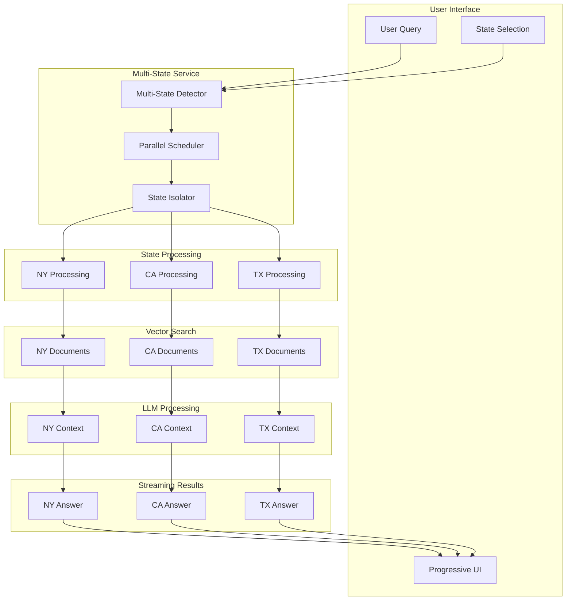

# Multi-State Search Documentation

## Overview

The Multi-State Search feature enables users to query compliance documents across multiple jurisdictions simultaneously while maintaining state isolation to ensure accurate, jurisdiction-specific answers. This feature addresses the critical need for comparative compliance analysis across different states.

## Architecture

### Core Concept

Multi-state search isolates document searches by state to prevent cross-contamination of regulatory information. Each state is processed independently with its own vector search scope, context generation, and answer formulation.



## Implementation Details

### 1. State Detection

The system automatically detects multi-state queries based on the selected states.

```typescript
// Multi-state detection logic
function detectMultiStateQuery(states: string[]): boolean {
  // Single state or "ALL" is not multi-state
  if (states.length <= 1 || states.includes('ALL')) {
    return false
  }
  
  // Multiple specific states trigger multi-state processing
  return states.length > 1
}

// Query processing decision
const isMultiState = detectMultiStateQuery(selectedStates)
if (isMultiState) {
  // Initialize multi-state UI immediately
  initializeMultiStateUI(selectedStates)
  // Process states in parallel
  await processMultiStateSearch(query, selectedStates)
} else {
  // Traditional single-state search
  await processSingleStateSearch(query, selectedStates[0])
}
```

### 2. State Isolation Service

Each state search operates in complete isolation with its own context and documents.

```typescript
// Multi-state search service
class MultiStateSearchService {
  async searchMultipleStates(
    query: string,
    states: string[],
    options: SearchOptions
  ): Promise<AsyncGenerator<StateSearchEvent>> {
    // Send immediate queued events for UI feedback
    for (const state of states) {
      yield { type: 'state-queued', state }
    }
    
    // Process states in parallel with complete isolation
    const statePromises = states.map(state => 
      this.processStateInIsolation(query, state, options)
    )
    
    // Stream results as they complete
    for await (const result of this.streamAsCompleted(statePromises)) {
      yield result
    }
  }
  
  private async processStateInIsolation(
    query: string,
    state: string,
    options: SearchOptions
  ): Promise<StateSearchResult> {
    // Signal processing start
    await this.sendEvent({ type: 'state-processing', state })
    
    // CRITICAL: Search only documents from this state
    const stateDocuments = await this.chromaClient.query({
      queryEmbeddings: await this.embedQuery(query),
      nResults: options.topK || 10,
      where: { state: state } // State isolation filter
    })
    
    // Generate answer using ONLY state-specific documents
    const stateContext = this.buildStateContext(stateDocuments, state)
    const answer = await this.generateAnswer(query, stateContext)
    
    // Stream the complete answer
    await this.sendEvent({
      type: 'state-answer',
      state,
      answer: answer.content,
      citations: answer.citations,
      sourceCount: stateDocuments.length
    })
    
    // Signal completion
    await this.sendEvent({ type: 'state-complete', state })
    
    return answer
  }
}
```

### 3. Progressive UI State Management

The UI provides immediate feedback and real-time updates throughout the search process.

```typescript
// State lifecycle management
type StateStatus = 'queued' | 'processing' | 'streaming' | 'complete'

interface StateAnswer {
  state: string
  answer: string
  citations: CitationData[]
  sourceCount: number
  processingTime: number
  status: StateStatus
}

// UI state management
function useMultiStateSearch() {
  const [multiStateResult, setMultiStateResult] = useState<MultiStateResult | null>(null)
  const [isMultiStateSearch, setIsMultiStateSearch] = useState(false)
  
  const initializeMultiStateUI = useCallback((states: string[]) => {
    setIsMultiStateSearch(true)
    setLoading(false) // Hide generic loading immediately
    
    // Initialize UI with all states in queued status
    setMultiStateResult({
      query: searchQuery,
      stateAnswers: states.map(state => ({
        state,
        answer: '',
        citations: [],
        sourceCount: 0,
        processingTime: 0,
        status: 'queued'
      }))
    })
  }, [])
  
  const handleStateEvent = useCallback((event: StateSearchEvent) => {
    setMultiStateResult(prev => {
      if (!prev) return prev
      
      const updatedAnswers = prev.stateAnswers.map(answer => {
        if (answer.state === event.state) {
          switch (event.type) {
            case 'state-processing':
              return { ...answer, status: 'processing' }
            case 'state-answer':
              return {
                ...answer,
                answer: event.answer,
                citations: event.citations,
                sourceCount: event.sourceCount,
                status: 'streaming'
              }
            case 'state-complete':
              return { ...answer, status: 'complete' }
            default:
              return answer
          }
        }
        return answer
      })
      
      return { ...prev, stateAnswers: updatedAnswers }
    })
  }, [])
}
```

## Event-Driven Architecture

### Server-Sent Events (SSE) Stream

The backend streams events to the frontend in real-time:

```typescript
// SSE Event Types
type StateSearchEvent = 
  | { type: 'state-queued', state: string }
  | { type: 'state-processing', state: string }
  | { type: 'state-answer', state: string, answer: string, citations: CitationData[], sourceCount: number }
  | { type: 'state-complete', state: string }
  | { type: 'done' }

// Event streaming implementation
export async function POST(request: NextRequest) {
  const { query, states } = await request.json()
  
  if (states.length > 1) {
    // Multi-state search
    const stream = new ReadableStream({
      async start(controller) {
        const encoder = new TextEncoder()
        
        // Send metadata
        controller.enqueue(encoder.encode(
          `data: ${JSON.stringify({
            type: 'metadata',
            query,
            isMultiState: true,
            states
          })}\n\n`
        ))
        
        // Process states with isolation
        for await (const event of multiStateService.searchMultipleStates(query, states, options)) {
          if (controller.desiredSize !== null) {
            controller.enqueue(encoder.encode(
              `data: ${JSON.stringify(event)}\n\n`
            ))
          }
        }
        
        // Send completion
        controller.enqueue(encoder.encode(`data: ${JSON.stringify({ type: 'done' })}\n\n`))
        controller.close()
      }
    })
    
    return new Response(stream, {
      headers: {
        'Content-Type': 'text/event-stream',
        'Cache-Control': 'no-cache',
        'Connection': 'keep-alive'
      }
    })
  }
}
```

### Frontend Event Processing

```typescript
// SSE event handling
useEffect(() => {
  if (!isSearching) return
  
  const eventSource = new EventSource('/api/search-citations-stream', {
    method: 'POST',
    body: JSON.stringify({ query, states: selectedStates })
  })
  
  eventSource.onmessage = (event) => {
    const data = JSON.parse(event.data)
    
    switch (data.type) {
      case 'metadata':
        if (data.isMultiState) {
          initializeMultiStateUI(data.states)
        }
        break
        
      case 'state-queued':
      case 'state-processing':  
      case 'state-answer':
      case 'state-complete':
        handleStateEvent(data)
        break
        
      case 'done':
        setIsSearching(false)
        eventSource.close()
        break
    }
  }
  
  return () => eventSource.close()
}, [isSearching, query, selectedStates])
```

## UI Components

### 1. StreamingMultiStateResults

The main component for displaying multi-state search results.

```typescript
interface StreamingMultiStateResultsProps {
  result: MultiStateResult
  onClose: () => void
}

export function StreamingMultiStateResults({ result, onClose }: StreamingMultiStateResultsProps) {
  return (
    <div className="space-y-6">
      {/* Query Header */}
      <div className="bg-white rounded-lg shadow-sm p-6">
        <h2 className="text-xl font-semibold mb-2">Multi-State Analysis</h2>
        <p className="text-gray-600">{result.query}</p>
      </div>
      
      {/* State Results */}
      <div className="space-y-4">
        {result.stateAnswers.map((stateAnswer) => (
          <StateAnswerCard
            key={stateAnswer.state}
            stateAnswer={stateAnswer}
            stateColor={getStateColor(stateAnswer.state)}
          />
        ))}
      </div>
    </div>
  )
}
```

### 2. StateAnswerCard

Individual state result component with status indicators.

```typescript
interface StateAnswerCardProps {
  stateAnswer: StateAnswer
  stateColor: string
}

function StateAnswerCard({ stateAnswer, stateColor }: StateAnswerCardProps) {
  return (
    <div className={`border-l-4 border-${stateColor}-500 bg-white rounded-lg shadow-sm`}>
      <div className="p-6">
        {/* State Header */}
        <div className="flex items-center justify-between mb-4">
          <div className="flex items-center space-x-3">
            <h3 className="text-lg font-semibold">{stateAnswer.state}</h3>
            <StatusIndicator status={stateAnswer.status} />
          </div>
          {stateAnswer.sourceCount > 0 && (
            <Badge variant="secondary">
              {stateAnswer.sourceCount} sources
            </Badge>
          )}
        </div>
        
        {/* Answer Content */}
        {stateAnswer.answer && (
          <div className="prose prose-sm max-w-none">
            <ReactMarkdown
              remarkPlugins={[remarkGfm]}
              components={{
                a: ({ href, children }) => (
                  <CitationLink 
                    href={href} 
                    citations={stateAnswer.citations}
                  >
                    {children}
                  </CitationLink>
                )
              }}
            >
              {stateAnswer.answer}
            </ReactMarkdown>
          </div>
        )}
        
        {/* Citations */}
        {stateAnswer.citations.length > 0 && (
          <CollapsibleCitations 
            citations={stateAnswer.citations}
            state={stateAnswer.state}
          />
        )}
      </div>
    </div>
  )
}
```

### 3. Status Indicators

Visual indicators for each state's processing status.

```typescript
interface StatusIndicatorProps {
  status: StateStatus
}

function StatusIndicator({ status }: StatusIndicatorProps) {
  const indicators = {
    queued: {
      icon: Clock,
      className: 'text-gray-400',
      label: 'Queued'
    },
    processing: {
      icon: Loader2,
      className: 'text-blue-500 animate-spin',
      label: 'Processing'
    },
    streaming: {
      icon: Zap,
      className: 'text-green-500 animate-pulse',
      label: 'Streaming'
    },
    complete: {
      icon: CheckCircle,
      className: 'text-green-600',
      label: 'Complete'
    }
  }
  
  const indicator = indicators[status]
  const Icon = indicator.icon
  
  return (
    <div className="flex items-center space-x-2">
      <Icon className={`h-4 w-4 ${indicator.className}`} />
      <span className="text-sm text-gray-600">{indicator.label}</span>
    </div>
  )
}
```

## State Isolation Benefits

### 1. Accuracy
- Each state's answer is based solely on documents from that jurisdiction
- No cross-contamination of regulatory information
- Precise jurisdiction-specific guidance

### 2. Performance
- Parallel processing of multiple states
- Immediate UI feedback with progressive loading
- Efficient resource utilization

### 3. User Experience
- Clear visual separation of state results
- Real-time progress indicators
- Responsive interface with immediate feedback

## Configuration

### State Color Mapping

```typescript
// Deterministic color assignment for visual consistency
const stateColors = {
  'NY': 'blue',
  'CA': 'green', 
  'TX': 'purple',
  'FL': 'orange',
  'NV': 'red',
  'NJ': 'indigo',
  'PA': 'pink',
  'IL': 'cyan'
}

function getStateColor(state: string): string {
  return stateColors[state] || 'gray'
}
```

### Search Options

```typescript
interface SearchOptions {
  topK?: number          // Number of documents to retrieve (default: 10)
  threshold?: number     // Similarity threshold (default: 0.7)
  includeMetadata?: boolean  // Include document metadata
  maxTokens?: number     // Maximum tokens for LLM response
  temperature?: number   // LLM temperature setting
}
```

## Error Handling

### State-Level Error Handling

```typescript
// Individual state error handling
private async processStateInIsolation(
  query: string,
  state: string,
  options: SearchOptions
): Promise<StateSearchResult> {
  try {
    // Normal processing...
  } catch (error) {
    // Send error event for this state
    await this.sendEvent({
      type: 'state-error',
      state,
      error: error.message
    })
    
    // Return empty result to not block other states
    return {
      state,
      answer: 'Unable to process this state at the moment.',
      citations: [],
      sourceCount: 0,
      error: error.message
    }
  }
}
```

### Frontend Error Display

```typescript
// Error state UI
function StateErrorCard({ stateAnswer }: { stateAnswer: StateAnswer }) {
  return (
    <div className="border-l-4 border-red-500 bg-red-50 rounded-lg p-4">
      <div className="flex items-center space-x-2">
        <AlertTriangle className="h-5 w-5 text-red-600" />
        <h3 className="font-semibold text-red-800">{stateAnswer.state}</h3>
      </div>
      <p className="text-red-700 mt-2">
        {stateAnswer.error || 'An error occurred processing this state.'}
      </p>
    </div>
  )
}
```

## Performance Optimizations

### 1. Parallel Processing
- States are processed concurrently, not sequentially
- Independent vector searches for each state
- Parallel LLM calls for answer generation

### 2. Streaming Results
- Results display immediately as they become available
- No waiting for all states to complete
- Progressive enhancement of the UI

### 3. Memory Management
- State isolation prevents memory leaks
- Proper cleanup of event listeners
- Efficient state updates using React's concurrent features

## Testing Strategy

### Unit Tests

```typescript
describe('MultiStateSearchService', () => {
  test('isolates states correctly', async () => {
    const service = new MultiStateSearchService()
    const states = ['NY', 'CA']
    
    const results = []
    for await (const event of service.searchMultipleStates('test query', states, {})) {
      results.push(event)
    }
    
    // Should have separate results for each state
    expect(results.filter(r => r.state === 'NY')).toHaveLength(3) // queued, processing, answer
    expect(results.filter(r => r.state === 'CA')).toHaveLength(3)
  })
})
```

### Integration Tests

```typescript
describe('Multi-State Search Integration', () => {
  test('end-to-end multi-state search', async () => {
    const response = await fetch('/api/search-citations-stream', {
      method: 'POST',
      body: JSON.stringify({
        query: 'licensing requirements',
        states: ['NY', 'CA']
      })
    })
    
    const events = await parseSSEResponse(response)
    
    expect(events).toContainEqual({
      type: 'state-queued',
      state: 'NY'
    })
    expect(events).toContainEqual({
      type: 'state-answer',
      state: 'NY',
      answer: expect.any(String)
    })
  })
})
```

---

*This documentation provides comprehensive coverage of the Multi-State Search feature, including architecture, implementation details, UI components, and testing strategies. The feature ensures accurate, isolated searches across multiple jurisdictions while providing an optimal user experience.*