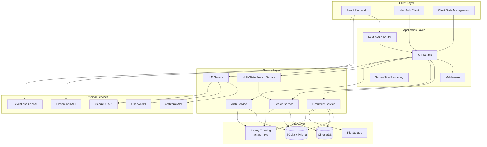
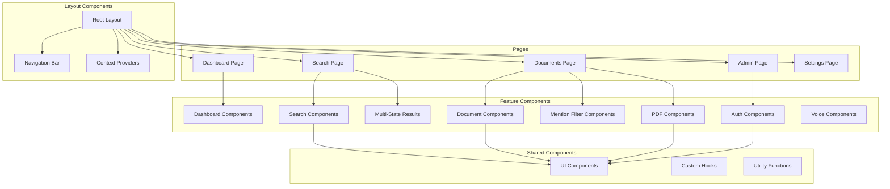
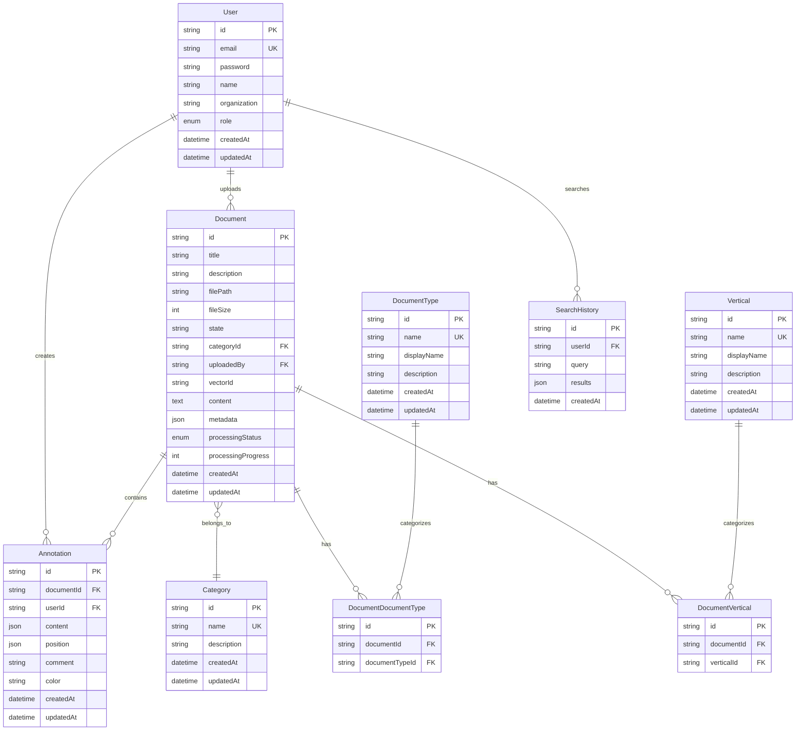
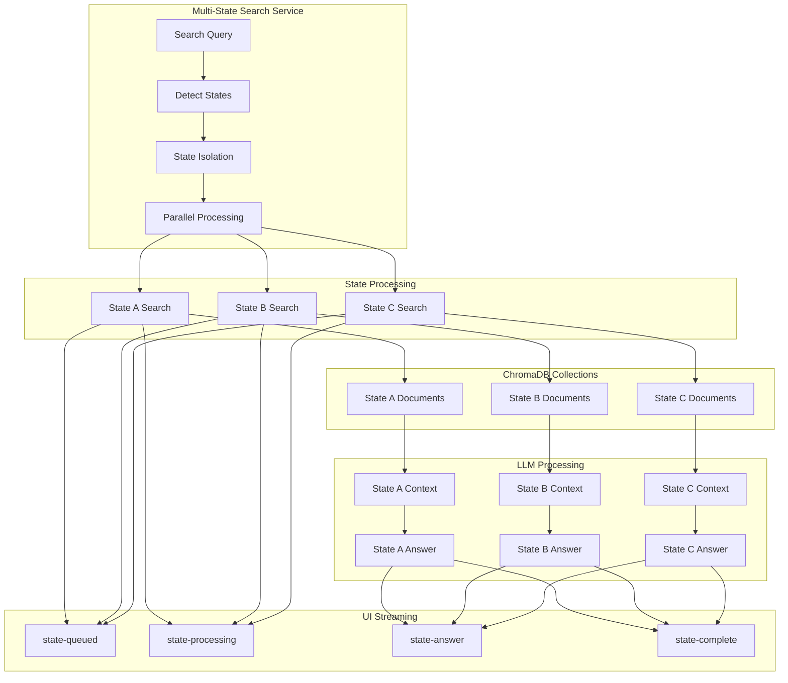
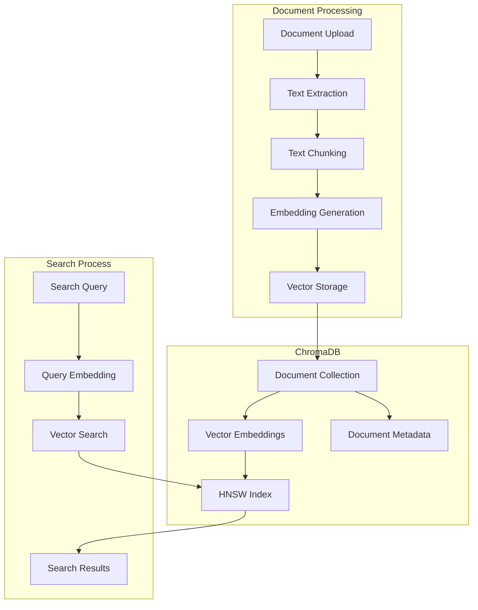
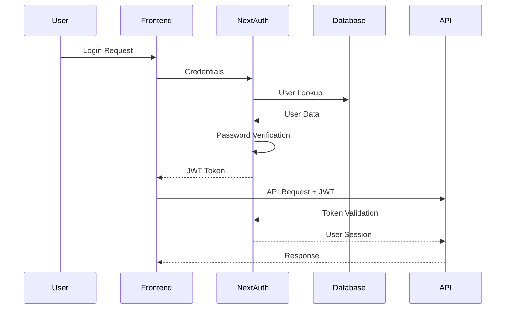
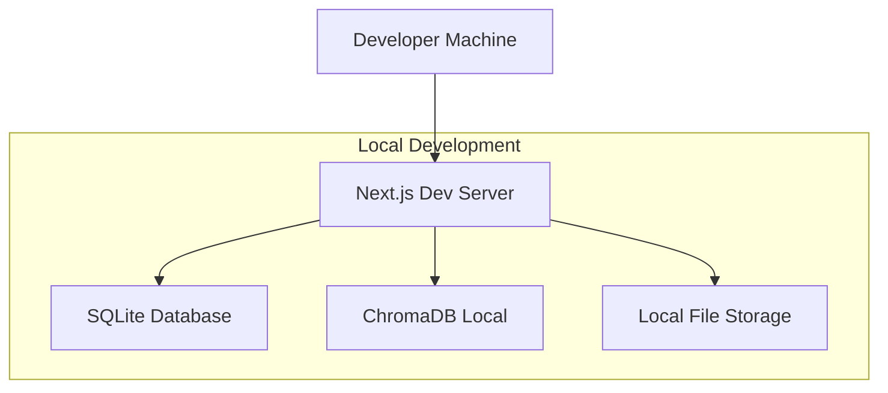
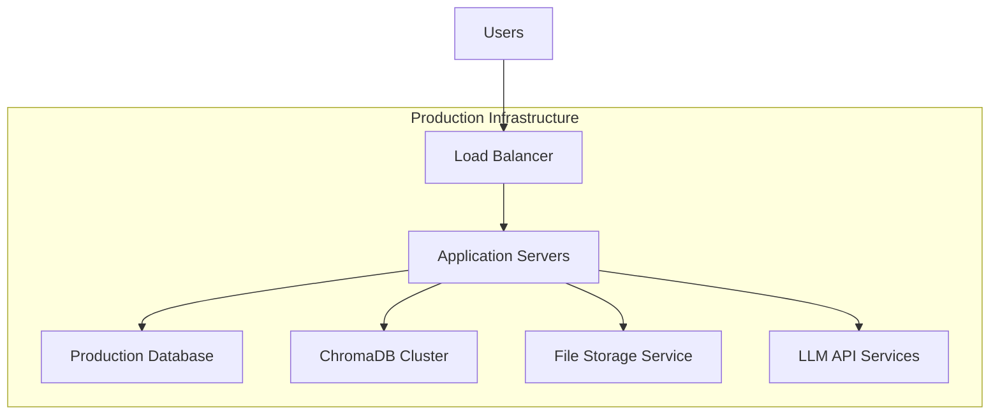
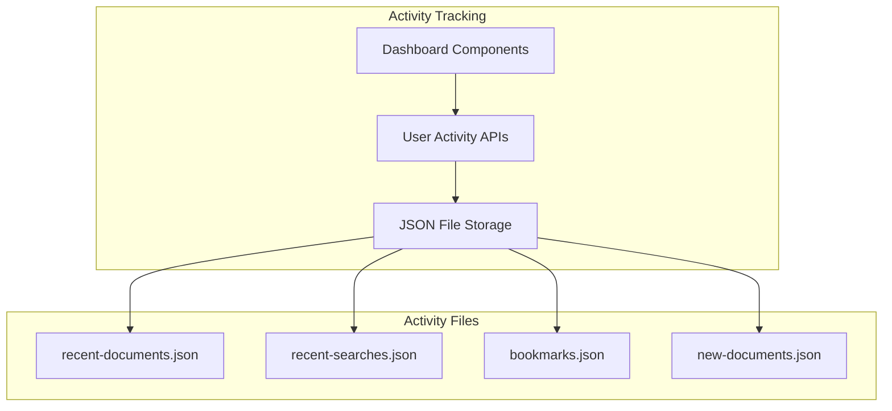
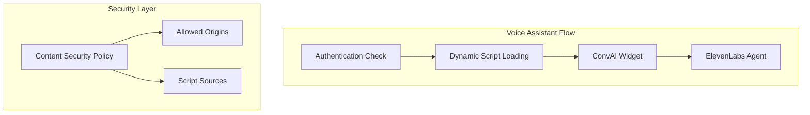

# System Architecture Documentation

## Overview

The Compliance Hub follows a modern, scalable architecture pattern that combines server-side rendering with client-side interactivity, vector-based search capabilities, and AI-powered natural language processing. The system now features multi-state search isolation, advanced filtering with @mentions, and a premium UI built with ShadCN/UI components.

## High-Level Architecture



## Technology Stack

### Frontend Technologies
- **React 19**: Modern React with concurrent features and improved performance
- **Next.js 15**: Full-stack React framework with App Router
- **TypeScript**: Type-safe JavaScript for better development experience
- **TailwindCSS**: Utility-first CSS framework for rapid UI development
- **ShadCN/UI**: Premium component library with accessibility and animations
- **Lucide React**: Modern icon library for consistent UI elements
- **ElevenLabs ConvAI**: Voice assistant integration for hands-free interaction
- **React Suspense**: Optimized loading states for dashboard components

### Backend Technologies
- **Next.js API Routes**: Serverless API endpoints
- **Prisma ORM**: Type-safe database ORM with migration support
- **NextAuth**: Authentication library with JWT support
- **bcryptjs**: Password hashing for security

### Database & Storage
- **SQLite**: Embedded database for development and small deployments
- **ChromaDB**: Vector database for embeddings and similarity search
- **File System**: Local file storage for uploaded documents
- **JSON Files**: Activity tracking storage for development
  - `recent-documents.json`: User document view history
  - `recent-searches.json`: Search history with state information
  - `bookmarks.json`: User bookmarked documents
  - `new-documents.json`: Recently added documents by administrators

### AI & Machine Learning
- **Anthropic Claude**: Primary LLM for natural language processing
- **OpenAI GPT**: Alternative LLM provider
- **Google Gemini**: Additional LLM provider for redundancy
- **ElevenLabs ConvAI**: Voice assistant integration for hands-free interaction
- **ElevenLabs API**: Speech synthesis and voice processing
- **PDF Processing**: Multiple libraries for text extraction and processing

## System Components

### 1. Frontend Architecture



### 2. Backend Architecture

```mermaid
graph TB
    subgraph "API Routes"
        AuthAPI[/api/auth/*]
        DocsAPI[/api/documents/*]
        SearchAPI[/api/search*]
        SettingsAPI[/api/settings/*]
        AdminAPI[/api/admin/*]
    end
    
    subgraph "Services"
        DocService[Document Service]
        SearchService[Search Service]
        AuthService[Auth Service]
        LLMService[LLM Service]
    end
    
    subgraph "Data Access"
        PrismaClient[Prisma Client]
        ChromaClient[Chroma Client]
        FileHandler[File Handler]
    end
    
    subgraph "External APIs"
        LLMProviders[LLM Providers]
        PDFProcessors[PDF Processors]
    end
    
    AuthAPI --> AuthService
    DocsAPI --> DocService
    SearchAPI --> SearchService
    SearchAPI --> MultiStateService
    SettingsAPI --> DocService
    AdminAPI --> DocService
    
    DocService --> PrismaClient
    DocService --> ChromaClient
    DocService --> FileHandler
    SearchService --> ChromaClient
    SearchService --> LLMService
    MultiStateService --> SearchService
    MultiStateService --> ChromaClient
    AuthService --> PrismaClient
    
    LLMService --> LLMProviders
    DocService --> PDFProcessors
```

### 3. Database Architecture



### 4. Multi-State Search Architecture



### 5. Vector Storage Architecture



### 6. Mention-Based Filtering Architecture

```mermaid
graph TB
    subgraph "Filter Input"
        MentionInput[DocumentMentionInput]
        Parser[Mention Parser]
        Suggestions[Dropdown Suggestions]
    end
    
    subgraph "Filter Types"
        StateFilter[@state mentions]
        VerticalFilter[#vertical mentions]
        TypeFilter[#documentType mentions]
    end
    
    subgraph "Filter Logic"
        StateOR[States: OR Logic]
        VerticalOR[Verticals: OR Logic]
        TypeOR[Types: OR Logic]
        CategoryAND[Categories: AND Logic]
    end
    
    subgraph "Database Query"
        QueryBuilder[Dynamic Query Builder]
        FilterApplication[Apply Filters]
        Results[Filtered Results]
    end
    
    MentionInput --> Parser
    Parser --> StateFilter
    Parser --> VerticalFilter
    Parser --> TypeFilter
    
    StateFilter --> StateOR
    VerticalFilter --> VerticalOR
    TypeFilter --> TypeOR
    
    StateOR --> CategoryAND
    VerticalOR --> CategoryAND
    TypeOR --> CategoryAND
    
    CategoryAND --> QueryBuilder
    QueryBuilder --> FilterApplication
    FilterApplication --> Results
    
    Parser --> Suggestions
    Suggestions --> MentionInput
```

## Security Architecture

### Authentication Flow


### Authorization Model
- **Role-Based Access Control (RBAC)**
  - **ADMIN Role**: Full system access including:
    - Document upload and management (Doc Admin section)
    - User management (create, delete, role assignment)
    - System settings and configuration
    - All standard user features
  - **USER Role**: Limited access including:
    - Document viewing and browsing
    - AI search functionality
    - Dashboard access
    - No administrative capabilities
- **JWT Token Security**
  - Secure token generation and validation
  - Token expiration and refresh mechanisms
  - Session management across requests
  - Role information embedded in tokens
- **Navigation Access Control**
  - Dynamic navigation based on user role
  - Admin-only buttons: "Doc Admin" and "Settings"
  - Visual role indicators (Admin badge)
  - Shield icons for administrative sections

## Performance Considerations

### Scalability Patterns
1. **Stateless API Design**: All API endpoints are stateless for horizontal scaling
2. **Vector Database Optimization**: ChromaDB with HNSW indexing for fast similarity search
3. **Streaming Responses**: Real-time search result streaming for better user experience
4. **Caching Strategy**: Client-side caching for frequently accessed data

### Database Optimization
- **Indexing Strategy**: Strategic indexes on frequently queried fields
- **Connection Pooling**: Efficient database connection management
- **Query Optimization**: Prisma ORM with optimized queries
- **Data Partitioning**: State-based document organization

## Deployment Architecture

### Development Environment


### Production Environment


## Integration Points

### External Service Integration
1. **LLM Providers**: Multi-provider support with failover capabilities
2. **PDF Processing**: Multiple PDF libraries for robust document processing
3. **Authentication**: NextAuth integration with multiple providers
4. **File Storage**: Configurable storage backends (local, cloud)
5. **Voice Assistant**: ElevenLabs ConvAI integration for hands-free interaction
6. **Activity Tracking**: File-based storage for user activity monitoring

### API Integration Patterns
- **RESTful APIs**: Standard HTTP methods and status codes
- **Streaming APIs**: Server-sent events for real-time responses
- **Error Handling**: Comprehensive error handling and logging
- **Rate Limiting**: API rate limiting and throttling

## Activity Tracking System

### File-Based Storage Architecture


### Activity Tracking Components
1. **Document View Tracking**: Records user document interactions
2. **Search History**: Maintains search queries with state information
3. **Bookmark Management**: Persistent bookmark storage across sessions
4. **New Document Notifications**: Global tracking of administrator uploads

## Voice Assistant Integration

### ElevenLabs ConvAI Architecture


### Voice Assistant Features
1. **Authentication-Based Access**: Only authenticated users can access voice features
2. **Dynamic Script Loading**: Conditional loading of ElevenLabs scripts
3. **CSP Compliance**: Secure integration with Content Security Policy
4. **Agent Configuration**: Pre-configured agent for regulatory compliance queries

## Security Configuration

### Content Security Policy (CSP)
The application implements a comprehensive CSP for secure ElevenLabs integration:

```javascript
// CSP Configuration for ElevenLabs
const cspPolicy = {
  'default-src': "'self'",
  'script-src': "'self' 'unsafe-inline' 'unsafe-eval' https://unpkg.com blob: data:",
  'connect-src': "'self' https://api.openai.com wss://api.openai.com https://*.anthropic.com https://*.elevenlabs.io wss://*.elevenlabs.io",
  'style-src': "'self' 'unsafe-inline'",
  'img-src': "'self' data: blob: https://*.googleapis.com https://*.elevenlabs.io",
  'font-src': "'self'",
  'media-src': "'self' blob: data:",
  'frame-src': "'self' https://*.elevenlabs.io",
  'worker-src': "'self' blob: data:"
};
```

### Security Features
1. **Secure Script Loading**: Dynamic script loading with CSP compliance
2. **Origin Validation**: Restricted origins for external services
3. **WebSocket Security**: Secure WebSocket connections for real-time features
4. **Data Validation**: Input validation and sanitization for all user inputs

---

*This architecture documentation provides a comprehensive overview of the system design. For implementation details, refer to the component-specific documentation.*