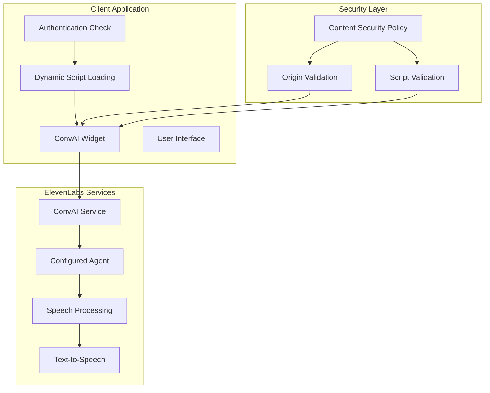

# Voice Assistant Integration Documentation

## Overview

The Compliance Hub integrates with ElevenLabs ConvAI to provide hands-free regulatory research capabilities. This integration allows authenticated users to interact with compliance documents and search functionality through natural voice commands.

## ElevenLabs ConvAI Integration

### Architecture Overview



### Component Implementation

#### Voice Assistant Component

```typescript
// /components/voice/VoiceAssistantElevenLabs.tsx
'use client'

import { useEffect } from 'react'
import { useSession } from 'next-auth/react'

interface VoiceAssistantProps {
  className?: string
}

export function VoiceAssistantElevenLabs({ className = '' }: VoiceAssistantProps) {
  const { data: session } = useSession()

  // Load the ElevenLabs script dynamically
  useEffect(() => {
    if (typeof window !== 'undefined' && !document.querySelector('script[src*="convai-widget-embed"]')) {
      const script = document.createElement('script')
      script.src = 'https://unpkg.com/@elevenlabs/convai-widget-embed'
      script.async = true
      script.type = 'text/javascript'
      script.onload = () => {
        console.log('ElevenLabs ConvAI script loaded successfully')
      }
      script.onerror = () => {
        console.error('Failed to load ElevenLabs ConvAI script')
      }
      document.head.appendChild(script)
    }
  }, [])

  // Don't render if user is not authenticated
  if (!session?.user) {
    return null
  }

  return (
    <div className={`voice-assistant-container ${className}`}>
      {/* Native ElevenLabs Widget - handles its own icon and positioning */}
      <elevenlabs-convai agent-id="agent_01k09mvx7aepg9zy3w59k327ye"></elevenlabs-convai>
    </div>
  )
}
```

#### Integration in Layout

```typescript
// /components/layout/navbar.tsx
import { VoiceAssistantElevenLabs } from '../voice/VoiceAssistantElevenLabs'

export function Navbar() {
  return (
    <nav className="navbar">
      {/* Other navbar components */}
      
      {/* Voice Assistant - positioned in top right */}
      <div className="voice-assistant-wrapper">
        <VoiceAssistantElevenLabs className="fixed bottom-4 right-4 z-50" />
      </div>
    </nav>
  )
}
```

## Security Configuration

### Content Security Policy (CSP)

The application implements a comprehensive CSP to securely integrate ElevenLabs services:

```javascript
// next.config.js
const nextConfig = {
  reactStrictMode: true,
  async headers() {
    return [
      {
        source: '/:path*',
        headers: [
          {
            key: 'Content-Security-Policy',
            value: [
              "default-src 'self'",
              "script-src 'self' 'unsafe-inline' 'unsafe-eval' https://unpkg.com blob: data:",
              "connect-src 'self' https://api.openai.com wss://api.openai.com https://*.anthropic.com https://*.elevenlabs.io wss://*.elevenlabs.io",
              "style-src 'self' 'unsafe-inline'",
              "img-src 'self' data: blob: https://*.googleapis.com https://*.elevenlabs.io",
              "font-src 'self'",
              "media-src 'self' blob: data:",
              "frame-src 'self' https://*.elevenlabs.io",
              "worker-src 'self' blob: data:"
            ].join('; ')
          }
        ]
      }
    ]
  }
}

module.exports = nextConfig
```

### CSP Directives Explained

| Directive | Purpose | ElevenLabs Requirements |
|-----------|---------|------------------------|
| `script-src` | Controls script execution | `https://unpkg.com` for widget script, `blob:` and `data:` for audio processing |
| `connect-src` | Controls network requests | `https://*.elevenlabs.io` and `wss://*.elevenlabs.io` for API and WebSocket connections |
| `media-src` | Controls audio/video sources | `blob:` and `data:` for audio playback |
| `frame-src` | Controls iframe embedding | `https://*.elevenlabs.io` for widget iframe |
| `worker-src` | Controls web workers | `blob:` and `data:` for audio processing workers |
| `img-src` | Controls image sources | `https://*.elevenlabs.io` for widget assets |

## Authentication Integration

### Session-Based Access Control

The voice assistant is only available to authenticated users:

```typescript
// Authentication check in voice component
export function VoiceAssistantElevenLabs() {
  const { data: session, status } = useSession()

  // Show loading state while checking authentication
  if (status === 'loading') {
    return (
      <div className="voice-assistant-loading">
        <div className="animate-pulse bg-gray-200 rounded-full h-12 w-12"></div>
      </div>
    )
  }

  // Don't render for unauthenticated users
  if (status === 'unauthenticated' || !session?.user) {
    return null
  }

  // Render voice assistant for authenticated users
  return (
    <div className="voice-assistant-authenticated">
      <elevenlabs-convai agent-id="agent_01k09mvx7aepg9zy3w59k327ye"></elevenlabs-convai>
    </div>
  )
}
```

### User Context Integration

```typescript
// Enhanced voice assistant with user context
export function VoiceAssistantElevenLabs() {
  const { data: session } = useSession()
  const [isReady, setIsReady] = useState(false)

  useEffect(() => {
    if (session?.user) {
      // Initialize voice assistant with user context
      const initializeVoiceAssistant = () => {
        // Custom initialization logic
        if (window.ElevenLabsConvAI) {
          window.ElevenLabsConvAI.initialize({
            userId: session.user.id,
            userRole: session.user.role,
            context: {
              application: 'compliance-hub',
              domain: 'regulatory-compliance'
            }
          })
          setIsReady(true)
        }
      }

      initializeVoiceAssistant()
    }
  }, [session])

  if (!session?.user || !isReady) {
    return null
  }

  return (
    <div className="voice-assistant-ready">
      <elevenlabs-convai agent-id="agent_01k09mvx7aepg9zy3w59k327ye"></elevenlabs-convai>
    </div>
  )
}
```

## Agent Configuration

### ElevenLabs Agent Setup

The voice assistant uses a pre-configured agent optimized for regulatory compliance:

```yaml
# ElevenLabs Agent Configuration
agent:
  id: agent_01k09mvx7aepg9zy3w59k327ye
  name: Compliance Hub Assistant
  description: AI assistant for sports betting regulatory compliance
  
  settings:
    voice:
      model: eleven_turbo_v2
      voice_id: professional_female
      stability: 0.8
      similarity_boost: 0.7
      
    conversation:
      max_tokens: 1000
      temperature: 0.3
      response_format: conversational
      
    knowledge_base:
      domain: regulatory_compliance
      specialization: sports_betting
      jurisdictions: US_states
      
  capabilities:
    - document_search
    - regulatory_guidance
    - compliance_questions
    - jurisdiction_comparison
    - deadline_reminders
    
  limitations:
    - no_legal_advice
    - information_only
    - requires_verification
```

### Agent Customization

```typescript
// Custom agent configuration
interface AgentConfig {
  agentId: string
  userRole: string
  context: {
    currentState?: string
    recentDocuments?: string[]
    searchHistory?: string[]
  }
}

export function configureAgent(config: AgentConfig) {
  const agentSettings = {
    agentId: config.agentId,
    customization: {
      greeting: getPersonalizedGreeting(config.userRole),
      context: buildContextualKnowledge(config.context),
      permissions: getRoleBasedPermissions(config.userRole)
    }
  }

  return agentSettings
}

function getPersonalizedGreeting(role: string): string {
  const greetings = {
    ADMIN: "Hello! I'm here to help with compliance administration and document management.",
    USER: "Hi! I can help you search compliance documents and answer regulatory questions."
  }
  
  return greetings[role] || greetings.USER
}
```

## Error Handling and Fallbacks

### Script Loading Error Handling

```typescript
export function VoiceAssistantElevenLabs() {
  const [scriptLoaded, setScriptLoaded] = useState(false)
  const [scriptError, setScriptError] = useState<string | null>(null)

  useEffect(() => {
    const loadScript = () => {
      if (document.querySelector('script[src*="convai-widget-embed"]')) {
        setScriptLoaded(true)
        return
      }

      const script = document.createElement('script')
      script.src = 'https://unpkg.com/@elevenlabs/convai-widget-embed'
      script.async = true
      script.type = 'text/javascript'
      
      script.onload = () => {
        setScriptLoaded(true)
        console.log('ElevenLabs ConvAI script loaded successfully')
      }
      
      script.onerror = () => {
        setScriptError('Failed to load voice assistant')
        console.error('Failed to load ElevenLabs ConvAI script')
      }
      
      document.head.appendChild(script)
    }

    loadScript()
  }, [])

  if (scriptError) {
    return (
      <div className="voice-assistant-error">
        <div className="bg-red-50 border border-red-200 rounded-lg p-4">
          <div className="flex items-center">
            <AlertCircle className="h-5 w-5 text-red-400 mr-2" />
            <span className="text-sm text-red-700">
              Voice assistant temporarily unavailable
            </span>
          </div>
        </div>
      </div>
    )
  }

  if (!scriptLoaded) {
    return (
      <div className="voice-assistant-loading">
        <div className="animate-pulse bg-gray-200 rounded-full h-12 w-12"></div>
      </div>
    )
  }

  return (
    <div className="voice-assistant-loaded">
      <elevenlabs-convai agent-id="agent_01k09mvx7aepg9zy3w59k327ye"></elevenlabs-convai>
    </div>
  )
}
```

### Network Error Handling

```typescript
// Network connectivity checking
export function useVoiceAssistantConnectivity() {
  const [isOnline, setIsOnline] = useState(navigator.onLine)
  const [elevenLabsStatus, setElevenLabsStatus] = useState<'checking' | 'online' | 'offline'>('checking')

  useEffect(() => {
    const handleOnline = () => setIsOnline(true)
    const handleOffline = () => setIsOnline(false)

    window.addEventListener('online', handleOnline)
    window.addEventListener('offline', handleOffline)

    return () => {
      window.removeEventListener('online', handleOnline)
      window.removeEventListener('offline', handleOffline)
    }
  }, [])

  useEffect(() => {
    const checkElevenLabsStatus = async () => {
      try {
        const response = await fetch('https://api.elevenlabs.io/v1/voices', {
          method: 'HEAD',
          timeout: 5000
        })
        setElevenLabsStatus(response.ok ? 'online' : 'offline')
      } catch (error) {
        setElevenLabsStatus('offline')
      }
    }

    if (isOnline) {
      checkElevenLabsStatus()
    } else {
      setElevenLabsStatus('offline')
    }
  }, [isOnline])

  return { isOnline, elevenLabsStatus }
}
```

## Performance Optimization

### Lazy Loading Implementation

```typescript
// Lazy loading for voice assistant
const VoiceAssistantLazy = lazy(() => 
  import('./VoiceAssistantElevenLabs').then(module => ({
    default: module.VoiceAssistantElevenLabs
  }))
)

export function VoiceAssistantWrapper() {
  const { data: session } = useSession()
  const [shouldLoad, setShouldLoad] = useState(false)

  useEffect(() => {
    if (session?.user) {
      // Delay loading to improve initial page load
      const timer = setTimeout(() => {
        setShouldLoad(true)
      }, 1000)

      return () => clearTimeout(timer)
    }
  }, [session])

  if (!session?.user || !shouldLoad) {
    return null
  }

  return (
    <Suspense fallback={<VoiceAssistantSkeleton />}>
      <VoiceAssistantLazy />
    </Suspense>
  )
}
```

### Memory Management

```typescript
// Memory-efficient voice assistant
export function VoiceAssistantElevenLabs() {
  const scriptRef = useRef<HTMLScriptElement | null>(null)
  const widgetRef = useRef<any>(null)

  useEffect(() => {
    return () => {
      // Cleanup on unmount
      if (scriptRef.current) {
        document.head.removeChild(scriptRef.current)
      }
      
      if (widgetRef.current) {
        widgetRef.current.destroy?.()
      }
    }
  }, [])

  // Component implementation...
}
```

## Testing Strategy

### Unit Tests

```typescript
// Voice assistant component tests
describe('VoiceAssistantElevenLabs', () => {
  beforeEach(() => {
    // Mock session
    jest.mocked(useSession).mockReturnValue({
      data: { user: { id: '1', role: 'USER' } },
      status: 'authenticated'
    })
  })

  test('renders for authenticated users', () => {
    render(<VoiceAssistantElevenLabs />)
    
    expect(screen.getByTestId('voice-assistant')).toBeInTheDocument()
  })

  test('does not render for unauthenticated users', () => {
    jest.mocked(useSession).mockReturnValue({
      data: null,
      status: 'unauthenticated'
    })

    render(<VoiceAssistantElevenLabs />)
    
    expect(screen.queryByTestId('voice-assistant')).not.toBeInTheDocument()
  })

  test('loads ElevenLabs script dynamically', () => {
    render(<VoiceAssistantElevenLabs />)
    
    const script = document.querySelector('script[src*="convai-widget-embed"]')
    expect(script).toBeInTheDocument()
  })
})
```

### Integration Tests

```typescript
// Voice assistant integration tests
describe('Voice Assistant Integration', () => {
  test('script loading and widget initialization', async () => {
    // Mock ElevenLabs script
    const mockScript = {
      onload: jest.fn(),
      onerror: jest.fn()
    }

    jest.spyOn(document, 'createElement').mockReturnValue(mockScript as any)
    jest.spyOn(document.head, 'appendChild').mockImplementation(() => {})

    render(<VoiceAssistantElevenLabs />)

    // Simulate script load
    mockScript.onload()

    await waitFor(() => {
      expect(mockScript.onload).toHaveBeenCalled()
    })
  })

  test('CSP compliance', () => {
    // Test that widget loads within CSP constraints
    const cspMeta = document.querySelector('meta[http-equiv="Content-Security-Policy"]')
    expect(cspMeta?.getAttribute('content')).toContain('https://*.elevenlabs.io')
  })
})
```

### E2E Tests

```typescript
// End-to-end voice assistant tests
describe('Voice Assistant E2E', () => {
  test('voice assistant appears for authenticated users', async () => {
    await page.goto('/login')
    await page.fill('[data-testid="email"]', 'test@example.com')
    await page.fill('[data-testid="password"]', 'password')
    await page.click('[data-testid="login-button"]')

    await page.waitForSelector('[data-testid="voice-assistant"]')
    
    const voiceAssistant = await page.locator('[data-testid="voice-assistant"]')
    expect(voiceAssistant).toBeVisible()
  })

  test('voice assistant is hidden for unauthenticated users', async () => {
    await page.goto('/')
    
    const voiceAssistant = await page.locator('[data-testid="voice-assistant"]')
    expect(voiceAssistant).not.toBeVisible()
  })
})
```

## Monitoring and Analytics

### Usage Tracking

```typescript
// Voice assistant usage analytics
export function trackVoiceAssistantUsage(event: string, data?: any) {
  // Track voice assistant interactions
  analytics.track('voice_assistant_interaction', {
    event,
    timestamp: new Date().toISOString(),
    userId: session?.user?.id,
    ...data
  })
}

// Usage in component
export function VoiceAssistantElevenLabs() {
  useEffect(() => {
    trackVoiceAssistantUsage('widget_loaded')
  }, [])

  const handleVoiceInteraction = (interaction: any) => {
    trackVoiceAssistantUsage('voice_interaction', {
      duration: interaction.duration,
      successful: interaction.successful,
      query: interaction.query
    })
  }

  // Component implementation...
}
```

### Error Monitoring

```typescript
// Error tracking for voice assistant
export function useVoiceAssistantErrorTracking() {
  const reportError = (error: Error, context?: any) => {
    // Send to error tracking service
    errorTracker.captureException(error, {
      tags: {
        component: 'voice-assistant',
        service: 'elevenlabs'
      },
      extra: context
    })
  }

  return { reportError }
}
```

## Troubleshooting Guide

### Common Issues

| Issue | Symptoms | Solution |
|-------|----------|----------|
| Script Loading Failure | Widget doesn't appear | Check CSP settings, network connectivity |
| Authentication Issues | Widget appears for all users | Verify session check logic |
| Audio Not Working | Widget loads but no audio | Check media permissions, CSP media-src |
| CSP Violations | Console errors about blocked resources | Update CSP directives |

### Debug Mode

```typescript
// Debug mode for voice assistant
export function VoiceAssistantElevenLabs({ debug = false }: { debug?: boolean }) {
  const [debugInfo, setDebugInfo] = useState<any>({})

  useEffect(() => {
    if (debug) {
      const debugTimer = setInterval(() => {
        setDebugInfo({
          scriptLoaded: !!document.querySelector('script[src*="convai-widget-embed"]'),
          sessionStatus: session?.status,
          timestamp: new Date().toISOString()
        })
      }, 1000)

      return () => clearInterval(debugTimer)
    }
  }, [debug])

  return (
    <div>
      {debug && (
        <div className="voice-assistant-debug">
          <pre>{JSON.stringify(debugInfo, null, 2)}</pre>
        </div>
      )}
      
      <elevenlabs-convai agent-id="agent_01k09mvx7aepg9zy3w59k327ye"></elevenlabs-convai>
    </div>
  )
}
```

---

*This voice assistant integration documentation provides comprehensive coverage of the ElevenLabs ConvAI implementation. For additional configuration options, refer to the ElevenLabs ConvAI documentation.*